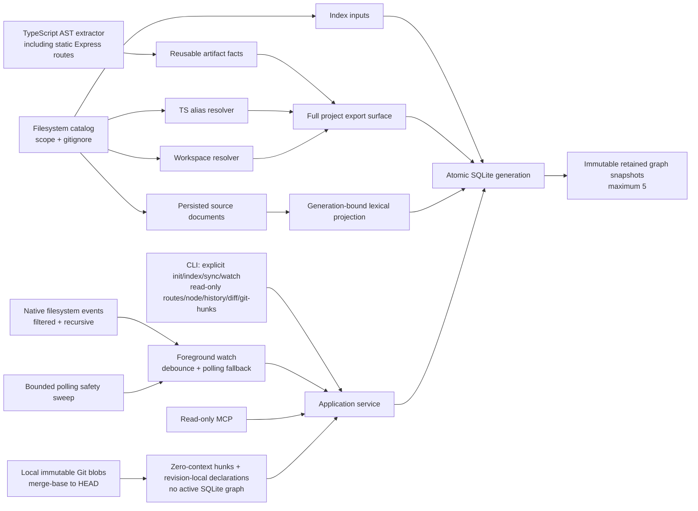

<div align="center">

# SymbolLattice

**Evidence-first local code intelligence for TypeScript and JavaScript projects.**

[](https://github.com/HsinPu/symbol-lattice/tags)
[](https://nodejs.org/)
[](https://www.typescriptlang.org/)
[](LICENSE)

[Quick start](#quick-start) | [Express routes](#static-express-route-evidence) | [Node inspection](#generation-bound-node-inspection) | [History and diff](#retained-graph-history-and-structural-diff) | [Auto sync](#opt-in-foreground-watch) | [Affected tests](#affected-test-evidence) | [Git hunks](#immutable-git-hunk-declaration-attribution) | [Context packs](#bounded-multi-symbol-context) | [Commands](#command-reference) | [MCP](#mcp-server) | [Architecture](#architecture) | [Roadmap](#roadmap)

</div>

> [!IMPORTANT]
> **v0.14.0** is an early developer release. This public repository runs from source; its npm package is intentionally private and is not published to npm.

SymbolLattice builds a local symbol graph without hiding uncertainty. It keeps syntax-proven artifact facts, resolves cross-file relationships conservatively, and records why every resolved edge exists. The graph stays local to the inspected project under `.symbol-lattice/index.sqlite`.

## Why SymbolLattice?

- **Evidence-first** - resolved edges retain a rule ID, resolution stage, considered symbols, relevant configuration paths, and re-export route when applicable.
- **Safe freshness** - source hashes and project inputs are stored with each active generation; `status` reports drift instead of silently rebuilding.
- **Workspace-aware** - local npm/Yarn-style workspaces can resolve package roots and explicit subpath exports without reading `node_modules`.
- **Incremental parsing, atomic publication** - `sync` only reparses changed source artifacts when their persisted facts are compatible, then atomically publishes one fresh project graph.
- **Event-accelerated foreground freshness** - opt-in `watch` uses native filesystem events when the host supports them, exposes bounded pending-path evidence in its own stream, coalesces saves, retains bounded polling as a safety sweep, and invokes the same atomic `sync` only after drift.
- **Generation-bound source evidence** - `search` and exact `explore` results use source captured with the active graph generation, even when the live project has since drifted.
- **Declaration-focused node view** - exact `node` results return the full persisted declaration range plus a bounded declaration body, direct callers/callees, and explicit limits from one active generation without substituting live source text.
- **Static HTTP entry evidence** - a narrow Express pack creates first-class `route` nodes and exact `routes` edges for statically proven literal registrations, so a handler can reveal the HTTP method and path that bind it.
- **Bounded context packs** - ordered symbol references produce persisted source, capped relationship/impact summaries, and static directed evidence paths without guessing ambiguous symbols or dynamic behavior.
- **Affected-test evidence** - changed indexed files map to conventionally named tests through bounded, exact import/export proof paths; explicit paths, `--working-tree`, and `--base <ref>` retain stale, scope, depth, visit, and result limits in the response.
- **Immutable Git hunk attribution** - `git-hunks` compares a local merge base with `HEAD` through immutable Git blobs, returns zero-context hunks, and anchors declarations independently in each revision without an active graph or a cross-revision identity claim.
- **Retained graph history** - up to five immutable graph generations can be listed and structurally compared without reading Git, live source text, or hidden background state.
- **Agent-safe MCP** - MCP tools are read-only and never initialize or refresh a project.

## Quick start

### Requirements

- Node.js `>=22.13 <25`
- npm

```bash
git clone https://github.com/HsinPu/symbol-lattice.git
cd symbol-lattice
npm install
npm run build

# Create the first graph for a project.
node dist/cli/main.js init /path/to/project

# Inspect a stored relationship.
node dist/cli/main.js explain-edge "edge:<edge-id>" --project /path/to/project
```

On Windows, use `npm.cmd` if `npm` is not available directly in PowerShell.

> [!WARNING]
> SymbolLattice refuses to index a filesystem root or home directory unless `--force` is supplied deliberately.

### Typical workflow

```bash
# Query symbols after indexing.
node dist/cli/main.js find add --project /path/to/project
node dist/cli/main.js callers "src/math.ts#add" --project /path/to/project
node dist/cli/main.js node "src/math.ts#add" --project /path/to/project
node dist/cli/main.js routes /path/to/project --method GET --path /api --limit 20
node dist/cli/main.js search "session timeout" --project /path/to/project --path src
node dist/cli/main.js context "src/consumer.ts#calculate" "src/math.ts#add" --project /path/to/project

# Select affected tests from changed files already present in the active generation.
node dist/cli/main.js affected src/math.ts --project /path/to/project
git diff --name-only HEAD | node dist/cli/main.js affected --stdin --project /path/to/project

# Or let SymbolLattice read a local Git change set without fetching or syncing.
node dist/cli/main.js affected --working-tree --project /path/to/project
node dist/cli/main.js affected --base origin/main --project /path/to/project

# Attribute immutable zero-context Git hunks to declarations extracted per revision.
node dist/cli/main.js git-hunks /path/to/project --base origin/main --limit 10

# Inspect freshness before an explicit update.
node dist/cli/main.js status /path/to/project
node dist/cli/main.js sync /path/to/project

# List immutable retained graph generations, then compare two returned IDs.
node dist/cli/main.js history /path/to/project
node dist/cli/main.js diff "generation:<older-id>" /path/to/project --to "generation:<newer-id>"

# Or keep an already initialized local graph fresh in this terminal.
node dist/cli/main.js watch /path/to/project
```

One-shot data commands emit stable, pretty JSON. `watch` is the deliberate streaming exception: it emits one compact NDJSON receipt per line. `--json` is retained as a forward-compatible script flag.

## Capabilities

| Area | v0.14.0 behavior |
| --- | --- |
| Source files | TypeScript, TSX, JavaScript, and JSX |
| Scope | Project root by default or repeatable, persisted `--scope` directories |
| Discovery | Root `.gitignore` with negation; `.git`, `.symbol-lattice`, `coverage`, `dist`, and `node_modules` are always excluded |
| Symbols | Files, classes, functions, methods, interfaces, types, variables, and static HTTP routes |
| Relationships | `contains`, module imports/exports, direct identifier calls, and evidence-bearing `routes` bindings |
| Module resolution | Relative paths, TypeScript/JavaScript `baseUrl` and `paths`, then local workspace packages |
| Workspaces | Root `package.json` workspaces array/object, local package root/subpath `exports`, and entrypoint fallback |
| Re-exports | Named aliases, `export *`, default-through-named aliases, and namespace-export provenance |
| Retrieval | Local deterministic FTS5 search across persisted source text and identifier parts; bounded path/language filters, source/symbol evidence, and exact `explore` excerpts from the same active generation |
| Node inspection | Exact ID, qualified-name, simple-name, or `path:line[:column]` matches can return the persisted declaration range, capped direct callers/callees, source provenance, truncation, and active freshness from one generation |
| Express routes | Static AST-proven `express` / `Router` literal registrations with bounded `routes` listing, exact handler proof when available, and unresolved route evidence when it is not |
| Context | Bounded packs for 1–8 ordered references: exact-match source excerpts, capped callers/callees and reverse impact, plus shortest static directed evidence paths between adjacent exact references |
| Affected tests | Explicit changed files or local Git change sets feed exact persisted `imports` / `exports` paths, deterministic proof paths, conventional test-path classification, and explicit completeness limits |
| Immutable Git hunks | Local merge-base-to-`HEAD` zero-context hunks from immutable blobs, independently anchored to revision-local declarations without an active SQLite graph |
| Retained history | Up to five immutable graph generations, newest-first summaries, live active freshness kept separate, and bounded structural `history` / `diff` reads |
| Storage | Local SQLite v4-compatible metadata with additive retained snapshot, generation-bound source retrieval, raw artifact-fact, edge-evidence, index-input, and index-work tables |
| Freshness | Source hashes, configuration/workspace manifest fingerprints, extractor/resolver versions, and actionable stale reasons |
| Foreground watch | Explicit native-event-accelerated monitor with a 250 ms debounce, bounded pending-file disclosure, compact NDJSON receipts, polling fallback/retry, and the existing atomic incremental `sync` |

### Resolution contract

| State | Meaning |
| --- | --- |
| `exact` | Proven by syntax, lexical binding, explicit import, workspace package, or re-export surface |
| `heuristic` | Conservative unique-name inference; useful but never presented as proof |
| `unresolved` | Kept for inspection but excluded from callers, callees, and impact paths |

For an exact call that travels through a barrel, evidence uses `module.reexported-import-binding` and includes a `resolutionPath`, for example:

```json
{
  "ruleId": "module.reexported-import-binding",
  "resolutionPath": [
    "apps/web/src/consumer.ts",
    "packages/core/src/index.ts",
    "packages/core/src/math.ts"
  ]
}
```

### Static Express route evidence

v0.14 adds the first framework pack as a graph contract, not a regex guess. A supported registration creates a file-contained `route` symbol such as `GET /users` and a distinct `routes` edge to its terminal handler. That edge remains visible in `callers`, `callees`, `impact`, `context`, `explore`, `node`, and `explain-edge`; its kind keeps HTTP dispatch separate from an ordinary function call.

```ts
import express, { Router } from "express";
import { listUsers } from "./users.js";

const app = express();
const router = Router();

app.get("/users", listUsers);
router.post("/users", requireAuth, createUser);
```

```bash
# Read the persisted active-generation route graph only.
node dist/cli/main.js routes /path/to/project
node dist/cli/main.js routes /path/to/project --method GET --path /users --limit 20
```

The pack accepts only static proofs:

- an ESM `express` default/namespace import or named `Router` import;
- an immutable `const` local receiver initialized directly by `express()`, `express.Router()`, or `Router()`;
- one of `get`, `post`, `put`, `patch`, `delete`, `head`, `options`, or `all`;
- a slash-prefixed string literal path; and
- identifier-only middleware/handler arguments, with the final identifier as the terminal handler.

If the terminal handler cannot be resolved through a lexical binding, explicit import, or re-export surface, the route and its `routes` edge remain persisted as `unresolved`. SymbolLattice does not promote a unique global name to a route handler.

> [!NOTE]
> `routes` is a read-only active-generation query. Its `status` may be stale after a source edit, while every route/handler record remains evidence from the last successfully indexed generation. Run `sync` or `index` to publish newer route evidence.

### Indexed source search

`find` and `query` resolve graph symbols by name, qualified name, ID, or location. `search` is a separate retrieval command: it searches only the source text and identifier-part corpus captured with the active graph generation.

```bash
# Prefix-style lexical retrieval. All query terms must match the indexed corpus.
node dist/cli/main.js search "fetch response" --project /path/to/project

# Restrict persisted results without reading the live source tree.
node dist/cli/main.js search "session timeout" --project /path/to/project \
  --path src/server --language typescript --limit 10
```

Search accepts letters, numbers, and identifier fragments; punctuation is treated as text separation rather than query syntax, and common diacritics fold consistently with local FTS (`café` can match `cafe`). Each result includes its deterministic rank, file and language, persisted source range/excerpt, terms found directly in source, an explanation, and zero or more overlapping declaration candidates.

> [!NOTE]
> `status` is evaluated against the live project, but `search.results` always come from the persisted active generation. If a file changes after indexing, search can truthfully return `stale: true` while still showing the older indexed excerpt. Run `sync` or `index` to publish newer evidence.

### Generation-bound exploration

For an exact symbol match, `explore` returns its excerpt from the same active generation as its graph relationships and ranges. It never substitutes the current file contents. This means a changed or deleted live file can produce `stale: true` while the response still carries the older, internally consistent evidence.

The bundled service supplies `sourceAvailability` to make that contract explicit:

- `active-generation` — `source` is immutable persisted evidence from the active generation.
- `unavailable` — the graph is still queryable, but an older adapter or legacy generation cannot supply persisted source text; `source` is `null` and SymbolLattice does not fall back to the live filesystem.
- `not-applicable` — the reference was ambiguous or not found, so there is no exact symbol source to return.

The field is additive: an external legacy `ExploreService` embedding may omit it rather than making a provenance claim it cannot support.

### Generation-bound node inspection

`node` is the exact-symbol companion to `explore`: it returns the full declaration range plus a bounded persisted declaration body rather than a small surrounding excerpt, together with direct persisted callers and callees from the same active generation.

```bash
# ID, qualified name, simple name, and path:line[:column] references use the normal exact-match rules.
node dist/cli/main.js node "src/math.ts#add" --project /path/to/project
node dist/cli/main.js node "src/math.ts:12" --project /path/to/project
```

Every response carries fixed `bounds`: at most **200 source lines**, **16,000 UTF-16 code units**, **25 direct callers**, **25 direct callees**, and **25 ambiguous match candidates**. `source` includes the full persisted declaration `range`, `totalLines`, `totalCharacters`, and `truncated`. When a declaration exceeds either source bound, `source.text` is a contiguous prefix of that immutable declaration range; SymbolLattice never quietly reads a current file to fill the remainder. `callers.truncated`, `callees.truncated`, and `matchCandidatesTruncated` make relation or ambiguity omissions explicit.

Like `explore`, `node` preserves `exact`, `ambiguous`, and `not_found` matching rather than choosing an ambiguous candidate. Ambiguous candidates retain deterministic source order and are capped at 25 with `matchCandidatesTruncated: true` when further persisted candidates exist. Only an exact match has source or graph relationships. `sourceAvailability` is `active-generation`, `unavailable`, or `not-applicable`; a legacy adapter or generation with no persisted source projection remains graph-queryable but returns `source: null`, never live source. The command and MCP tool are read-only and do not initialize, sync, or refresh an index.

### Bounded multi-symbol context

`context` is a separate, additive view for reading a small, explicit set of related symbols. It does not replace the single-symbol `explore` contract.

```bash
node dist/cli/main.js context \
  "src/consumer.ts#calculate" \
  "src/math.ts#add" \
  --project /path/to/project
```

The input accepts **1–8 ordered references**. Each result preserves the normal `exact`, `ambiguous`, or `not_found` match rather than selecting an ambiguous candidate. Ambiguous candidate lists cap at 25 and set `matchCandidatesTruncated` when more persisted candidates exist. Exact matches include a persisted source excerpt when the active generation can supply it, bounded direct callers/callees, and bounded reverse-impact paths.

Adjacent exact references are also checked as a directed static route in the supplied order. A returned `path` is the deterministic shortest path through **exact** `calls`, `routes`, or `imports` edges only. SymbolLattice never reverses an edge, treats a heuristic edge as proof, or fabricates a dynamic-dispatch hop. Each pair reports one of `path`, `same-symbol`, `no-path`, `not-applicable`, or `truncated`.

| Option | Default | Range | Effect |
| --- | ---: | ---: | --- |
| Match candidates | `25` | fixed | Cap candidates returned for each ambiguous reference and report `matchCandidatesTruncated` |
| `--relation-limit` | `8` | `1–25` | Cap direct callers and callees per exact symbol |
| `--max-hops` | `4` | `1–6` | Cap directed evidence-path hops for each adjacent pair |
| `--impact-depth` | `2` | `1–3` | Cap reverse dependency depth per exact symbol |
| `--impact-limit` | `8` | `1–25` | Cap reverse-impact paths per exact symbol |

Each context response includes the applied `bounds`, per-section `truncated` flags, and a fixed per-path traversal budget. This makes response size and omitted evidence explicit instead of silently ranking or dropping data.

> [!NOTE]
> Context uses the same active-generation source-document bundle as its graph data. With an older `GraphStore` adapter or legacy generation, exact graph context remains available with `sourceAvailability: "unavailable"`; SymbolLattice never reads the live file as a substitute.

### Affected test evidence

`affected` turns changed source files into a bounded test-selection report. Supply one or more paths directly, pipe a file list into `--stdin`, or select the files with a local read-only Git change set.

```bash
# One or more project-relative files. Absolute paths are normalized to the project.
node dist/cli/main.js affected src/math.ts src/http/client.ts --project /path/to/project

# Keep Git selection caller-owned when that fits an existing CI pipeline.
git diff --name-only HEAD | node dist/cli/main.js affected --stdin --project /path/to/project

# Compare HEAD with the staged/unstaged working tree and untracked files.
node dist/cli/main.js affected --working-tree --project /path/to/project

# Compare the local merge-base of origin/main and HEAD. This does not fetch.
node dist/cli/main.js affected --base origin/main --project /path/to/project
```

#### Local Git selection

`--working-tree` resolves the local `HEAD`, compares it with the staged and unstaged working tree, and adds untracked files that are not ignored. `--base <ref>` resolves the supplied **local** ref, finds `merge-base(<ref>, HEAD)`, and compares that merge base with `HEAD`; it intentionally excludes uncommitted and untracked work.

The two Git modes are mutually exclusive and cannot be combined with explicit paths or `--stdin`. They require a repository with a resolvable `HEAD`. Git is run with argv-only process execution, `--no-ext-diff`, and `--no-textconv`; SymbolLattice never fetches, commits, stages, initializes, indexes, or syncs as part of this query.

Git output is preserved under `changeSet.changes`, including non-source files and both sides of renames or copies. Only supported TypeScript/JavaScript paths outside `.git`, `.symbol-lattice`, `coverage`, `dist`, and `node_modules` become `changeSet.sourcePaths`; those paths are capped at `50` and are the only inputs sent to graph analysis. If a Git change set has no supported source paths, the response returns its provenance with `affected: null` rather than inventing an empty graph traversal.

> [!CAUTION]
> Git selection is **file-level**, not semantic Git diff. It does not map hunks to declarations, infer runtime behavior, or run a test runner. A base comparison may also be stale relative to the active graph generation; use the returned freshness and completeness fields before treating the selected tests as complete.

For each changed file that exists in the active generation, SymbolLattice walks reverse **exact** `imports` and `exports` edges. This includes barrel re-exports and returns one deterministic proof path from the changed file to each selected test. A changed test file itself is included with a zero-edge `changed-test` path.

Test files are classified conservatively from their indexed paths: `*.test.*`, `*.spec.*`, and `*.e2e.*`, plus files under `__tests__/`, `test/`, `tests/`, `spec/`, or `e2e/`. This is static path convention, not test-runner discovery.

| Bound | Default | Range | Effect |
| --- | ---: | ---: | --- |
| Changed source paths | `50` | `1-50` explicit; `0-50` from Git | Rejects oversized input lists instead of silently dropping files |
| `--depth` | `5` | `1-8` | Caps reverse exact import/export hops per changed indexed file |
| `--limit` | `25` | `1-100` | Caps returned proof-bearing test records |
| Visited files | `500` | fixed | Caps traversal work independently for each changed indexed file |

An explicit-path report always includes `inputs.indexed`, `inputs.notIndexed`, the test-path classification, proof path, `indexScope`, and `completeness`. A Git-selected report wraps that report in `affected` and adds immutable `changeSet` provenance. `completeForActiveGeneration` is true only when the active generation is fresh, every requested path was indexed, and no depth, visit, or result cap omitted evidence. It is never a claim that unindexed source roots, runtime-discovered tests, dynamic dispatch, or unsupported languages are fully covered.

> [!NOTE]
> The graph proof is always read from the active persisted generation. As with other query commands, freshness is evaluated against the live project so a stale index is visible rather than silently refreshed.

### Immutable Git hunk declaration attribution

`git-hunks [path] --base <ref> [--limit <count>]` is intentionally separate from `affected --base <ref>`. `affected` first performs **file-level** local Git selection and then uses the active persisted graph to select conventionally named tests. `git-hunks` requires no active SQLite graph: it resolves the supplied local ref, computes `merge-base(<ref>, HEAD)`, and compares that merge base with `HEAD` only. It reads immutable local Git blobs, returns zero-context unified hunks, and extracts declaration anchors separately from the exact old and new revisions.

```bash
# Read immutable local Git revisions only; this never fetches or uses the working tree.
node dist/cli/main.js git-hunks /path/to/project --base origin/main

# Apply a smaller global hunk-record result bound.
node dist/cli/main.js git-hunks /path/to/project --base origin/main --limit 10
```

The command has no working-tree, staged, or untracked-file selector. It does not read an active graph, select tests, fetch, index, synchronize, or mutate Git or SQLite state. Supported TS/TSX/JS/JSX source sides are read from the two resolved revisions only.

| Bound | Default | Range | Effect |
| --- | ---: | ---: | --- |
| Changed supported source files | `50` | fixed maximum | Rejects a larger local merge-base-to-`HEAD` source selection rather than reading more blobs |
| `--limit` | `25` | `1-100` | Globally caps returned hunk records after deterministic ordering |
| Declaration anchors | `25` per side | fixed maximum | Caps anchors independently for each old and new hunk side and reports truncation explicitly |

> [!CAUTION]
> Declaration IDs and anchors are **revision-local** evidence. A returned old-side declaration and new-side declaration are not an identity match: SymbolLattice makes no rename, move, or cross-side continuity claim.

### Workspace resolution

SymbolLattice recognizes local workspace packages declared by the root `package.json`:

```json
{
  "private": true,
  "workspaces": ["packages/*"]
}
```

It also accepts `{ "workspaces": { "packages": [...] } }`, recursive `**` patterns, and `!` exclusions. Resolution order is:

1. Relative source path.
2. TypeScript/JavaScript `paths` or `baseUrl` alias.
3. Local workspace package name and explicit subpath export.
4. Unresolved.

Workspace targets must already be inside the active source scope. SymbolLattice never broadens `--scope`, follows `node_modules`, or chooses between duplicate workspace package names. Invalid, escaping, or duplicate manifests fail explicitly before replacing the active graph.

### Re-export semantics

The extractor stores re-export syntax as raw, reusable facts. The resolver then builds a deterministic export surface across the project:

- Local and explicit named exports take precedence over wildcard exports.
- `export *` never forwards `default`.
- Wildcard name collisions remain unresolved rather than selecting the first candidate.
- Cyclic barrels terminate safely; no target is fabricated without a declaration.
- `export * as namespace` is retained as provenance, but namespace property dispatch remains unresolved in this release.

### Incremental sync contract

`init` and `index` perform a complete extraction and graph rebuild. `sync` is explicit and follows this contract:

1. Scan current sources, scope, ignore policy, TypeScript configuration, and workspace manifests.
2. Reuse a persisted raw artifact only when its file path, content hash, language, and extractor version match.
3. Re-extract added, modified, or incompatible artifacts.
4. Compute reverse import/re-export dependency invalidation for observability.
5. Rebuild the full module/export and source-retrieval projections from the current raw facts and scanned source documents.
6. Atomically replace the active generation only after all work succeeds.

The full-project projection in step 5 is intentional: a new export, removed file, barrel change, or configuration change can affect an unchanged caller. `lastIndexWork` reports `reExtractedFiles`, `reusedArtifactFiles`, and `dependencyInvalidatedFiles`; it does **not** claim that resolution was only partial. A no-op `sync` does not create a new generation.

## Retained graph history and structural diff

Every successful `init`, `index`, or changed `sync` publishes an immutable graph snapshot. SymbolLattice retains at most **five** generations, including the active one. `history` lists their IDs and immutable metadata; use those IDs as inputs to `diff`.

```bash
# Newest first. `--limit` only limits this response; it does not change retention.
node dist/cli/main.js history /path/to/project --limit 5

# Compare an older retained graph with the active graph.
node dist/cli/main.js diff "generation:<older-id>" /path/to/project --limit 50

# Or select both retained graph generations explicitly.
node dist/cli/main.js diff "generation:<older-id>" /path/to/project \
  --to "generation:<newer-id>" --limit 50
```

`history` returns newest-first generation summaries with the captured counts, index-work telemetry when available, extractor/resolver versions, and a `retention` object. Its `activeStatus` is deliberately separate: it is the live-filesystem freshness of the **current active generation**, not a freshness claim about an older retained snapshot.

Each `history` or `diff` selection is assembled from one coherent persisted SQLite read. A concurrent `sync` cannot mix retained snapshots from one generation set with an active projection from another; live freshness remains separately reported in `activeStatus`.

`diff` compares two saved `GraphSnapshot` values and returns independently bounded `added`, `removed`, and `modified` sections for files, symbols, edges, and pending references. Every section reports `{ items, total, truncated }`; `--limit` applies independently to every section. File modification ignores the publication-only `indexedAt` field and instead uses path, content hash, and language. Symbols, edges, and pending references are compared by stable ID; a same-ID payload change is an explicit structural modification.

> [!CAUTION]
> This is a retained **graph** diff, not Git history or a semantic source diff. It does not identify commits, inspect hunks, infer renames or moves, browse historical source text, or map lines to declarations. A changed identity is reported as remove-plus-add unless a stable ID persists. Unknown, evicted, or older than five generations are reported explicitly rather than silently substituted.

History and diff are read-only: they never run `init`, `index`, `sync`, or `watch`. A no-op `sync` also does not create a duplicate generation. Existing v0.10-and-earlier active indexes gain a trustworthy retained snapshot only through an explicit mutating lifecycle such as `sync`, `index`, or `init`; read commands never perform that migration for you.

### Opt-in event-accelerated foreground watch

`watch` brings the existing freshness and atomic-sync contract into an explicit foreground process. The CLI requests a native recursive filesystem watcher when the host supports it, coalesces event bursts for 250 ms, and keeps the established bounded polling cadence as a safety sweep. It never starts implicitly from a query, MCP request, or another CLI command.

```bash
# Requires an existing initialized graph. Native events accelerate the default 2-second safety sweep.
node dist/cli/main.js watch /path/to/project

# Choose an intentionally slower safety sweep for a large project (250-60000 ms).
node dist/cli/main.js watch /path/to/project --interval 5000

# Opt out of native events when a controlled environment needs polling only.
node dist/cli/main.js watch /path/to/project --poll

# A filesystem root or home-directory project still needs deliberate consent.
node dist/cli/main.js watch /path/to/project --force
```

At startup, SymbolLattice runs the same live freshness check used by `status`, completes an atomic `sync` only if that check finds drift, then subscribes to native project events. An event restarts one 250 ms debounce and runs the same status-to-sync path, while an independent bounded safety sweep remains armed even if events continue arriving. Events that arrive during a status check or sync coalesce into one later reconciliation, so scans and writes never overlap. The adapter ignores `.git`, `.symbol-lattice`, `coverage`, `dist`, and `node_modules` events; its own SQLite publication cannot trigger a feedback loop. The watch process reuses stored scope and intentionally exposes no `--scope`, so it cannot quietly replace the scope established by a prior `init`, `index`, or `sync`.

Each stdout line is one compact NDJSON receipt. Every receipt has `event`, `observedAt`, `projectPath`, `status`, `previousGenerationId`, `generationId`, `lastIndexWork`, `error`, `retryDelayMs`, `pendingFileCount`, `pendingFiles`, `pendingFilesTruncated`, and `pendingFilesUnknown`; values that do not apply are explicit `null` rather than omitted. `event-watch-active` confirms that native events are available. `event-watch-failed` carries either `WATCH_EVENTS_UNAVAILABLE` (setup) or `WATCH_EVENTS_FAILED` (a later watcher error), closes the event source, and leaves polling active.

For native events, `event-pending` discloses the bounded project-relative paths that still need a successful freshness reconciliation. `pendingFiles` is lexically ordered and capped at 25 paths. `pendingFileCount` is exact only when no path was unknown and the cap was not reached; otherwise it is `null`, with `pendingFilesUnknown` or `pendingFilesTruncated` explaining why. A successful `event-fresh` or `synced` receipt clears the pending state; a `status-failed` or `sync-failed` receipt retains it. Polling-only mode never fabricates file paths. The abbreviated examples below show only the fields relevant to each transition.

```json
{"event":"event-watch-active","error":null,"retryDelayMs":null}
{"event":"event-pending","pendingFileCount":1,"pendingFiles":["src/math.ts"],"pendingFilesTruncated":false,"pendingFilesUnknown":false}
{"event":"stale-detected","previousGenerationId":"generation:old","generationId":"generation:old","error":null,"retryDelayMs":null}
{"event":"synced","previousGenerationId":"generation:old","generationId":"generation:new","lastIndexWork":{"mode":"incremental"},"pendingFileCount":0,"pendingFiles":[],"pendingFilesTruncated":false,"pendingFilesUnknown":false,"error":null,"retryDelayMs":null}
```

Temporary configuration or filesystem failures emit `sync-failed` or `status-failed` with an actionable error and a bounded exponential retry delay (at most 60000 ms). If native watching is unavailable or later fails, the existing polling loop remains the fallback rather than making freshness silently disappear. If the previously active index itself disappears, `watch` emits terminal `status-failed` with `MISSING_INDEX`, exits non-zero, and requires a new explicit `init` before restart. The current active generation remains available through ordinary refresh failures because `sync` publishes only after a successful full-project projection. Press `Ctrl+C` (or send `SIGTERM`) to close the event source and stop future work; an in-flight sync is allowed to finish before the final `stopped` receipt.

> [!CAUTION]
> This is an explicit foreground event accelerator with polling fallback, not a daemon or a durable background service. Native events are a scheduling hint: every reconciliation still scans the live catalog before deciding whether to publish. Pending paths are observable only by the foreground stream that observed them; SymbolLattice does not claim CodeGraph-style MCP response banners, cross-process pending state, per-file partial resolution, semantic Git diff, or background freshness after the process exits.

## Configuration and scope

```bash
# Index only selected project-relative directories.
node dist/cli/main.js init /path/to/project --scope src --scope packages/core

# Reuse the successful scope later.
node dist/cli/main.js sync /path/to/project

# Replace it deliberately.
node dist/cli/main.js sync /path/to/project --scope src
```

The active generation fingerprints the root `.gitignore`, selected `tsconfig.json` or `jsconfig.json`, project-local `extends` chain, root workspace manifest, discovered workspace manifests, and effective scope. `status` can report:

| Reason | Meaning |
| --- | --- |
| `source-files-changed` | The active source set or source hash differs |
| `project-inputs-changed` | Scope, ignore policy, config, or workspace metadata differs |
| `indexer-version-changed` | Persisted artifacts or projection semantics need an explicit refresh |
| `configuration-invalid` | Current TypeScript or workspace configuration cannot be parsed safely |
| `configuration-untracked` | A legacy generation has no reproducibility identity |

## Command reference

| Command | Purpose |
| --- | --- |
| `init [path]` | Create the local database and build the first full generation |
| `index [path]` | Explicitly perform a full extraction and rebuild |
| `sync [path]` | Explicitly reuse compatible raw facts and publish a fresh graph when needed |
| `watch [path]` | Keep an existing graph fresh in the foreground with native-event acceleration, a 250 ms debounce, capped pending-path disclosure, `--interval 250-60000` polling fallback, `--poll` opt-out, compact NDJSON receipts, retry/backoff, and `--force` only for deliberate broad paths |
| `status [path]` | Report active generation, freshness, stale reasons, and latest index work |
| `history [path]` | List bounded immutable retained graph-generation summaries; accepts `--limit` and never refreshes the index |
| `diff <from-generation-id> [path]` | Structurally compare an older retained graph with active or explicit `--to <generation-id>`; accepts per-category `--limit` and never refreshes the index |
| `find <query>` / `query <query>` | Search symbols by name, qualified name, ID, or location |
| `search <query>` | Search persisted source and identifier evidence; accepts `--limit`, `--path`, and `--language` |
| `node <reference>` | Return one exact symbol's bounded persisted declaration range, direct callers/callees, provenance, and freshness; never refreshes the index |
| `routes [path]` | List bounded static Express route nodes and handler evidence; accepts `--method`, `--path`, and `--limit`; never refreshes the index |
| `callers <symbol>` / `callees <symbol>` | Show direct graph relationships |
| `impact <symbol>` | Trace reverse impact with optional `--depth` and explicit output `--limit` |
| `affected [filePaths...]` | Select conventionally named tests from exact persisted import/export evidence; accepts direct paths or `--stdin`, plus local Git `--working-tree` or `--base <ref>`, `--depth`, and `--limit` |
| `git-hunks [path] --base <ref> [--limit <count>]` | Read bounded zero-context hunks from immutable local merge-base-to-`HEAD` blobs and anchor declarations independently per revision; needs no active SQLite graph |
| `explore <query>` | Return exact generation-bound source when available, callers, callees, impact, and freshness |
| `context <reference...>` | Build a bounded multi-symbol persisted-evidence pack for 1–8 ordered references |
| `explain-edge <edge-id>` | Explain edge endpoints and resolution evidence |
| `serve --mcp` | Start the stdio MCP server |

`init`, `index`, and `sync` accept repeatable `--scope <directory>` plus `--force`. `watch` deliberately has no `--scope`: it reuses the active generation's persisted scope.

## MCP server

Build SymbolLattice and initialize the target project first:

```bash
node dist/cli/main.js serve --mcp --project /path/to/project
```

| Tool | Contract |
| --- | --- |
| `symbol_lattice_explore` | Return generation-bound source when available, callers, callees, impact, freshness, and structured output for an existing graph |
| `symbol_lattice_node` | Return one exact node's bounded persisted declaration range, direct callers/callees, provenance, and freshness without refreshing an index |
| `symbol_lattice_routes` | Return bounded static Express route nodes, method/path filters, handler-edge evidence, and freshness without refreshing an index |
| `symbol_lattice_context` | Return bounded generation-bound source, relationships, reverse impact, and directed proof paths for ordered references without refreshing an index |
| `symbol_lattice_affected` | Return bounded affected-test proofs for changed files, index coverage, and completeness limits without refreshing an index |
| `symbol_lattice_affected_git` | Read a local Git working-tree or merge-base change set, then return its provenance and bounded affected-test proofs without fetching, refreshing, or synchronizing an index |
| `symbol_lattice_git_hunks` | Return bounded zero-context hunks from immutable local merge-base-to-`HEAD` blobs and revision-local declaration anchors without an active graph, Git fetch, or mutation |
| `symbol_lattice_search` | Return persisted source evidence, declaration candidates, and freshness without refreshing an index |
| `symbol_lattice_history` | List retained immutable graph-generation summaries and separately named active live freshness without refreshing an index |
| `symbol_lattice_diff` | Compare two retained graph snapshots structurally with per-category bounds; it is not a Git or hunk diff and never refreshes an index |
| `symbol_lattice_explain_edge` | Return an edge, endpoints, evidence, and freshness for an existing graph |

None of these tools initializes, refreshes, starts a watcher, or otherwise mutates an index. `symbol_lattice_affected_git` additionally uses local read-only Git only; it never fetches or updates repository state. `symbol_lattice_git_hunks` uses only immutable local Git blobs from the resolved merge base to `HEAD`; it does not select working-tree, staged, or untracked files, read an active SQLite graph, or claim rename, move, or cross-side identity. `symbol_lattice_history` and `symbol_lattice_diff` read retained graph snapshots only; they do not browse historical source or run Git.

## Upgrade notes

SQLite v1 through v4 indexes remain readable. v0.4 adds generation-bound source documents and an FTS5 projection under the SQLite v4 metadata marker, so a v0.3 binary can still open and reindex after a rollback. A legacy generation has no historical source-search projection, so `search` reports an explicit availability error until a successful `sync` or `index` publishes one. That backfill can reuse compatible v0.3 raw artifact facts; it does not invent historical source evidence or telemetry. v0.4.1 adds no schema migration: when an embedded older GraphStore adapter or legacy active generation cannot supply the persisted source documents, exact `explore` remains graph-queryable with `source: null` and `sourceAvailability: "unavailable"`; it never reads a live file as substitute evidence. v0.5 adds no SQLite migration either: `context` reuses that same optional source-document bundle and keeps exact graph context available with source marked `unavailable` when an older adapter cannot supply it. v0.6 adds no SQLite migration: `affected` only reads the active graph bundle, so compatible legacy GraphStore adapters remain usable; older adapters expose `indexScope: null` instead of a fabricated scope. v0.7 also adds no SQLite migration: ordinary graph queries and explicit-path `affected` remain compatible with older adapters, while Git-selected affected tests are available only when a `GitChangeSetProvider` is injected; the CLI provides the local read-only adapter. v0.8 adds no SQLite migration: `watch` is a foreground CLI lifecycle around the existing status and sync service paths, so older embeddings and the read-only MCP tool surface remain unchanged. v0.9 also adds no SQLite migration: it injects an optional native event source into the existing foreground lifecycle, while older embeddings continue with polling only. v0.10 adds no SQLite migration and keeps callback callers source-compatible, but TypeScript producers that construct `WatchReceipt` must supply the four pending-disclosure fields. A short-lived pre-release marker `5` is normalized to `4` by explicit `sync` or `index` before rollback.

v0.11 keeps the SQLite metadata marker at `4` for rollback compatibility and adds an immutable `generation_snapshots` table plus retained-generation side data. It retains at most five graph generations, including the active one, and explicitly removes obsolete FTS rows before generation deletion. A v2-v4 active projection is backfilled only by an explicit mutating lifecycle (`sync`, `index`, or `init`); a v1 projection has no real generation ID, so SymbolLattice never fabricates a historical snapshot for it. `history` and `diff` remain read-only: if the active generation has not been backfilled, they return an explicit availability error instead of modifying the database. Older external `GraphStore` adapters remain usable for their existing features; retained-history requests return an explicit availability error until the adapter implements the optional capability. Embeddings that do not expose `history` or `diff` do not register their respective MCP tools.

v0.12 adds no SQLite migration or active-graph requirement. Immutable Git hunk attribution is available to an embedding only when it supplies the optional Git hunk capability; otherwise its existing MCP surface remains unchanged. The feature reads local immutable Git blobs directly and never backfills, refreshes, or otherwise changes an index.

v0.13 adds no SQLite migration or index backfill. `node` reuses the optional active source-document bundle already used by exact exploration: a compatible adapter exposes the additive CLI/service and `symbol_lattice_node` MCP surface, while an explore-only embedding keeps its existing MCP tools. Exact nodes remain graph-queryable when a legacy adapter or generation cannot return source documents, but report `sourceAvailability: "unavailable"` and never read current filesystem text as a substitute.

v0.14 adds no SQLite schema migration. It persists additive `route` symbols and `routes` edges through the existing graph and retained-snapshot tables, while the raw-fact/resolver version advance deliberately marks a pre-v0.14 active index as needing `sync` or `index` before it can make a route-coverage claim. The `routes` CLI/service works against the active generation only; an explore-only embedded MCP service does not register `symbol_lattice_routes` until it exposes that optional capability.

## Architecture



```text
src/
  application/     Use cases, incremental planning, and graph projection
  cli/             Commander-based CLI
  domain/          Graph, evidence, identity, and index-work contracts
  extraction/      TypeScript AST fact extraction
  infrastructure/  Filesystem, workspace, TypeScript, and SQLite adapters
  mcp/             Read-only MCP server
  ports/           Dependency boundaries
```

## Deliberate boundaries

v0.14.0 does not yet provide:

- Daemon mode, background automatic sync after the foreground process exits, cross-process watch coordination, MCP per-query pending-file banners, worker pools, or historical source browsing.
- pnpm workspace YAML, TypeScript project references, external/package `extends`, or nested `.gitignore` semantics.
- CommonJS `require`, dynamic dispatch, decorators, reflection, arbitrary framework routes, or namespace property-call resolution. The v0.14 Express pack is intentionally limited to syntax-proven static registrations; it does not model mutable/aliased receivers, mounts, chained routers, inline callbacks, decorators, or runtime route composition.
- Parsers beyond TS/TSX/JS/JSX, external dependency indexing, telemetry, or multi-project routing.
- Embedding-based or cloud retrieval, semantic ranking, arbitrary natural-language context assembly, semantic Git diff beyond immutable zero-context hunk-to-revision-local-declaration evidence, or reliable rename/move/cross-side identity attribution.

## Roadmap

| Milestone | Focus |
| --- | --- |
| `v0.3.0` | Workspace packages, AST re-exports, dependency-aware incremental parsing, and schema v4 telemetry |
| `v0.4.0` | Generation-bound FTS5 source retrieval, source/symbol evidence, CLI search, and structured read-only MCP retrieval |
| `v0.4.1` | Generation-bound exact exploration source, explicit source availability, and adapter-safe source-document reads |
| `v0.5.0` | Bounded multi-symbol context, exact static evidence paths, capped relationship/impact context, and explicit `impact --limit` |
| `v0.6.0` | Changed-file affected-test evidence with exact import/export proofs, bounded traversal, explicit index coverage, and read-only MCP support |
| `v0.7.0` | Local Git-aware changed-file selection for working trees or local merge bases, immutable change-set provenance, and read-only MCP support |
| `v0.8.0` | Opt-in foreground freshness watch, compact NDJSON lifecycle receipts, bounded retry/backoff, and atomic incremental synchronization without MCP mutation |
| `v0.9.0` | Native-event-accelerated foreground watch with debounce, hard-excluded event filtering, polling fallback, atomic sync reuse, and no MCP mutation |
| `v0.10.0` | Bounded foreground pending-file disclosure for native event batches, honest unknown/overflow semantics, and clear-after-success lifecycle evidence |
| `v0.11.0` | Bounded retained immutable graph generations, read-only CLI/MCP history and structural diff, explicit active freshness, and v4-compatible storage migration |
| `v0.12.0` | Bounded immutable local Git hunk attribution with zero-context hunks, revision-local declaration anchors, and read-only CLI/MCP support without an active graph |
| `v0.13.0` | Exact persisted node inspection with bounded full declaration ranges, direct callers/callees, explicit source provenance, and additive read-only CLI/MCP support |
| `v0.14.0` | First AST-proven Express framework pack: literal static route nodes/handler edges, route-aware graph traversal, and bounded read-only CLI/MCP listing |
| `v0.15+` | Additional language adapters, framework packs, contract graphs, retained-generation source browsing, and further CodeGraph-parity work where evidence supports it |

See [CHANGELOG.md](CHANGELOG.md) for release notes and migration history.

## Development

```bash
npm.cmd run check
npm.cmd test
npm.cmd run build
npm.cmd pack --dry-run
git diff --check
```

The suite covers discovery, input fingerprints, alias and workspace resolution, exact static Express route extraction and handler resolution, route-aware graph traversal, re-export semantics, exact affected-test proofs and completeness limits, local Git change-set parsing and selection, immutable revision-local Git hunk declaration attribution, bounded generation-bound node declaration evidence, generation-bound search and exploration source evidence, retained graph history and structural diffs, legacy snapshot backfill, stale-source evidence, incremental raw-fact reuse, bounded foreground pending-file disclosure, event debounce/polling fallback/retry receipts, no-op sync, schema migration, atomic rollback, MCP read-only behavior, CLI parsing, and architecture boundaries.

## Contributing

Issues and focused pull requests are welcome. Keep changes small, preserve explicit indexing and evidence contracts, and add tests for observable graph behavior.

## License

Distributed under the [MIT License](LICENSE).

## Links

- [Repository](https://github.com/HsinPu/symbol-lattice)
- [Issues](https://github.com/HsinPu/symbol-lattice/issues)
- [Pull requests](https://github.com/HsinPu/symbol-lattice/pulls)
- [Releases and tags](https://github.com/HsinPu/symbol-lattice/tags)
