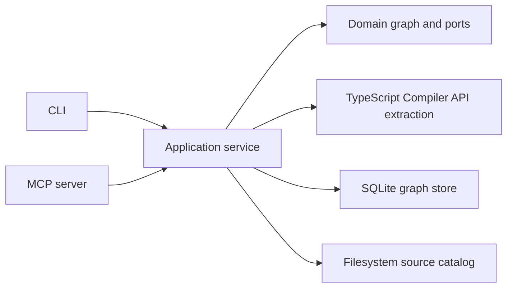

<div align="center">

# SymbolLattice

**Evidence-first local code graph exploration for TypeScript and JavaScript.**


[](LICENSE)

[Quick start](#quick-start) · [Commands](#command-reference) · [MCP](#mcp-server) · [Contributing](#contributing)

</div>

> [!IMPORTANT]
> SymbolLattice is an early v0.1 developer tool. Install and run it from source today; it is not published to npm yet.

SymbolLattice turns a local TypeScript or JavaScript project into a queryable graph of symbols and relationships. It is designed to make uncertainty visible: every resolved edge carries a resolution kind and confidence, while unresolved references remain available for inspection instead of becoming false graph links.

## Why SymbolLattice?

- **Evidence before inference** — distinguish `exact`, `heuristic`, and `unresolved` relationships.
- **Local and explicit** — create or refresh an index only when you ask; no watcher, daemon, or telemetry in v0.1.
- **Agent-safe MCP** — one read-only `symbol_lattice_explore` tool that never changes an index.
- **Useful graph questions** — find symbols, inspect callers and callees, trace reverse impact, and retrieve source evidence.

## Quick start

### Requirements

- Node.js `>=22.13 <25`
- npm

```bash
git clone https://github.com/HsinPu/symbol-lattice.git
cd symbol-lattice
npm install
npm run build

# Create a local SQLite index for the project you want to inspect.
node dist/cli/main.js init /path/to/your-project
```

On Windows, use `npm.cmd` if your shell does not resolve `npm` directly.

The index is stored inside the inspected project at `.symbol-lattice/index.sqlite`. `init` performs the first full index; `index` and `sync` are explicit full refreshes in v0.1.

> [!WARNING]
> SymbolLattice refuses to index a filesystem root or home directory unless you deliberately pass `--force`.

## What it understands

| Area | v0.1 support |
| --- | --- |
| Source files | TypeScript, TSX, JavaScript, and JSX |
| Symbols | Files, classes, functions, methods, interfaces, types, and variables |
| Relationships | `contains`, relative-module `imports` / `exports`, and direct identifier `calls` |
| Default exports | Named declarations, existing-symbol exports, and direct callable expressions |
| Storage | Local SQLite with deterministic snapshot replacement |
| Evidence | Source ranges, reference names, resolution kind, confidence, and stale-index status |

### Resolution contract

| Kind | Meaning |
| --- | --- |
| `exact` | Proven locally or through an explicit import/export binding |
| `heuristic` | Conservative unique-name inference; never presented as proof |
| `unresolved` | Preserved for inspection, but excluded from callers, callees, and impact paths |

## Command reference

All data-returning v0.1 CLI commands emit stable, pretty JSON. `--json` is retained as a forward-compatible flag for scripts; `serve --mcp` runs the long-lived stdio protocol instead.

| Command | Purpose |
| --- | --- |
| `init [path]` | Create the local database and perform the first index |
| `index [path]` | Explicitly rebuild the complete graph |
| `sync [path]` | Explicitly refresh the complete graph |
| `status [path]` | Report index state and source staleness |
| `find <query>` / `query <query>` | Search symbols by name, qualified name, ID, or location |
| `callers <symbol>` / `callees <symbol>` | Show direct graph relationships |
| `impact <symbol>` | Trace reverse impact with an optional `--depth` |
| `explore <query>` | Return a symbol, source evidence, and nearby graph context |
| `serve --mcp` | Start the stdio MCP server |

```bash
# Search an indexed project.
node dist/cli/main.js find add --project /path/to/your-project

# Resolve a symbol by qualified name and inspect its callers.
node dist/cli/main.js callers "src/math.ts#add" --project /path/to/your-project

# Follow reverse impact two hops deep.
node dist/cli/main.js impact "src/math.ts#add" --depth 2 --project /path/to/your-project

# See every available option.
node dist/cli/main.js --help
```

A symbol reference can be a qualified name such as `src/math.ts#add`, a symbol ID, an unambiguous simple name, or a `relative/path.ts:line[:column]` location.

## MCP server

Build SymbolLattice and initialize the target project before starting MCP:

```bash
node dist/cli/main.js serve --mcp --project /path/to/your-project
```

The server exposes exactly one stdio tool:

| Tool | Contract |
| --- | --- |
| `symbol_lattice_explore` | Read-only and idempotent; explores an existing index and returns actionable guidance when no index exists |

This is intentional: MCP never initializes, refreshes, or mutates an index on an agent's behalf.

## Architecture



```text
src/
├── application/     Use cases and orchestration
├── cli/             Commander-based CLI
├── domain/          Graph rules, traversal, IDs, and contracts
├── extraction/      TypeScript Compiler API facts
├── infrastructure/  Filesystem and SQLite adapters
├── mcp/             Read-only MCP server
└── ports/           Dependency boundaries
```

## Deliberate v0.1 boundaries

SymbolLattice favors trustworthy, inspectable results over broad static-analysis claims. It does **not** yet provide:

- Watchers, daemon mode, or automatic sync
- Dynamic dispatch, callbacks, `require`, path aliases, decorators, framework routes, or reflection
- Parsers beyond TS/TSX/JS/JSX, native kernels, workers, telemetry, or multi-project routing
- More than one MCP tool

## Development

```bash
npm run check
npm test
npm run build
npm pack --dry-run
```

The test suite covers extraction, default-export resolution, SQLite replacement semantics, stale detection, caller/callee/impact traversal, source evidence, architecture boundaries, and the MCP contract.

## Contributing

Issues and focused pull requests are welcome. Please keep changes small, preserve the explicit resolution contract, and include tests for observable graph behavior.

Before opening a pull request, run the commands in [Development](#development). For a proposed capability that crosses a v0.1 boundary, open an issue first so its confidence and safety model can be agreed on.

## License

Distributed under the [MIT License](LICENSE).

## Links

- [Repository](https://github.com/HsinPu/symbol-lattice)
- [Issues](https://github.com/HsinPu/symbol-lattice/issues)
- [Pull requests](https://github.com/HsinPu/symbol-lattice/pulls)
