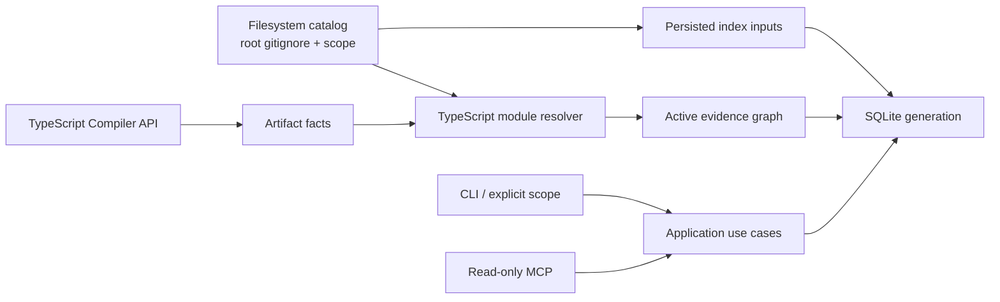

<div align="center">

# SymbolLattice

**An evidence-first, local code-intelligence platform for TypeScript and JavaScript.**

[](https://github.com/HsinPu/symbol-lattice/tags)


[](LICENSE)

[Quick start](#quick-start) · [Commands](#command-reference) · [Configuration contract](#configuration-contract) · [MCP](#mcp-server) · [Architecture](#architecture) · [Roadmap](#roadmap)

</div>

> [!IMPORTANT]
> **v0.2.1 — Configuration-aware scope** is an early developer release. It runs from source and is not published to npm.

SymbolLattice turns a local project into a queryable symbol graph without hiding uncertainty. It keeps raw syntax facts, makes index refresh explicit, and records why each graph edge was resolved. v0.2.1 also preserves the project inputs that determine scope and TypeScript module aliases, so configuration-only edits cannot silently leave an apparently-current graph behind.

## Why SymbolLattice?

- **Evidence-first** — resolved graph edges retain their rule, stage, considered symbols, and (for configured aliases) the configuration files that participated.
- **Configuration-aware** — root `.gitignore`, selected `tsconfig.json` or `jsconfig.json`, local `extends` files, and effective scope are fingerprinted with the active graph generation.
- **Local and explicit** — only `init`, `index`, and `sync` write an index. There is no watcher, daemon, telemetry, or implicit rebuild.
- **Agent-safe MCP** — MCP tools are read-only and idempotent; they report freshness instead of creating or refreshing data.

## Quick start

### Requirements

- Node.js `>=22.13 <25`
- npm

```bash
git clone https://github.com/HsinPu/symbol-lattice.git
cd symbol-lattice
npm install
npm run build

# Create an index for the project you want to inspect.
node dist/cli/main.js init /path/to/your-project

# Explain a stored relationship after indexing.
node dist/cli/main.js explain-edge "edge:<edge-id>" --project /path/to/your-project
```

On Windows, use `npm.cmd` when `npm` is not available directly in your shell.

The index lives in the inspected project at `.symbol-lattice/index.sqlite`. `init`, `index`, and `sync` deliberately perform a complete, atomic rebuild in v0.2.1.

> [!WARNING]
> SymbolLattice refuses to index a filesystem root or home directory unless you deliberately pass `--force`.

### Upgrade an existing index

v0.1 and v0.2 snapshots remain readable. Run one explicit `sync` after upgrading to v0.2.1: it stores the active generation's scope/configuration identity and upgrades legacy database schema data without inventing old provenance. Until then, `status` reports `configuration-untracked` rather than claiming configuration freshness.

## What it understands

| Area | v0.2.1 support |
| --- | --- |
| Source files | TypeScript, TSX, JavaScript, and JSX |
| Project scope | Project root by default, or repeatable persisted `--scope` directories |
| Ignore policy | Root `.gitignore` with negation; `.git`, `.symbol-lattice`, `coverage`, `dist`, and `node_modules` are always excluded |
| Symbols | Files, classes, functions, methods, interfaces, types, and variables |
| Relationships | `contains`, imports/exports, and direct identifier calls |
| Module resolution | Relative imports plus TypeScript/JavaScript `baseUrl` and `paths` aliases |
| Storage | Local SQLite, atomic active-generation replacement, raw artifact facts, edge evidence, and generation-bound index inputs |
| Freshness | Source hashes plus configuration/scope fingerprint with actionable stale reasons |

### Resolution contract

| Kind | Meaning |
| --- | --- |
| `exact` | Proven locally or through an explicit import/export binding |
| `heuristic` | Conservative unique-name inference; never presented as proof |
| `unresolved` | Preserved for inspection, but excluded from callers, callees, and impact paths |

### Evidence stages

| Stage | Meaning |
| --- | --- |
| `syntax` | A direct AST relationship such as containment |
| `lexical` | A source-local binding proved the target |
| `module` | A project module/import/export rule proved the target |
| `heuristic` | A bounded unique-name inference supplied the target |
| `unresolved` | The resolver could not prove one target |
| `legacy` | A v0.1 snapshot is still queryable but has no newly captured evidence |

## Configuration contract

### Scope and ignore policy

```bash
# Index only these project-relative directories.
node dist/cli/main.js init /path/to/project --scope src --scope packages/core

# Reuse that persisted scope on a later refresh.
node dist/cli/main.js sync /path/to/project

# Deliberately replace the stored scope.
node dist/cli/main.js sync /path/to/project --scope src
```

- `--scope` is repeatable, normalized to project-relative directories, deduplicated, and persisted with the successful generation.
- When no new `--scope` is supplied, `index` and `sync` reuse the last successful scope. A first index defaults to `.`.
- Only the project's root `.gitignore` controls discovery in this release. Its negation rules are honored; nested `.gitignore` files intentionally do not change the policy yet.
- Hard-excluded tool/build directories can never be re-included by a negation rule.

### TypeScript and JavaScript aliases

SymbolLattice selects a root `tsconfig.json` first, then a root `jsconfig.json` when no `tsconfig.json` exists. It uses the TypeScript compiler API for `compilerOptions.baseUrl` and `compilerOptions.paths`, while accepting a target only when it is one of the currently indexed project source files.

- A selected config may use a **project-local** relative `extends` chain; every participating file is persisted in edge evidence and the freshness fingerprint.
- Invalid config syntax, cycles, missing local `extends`, and external/package `extends` fail explicitly as `INVALID_PROJECT_CONFIGURATION`; an existing graph remains intact.
- TypeScript `files`, `include`, and `exclude` do not silently redefine source discovery. Scope and root `.gitignore` remain the sole discovery contract in v0.2.1.
- Changing a tracked config file, the root `.gitignore`, or the effective scope makes `status` stale with `project-inputs-changed`; malformed current configuration reports `configuration-invalid`.

## Command reference

All data-returning commands emit stable, pretty JSON. `--json` remains a forward-compatible flag for scripts; `serve --mcp` runs the long-lived stdio protocol.

| Command | Purpose |
| --- | --- |
| `init [path]` | Create the local database and build the first graph generation |
| `index [path]` | Explicitly rebuild the complete graph |
| `sync [path]` | Explicitly refresh the complete graph |
| `status [path]` | Report active generation, source/configuration freshness, and stale reasons |
| `find <query>` / `query <query>` | Search symbols by name, qualified name, ID, or location |
| `callers <symbol>` / `callees <symbol>` | Show direct graph relationships |
| `impact <symbol>` | Trace reverse impact with an optional `--depth` |
| `explore <query>` | Return a symbol, source evidence, and nearby graph context |
| `explain-edge <edge-id>` | Explain a stored relationship and its resolution evidence |
| `serve --mcp` | Start the stdio MCP server |

`init`, `index`, and `sync` also accept `--scope <directory>` (repeatable) and `--force`. Supplying `--scope` replaces the previous successful scope; omitting it reuses the stored scope when one exists.

```bash
# Search an indexed project.
node dist/cli/main.js find add --project /path/to/your-project

# Resolve a symbol by qualified name and inspect its callers.
node dist/cli/main.js callers "src/math.ts#add" --project /path/to/your-project

# Follow reverse impact two hops deep.
node dist/cli/main.js impact "src/math.ts#add" --depth 2 --project /path/to/your-project

# Inspect why a graph edge exists. Obtain an edge ID from callers, callees,
# impact, explore, or another JSON query result.
node dist/cli/main.js explain-edge "<edge-id>" --project /path/to/your-project
```

A symbol reference can be a qualified name such as `src/math.ts#add`, a symbol ID, an unambiguous simple name, or a `relative/path.ts:line[:column]` location.

## MCP server

Build SymbolLattice and initialize the target project before starting MCP:

```bash
node dist/cli/main.js serve --mcp --project /path/to/your-project
```

The server exposes read-only tools only:

| Tool | Contract |
| --- | --- |
| `symbol_lattice_explore` | Finds a symbol and returns source, callers, callees, impact, and freshness from an existing index |
| `symbol_lattice_explain_edge` | Returns the relationship, endpoints, resolution evidence, and freshness from an existing index |

Neither MCP tool initializes, refreshes, or otherwise mutates an index.

## Architecture



```text
src/
├── application/     Use cases and orchestration
├── cli/             Commander-based CLI
├── domain/          Graph, fact, evidence, identity, and traversal contracts
├── extraction/      TypeScript Compiler API adapter
├── infrastructure/  Filesystem, TypeScript resolver, and SQLite adapters
├── mcp/             Read-only MCP server
└── ports/           Dependency boundaries
```

## Deliberate v0.2.1 boundaries

SymbolLattice now has configuration-aware source scope and aliases, but it does **not** yet provide:

- Automatic sync, watchers, daemon mode, worker pools, or incremental updates
- Workspaces/project references, re-export semantics, CommonJS `require`, decorators, framework routes, reflection, or dynamic dispatch
- Nested `.gitignore`, package/external TypeScript `extends`, parsers beyond TS/TSX/JS/JSX, native kernels, telemetry, or multi-project routing
- Historical graph generations, Git semantic diff, or full-text search

## Roadmap

| Milestone | Focus |
| --- | --- |
| `v0.2.1` | Configuration-aware scope and TypeScript path-alias resolution |
| `v0.3` | Workspace/re-export semantics, dependency invalidation, and incremental sync |
| `v0.4` | Full-text search, multi-symbol context, impact queries, and richer MCP retrieval |
| `v0.5+` | Opt-in watcher/daemon, language adapters, framework packs, Git semantic diff, and contract graphs |

See [CHANGELOG.md](CHANGELOG.md) for shipped versions and migration notes.

## Development

```bash
npm.cmd run check
npm.cmd test
npm.cmd run build
npm.cmd pack --dry-run
git diff --check
```

The suite covers discovery scope, root ignore policy, configuration fingerprints, alias resolution evidence, invalid-configuration safety, artifact facts, v1/v2/v3 SQLite migration, active-generation replacement, freshness, traversal, MCP read-only behavior, and architecture boundaries.

## Contributing

Issues and focused pull requests are welcome. Please keep each change small, preserve the explicit indexing and resolution contracts, and add tests for observable graph behavior.

Before opening a pull request, run the commands in [Development](#development). For a capability that crosses a documented boundary, open an issue first so its evidence, confidence, and safety model can be agreed on.

## License

Distributed under the [MIT License](LICENSE).

## Links

- [Repository](https://github.com/HsinPu/symbol-lattice)
- [Issues](https://github.com/HsinPu/symbol-lattice/issues)
- [Pull requests](https://github.com/HsinPu/symbol-lattice/pulls)
- [Releases and tags](https://github.com/HsinPu/symbol-lattice/tags)
