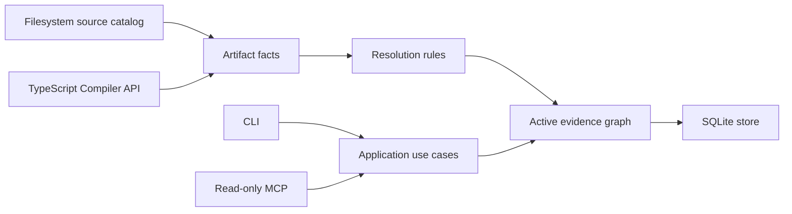

<div align="center">

# SymbolLattice

**A local, evidence-first code-intelligence platform for TypeScript and JavaScript.**

[](https://github.com/HsinPu/symbol-lattice/tags)


[](LICENSE)

[Quick start](#quick-start) · [Commands](#command-reference) · [MCP](#mcp-server) · [Architecture](#architecture) · [Roadmap](#roadmap)

</div>

> [!IMPORTANT]
> **v0.2.0 — Graph Evidence Foundation** is an early developer release. It runs from source and is not published to npm yet.

SymbolLattice turns a local project into a queryable symbol graph without hiding uncertainty. It preserves the syntax facts used to build a graph, attaches evidence to newly resolved relationships, and keeps indexing explicit: agents can query an existing index, but never create or refresh one implicitly.

## Why SymbolLattice?

- **Explainable relationships** — new graph edges record the rule, resolution stage, and considered symbol candidates behind the result.
- **Durable artifact facts** — local bindings, import/export bindings, reference scopes, and structural facts are stored with the active graph generation.
- **Local and explicit** — `init`, `index`, and `sync` are the only operations that write an index; there is no watcher, daemon, telemetry, or network dependency.
- **Agent-safe MCP** — MCP tools are read-only, idempotent, and report index freshness rather than silently rebuilding data.

## Quick start

### Requirements

- Node.js `>=22.13 <25`
- npm

```bash
git clone https://github.com/HsinPu/symbol-lattice.git
cd symbol-lattice
npm install
npm run build

# Create an index for the project you want to inspect.
node dist/cli/main.js init /path/to/your-project

# Explain a relationship after indexing.
node dist/cli/main.js explain-edge "edge:<edge-id>" --project /path/to/your-project
```

On Windows, use `npm.cmd` when `npm` is not available directly in your shell.

The index is stored in the inspected project at `.symbol-lattice/index.sqlite`. `init`, `index`, and `sync` intentionally perform complete, atomic rebuilds in v0.2.0.

> [!WARNING]
> SymbolLattice refuses to index a filesystem root or home directory unless you deliberately pass `--force`.

### Upgrading an existing v0.1 index

v0.1 snapshots remain readable. Run one explicit `sync` after upgrading to create the active v0.2.0 generation, persist raw artifact facts, and attach evidence to newly built edges.

## What it understands

| Area | v0.2.0 support |
| --- | --- |
| Source files | TypeScript, TSX, JavaScript, and JSX |
| Symbols | Files, classes, functions, methods, interfaces, types, and variables |
| Relationships | `contains`, relative-module `imports` / `exports`, and direct identifier `calls` |
| Default exports | Named declarations, existing-symbol exports, and direct callable expressions |
| Storage | Local SQLite, active graph generation, atomic full replacement |
| Durable facts | Symbols, structural edges, pending references, local bindings, import bindings, export bindings, and reference scopes |
| Evidence | Rule ID, resolution stage, candidate symbols, source range, resolution kind, confidence, and freshness |

### Resolution contract

| Kind | Meaning |
| --- | --- |
| `exact` | Proven locally or through an explicit import/export binding |
| `heuristic` | Conservative unique-name inference; never presented as proof |
| `unresolved` | Preserved for inspection, but excluded from callers, callees, and impact paths |

### Evidence stages

| Stage | Meaning |
| --- | --- |
| `syntax` | A direct AST relationship such as containment |
| `lexical` | A source-local binding proved the target |
| `module` | A project module/import/export rule proved the target |
| `heuristic` | A bounded unique-name inference supplied the target |
| `unresolved` | The resolver could not prove one target |
| `legacy` | A v0.1 snapshot is still queryable but has no newly captured evidence |

## Command reference

All data-returning commands emit stable, pretty JSON. `--json` remains a forward-compatible flag for scripts; `serve --mcp` runs the long-lived stdio protocol.

| Command | Purpose |
| --- | --- |
| `init [path]` | Create the local database and build the first graph generation |
| `index [path]` | Explicitly rebuild the complete graph |
| `sync [path]` | Explicitly refresh the complete graph |
| `status [path]` | Report index state, active generation, and source staleness |
| `find <query>` / `query <query>` | Search symbols by name, qualified name, ID, or location |
| `callers <symbol>` / `callees <symbol>` | Show direct graph relationships |
| `impact <symbol>` | Trace reverse impact with an optional `--depth` |
| `explore <query>` | Return a symbol, source evidence, and nearby graph context |
| `explain-edge <edge-id>` | Explain a stored relationship and its resolution evidence |
| `serve --mcp` | Start the stdio MCP server |

```bash
# Search an indexed project.
node dist/cli/main.js find add --project /path/to/your-project

# Resolve a symbol by qualified name and inspect its callers.
node dist/cli/main.js callers "src/math.ts#add" --project /path/to/your-project

# Follow reverse impact two hops deep.
node dist/cli/main.js impact "src/math.ts#add" --depth 2 --project /path/to/your-project

# Inspect why a graph edge exists. Obtain an edge ID from callers, callees,
# impact, explore, or another JSON query result.
node dist/cli/main.js explain-edge "<edge-id>" --project /path/to/your-project

# See every available option.
node dist/cli/main.js --help
```

A symbol reference can be a qualified name such as `src/math.ts#add`, a symbol ID, an unambiguous simple name, or a `relative/path.ts:line[:column]` location.

## MCP server

Build SymbolLattice and initialize the target project before starting MCP:

```bash
node dist/cli/main.js serve --mcp --project /path/to/your-project
```

The server exposes read-only tools only:

| Tool | Contract |
| --- | --- |
| `symbol_lattice_explore` | Finds a symbol and returns source, callers, callees, impact, and freshness from an existing index |
| `symbol_lattice_explain_edge` | Returns the relationship, source and target symbols, resolution evidence, and freshness from an existing index |

Neither MCP tool initializes, refreshes, or otherwise mutates an index.

## Architecture



```text
src/
├── application/     Use cases and orchestration
├── cli/             Commander-based CLI
├── domain/          Graph, fact, evidence, identity, and traversal contracts
├── extraction/      TypeScript Compiler API adapter
├── infrastructure/  Filesystem and SQLite adapters
├── mcp/             Read-only MCP server
└── ports/           Dependency boundaries
```

## Deliberate v0.2.0 boundaries

SymbolLattice now has the facts and evidence needed for later scale work, but it does **not** yet provide:

- Automatic sync, watchers, daemon mode, worker pools, or incremental updates
- Path aliases, `require`, decorators, framework routes, reflection, or dynamic dispatch
- Parsers beyond TS/TSX/JS/JSX, native kernels, telemetry, or multi-project routing
- Historical graph generations, Git semantic diff, or full-text search

## Roadmap

| Milestone | Focus |
| --- | --- |
| `v0.2.1` | Configuration-aware scope and TypeScript path-alias resolution |
| `v0.3` | Workspace/re-export semantics, dependency invalidation, and incremental sync |
| `v0.4` | Full-text search, multi-symbol context, impact queries, and richer MCP retrieval |
| `v0.5+` | Opt-in watcher/daemon, language adapters, framework packs, Git semantic diff, and contract graphs |

See [CHANGELOG.md](CHANGELOG.md) for shipped versions and migration notes.

## Development

```bash
npm.cmd run check
npm.cmd test
npm.cmd run build
npm.cmd pack --dry-run
git diff --check
```

The suite covers extraction, resolution, evidence, artifact-fact persistence, active-generation replacement, staleness, caller/callee/impact traversal, MCP read-only behavior, and architecture boundaries.

## Contributing

Issues and focused pull requests are welcome. Please keep each change small, preserve the explicit indexing and resolution contracts, and add tests for observable graph behavior.

Before opening a pull request, run the commands in [Development](#development). For a capability that crosses a documented boundary, open an issue first so its evidence, confidence, and safety model can be agreed on.

## License

Distributed under the [MIT License](LICENSE).

## Links

- [Repository](https://github.com/HsinPu/symbol-lattice)
- [Issues](https://github.com/HsinPu/symbol-lattice/issues)
- [Pull requests](https://github.com/HsinPu/symbol-lattice/pulls)
- [Releases and tags](https://github.com/HsinPu/symbol-lattice/tags)
