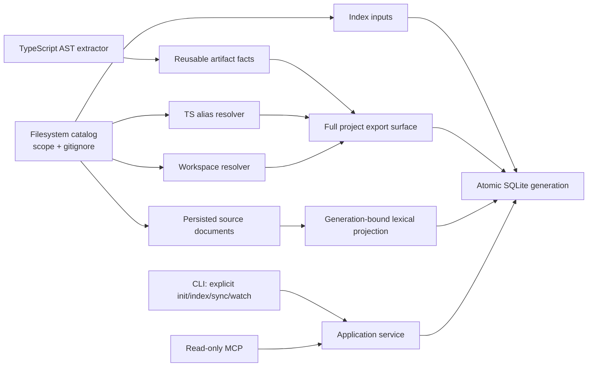

<div align="center">

# SymbolLattice

**Evidence-first local code intelligence for TypeScript and JavaScript projects.**

[](https://github.com/HsinPu/symbol-lattice/tags)
[](https://nodejs.org/)
[](https://www.typescriptlang.org/)
[](LICENSE)

[Quick start](#quick-start) | [Auto sync](#opt-in-foreground-watch) | [Affected tests](#affected-test-evidence) | [Context packs](#bounded-multi-symbol-context) | [Commands](#command-reference) | [MCP](#mcp-server) | [Architecture](#architecture) | [Roadmap](#roadmap)

</div>

> [!IMPORTANT]
> **v0.8.0** is an early developer release. This public repository runs from source; its npm package is intentionally private and is not published to npm.

SymbolLattice builds a local symbol graph without hiding uncertainty. It keeps syntax-proven artifact facts, resolves cross-file relationships conservatively, and records why every resolved edge exists. The graph stays local to the inspected project under `.symbol-lattice/index.sqlite`.

## Why SymbolLattice?

- **Evidence-first** - resolved edges retain a rule ID, resolution stage, considered symbols, relevant configuration paths, and re-export route when applicable.
- **Safe freshness** - source hashes and project inputs are stored with each active generation; `status` reports drift instead of silently rebuilding.
- **Workspace-aware** - local npm/Yarn-style workspaces can resolve package roots and explicit subpath exports without reading `node_modules`.
- **Incremental parsing, atomic publication** - `sync` only reparses changed source artifacts when their persisted facts are compatible, then atomically publishes one fresh project graph.
- **Auditable foreground freshness** - opt-in `watch` repeatedly verifies source/configuration freshness, invokes the same atomic `sync` only after drift, and emits one machine-readable receipt per lifecycle event.
- **Generation-bound source evidence** - `search` and exact `explore` results use source captured with the active graph generation, even when the live project has since drifted.
- **Bounded context packs** - ordered symbol references produce persisted source, capped relationship/impact summaries, and static directed evidence paths without guessing ambiguous symbols or dynamic behavior.
- **Affected-test evidence** - changed indexed files map to conventionally named tests through bounded, exact import/export proof paths; explicit paths, `--working-tree`, and `--base <ref>` retain stale, scope, depth, visit, and result limits in the response.
- **Agent-safe MCP** - MCP tools are read-only and never initialize or refresh a project.

## Quick start

### Requirements

- Node.js `>=22.13 <25`
- npm

```bash
git clone https://github.com/HsinPu/symbol-lattice.git
cd symbol-lattice
npm install
npm run build

# Create the first graph for a project.
node dist/cli/main.js init /path/to/project

# Inspect a stored relationship.
node dist/cli/main.js explain-edge "edge:<edge-id>" --project /path/to/project
```

On Windows, use `npm.cmd` if `npm` is not available directly in PowerShell.

> [!WARNING]
> SymbolLattice refuses to index a filesystem root or home directory unless `--force` is supplied deliberately.

### Typical workflow

```bash
# Query symbols after indexing.
node dist/cli/main.js find add --project /path/to/project
node dist/cli/main.js callers "src/math.ts#add" --project /path/to/project
node dist/cli/main.js search "session timeout" --project /path/to/project --path src
node dist/cli/main.js context "src/consumer.ts#calculate" "src/math.ts#add" --project /path/to/project

# Select affected tests from changed files already present in the active generation.
node dist/cli/main.js affected src/math.ts --project /path/to/project
git diff --name-only HEAD | node dist/cli/main.js affected --stdin --project /path/to/project

# Or let SymbolLattice read a local Git change set without fetching or syncing.
node dist/cli/main.js affected --working-tree --project /path/to/project
node dist/cli/main.js affected --base origin/main --project /path/to/project

# Inspect freshness before an explicit update.
node dist/cli/main.js status /path/to/project
node dist/cli/main.js sync /path/to/project

# Or keep an already initialized local graph fresh in this terminal.
node dist/cli/main.js watch /path/to/project
```

One-shot data commands emit stable, pretty JSON. `watch` is the deliberate streaming exception: it emits one compact NDJSON receipt per line. `--json` is retained as a forward-compatible script flag.

## Capabilities

| Area | v0.8.0 behavior |
| --- | --- |
| Source files | TypeScript, TSX, JavaScript, and JSX |
| Scope | Project root by default or repeatable, persisted `--scope` directories |
| Discovery | Root `.gitignore` with negation; `.git`, `.symbol-lattice`, `coverage`, `dist`, and `node_modules` are always excluded |
| Symbols | Files, classes, functions, methods, interfaces, types, and variables |
| Relationships | `contains`, module imports/exports, and direct identifier calls |
| Module resolution | Relative paths, TypeScript/JavaScript `baseUrl` and `paths`, then local workspace packages |
| Workspaces | Root `package.json` workspaces array/object, local package root/subpath `exports`, and entrypoint fallback |
| Re-exports | Named aliases, `export *`, default-through-named aliases, and namespace-export provenance |
| Retrieval | Local deterministic FTS5 search across persisted source text and identifier parts; bounded path/language filters, source/symbol evidence, and exact `explore` excerpts from the same active generation |
| Context | Bounded packs for 1–8 ordered references: exact-match source excerpts, capped callers/callees and reverse impact, plus shortest static directed evidence paths between adjacent exact references |
| Affected tests | Explicit changed files or local Git change sets feed exact persisted `imports` / `exports` paths, deterministic proof paths, conventional test-path classification, and explicit completeness limits |
| Storage | Local SQLite v4 metadata with additive generation-bound source retrieval tables, raw artifact facts, edge evidence, index inputs, and index-work telemetry |
| Freshness | Source hashes, configuration/workspace manifest fingerprints, extractor/resolver versions, and actionable stale reasons |
| Foreground watch | Explicit polling monitor with compact NDJSON receipts, bounded retry/backoff, and the existing atomic incremental `sync` |

### Resolution contract

| State | Meaning |
| --- | --- |
| `exact` | Proven by syntax, lexical binding, explicit import, workspace package, or re-export surface |
| `heuristic` | Conservative unique-name inference; useful but never presented as proof |
| `unresolved` | Kept for inspection but excluded from callers, callees, and impact paths |

For an exact call that travels through a barrel, evidence uses `module.reexported-import-binding` and includes a `resolutionPath`, for example:

```json
{
  "ruleId": "module.reexported-import-binding",
  "resolutionPath": [
    "apps/web/src/consumer.ts",
    "packages/core/src/index.ts",
    "packages/core/src/math.ts"
  ]
}
```

### Indexed source search

`find` and `query` resolve graph symbols by name, qualified name, ID, or location. `search` is a separate retrieval command: it searches only the source text and identifier-part corpus captured with the active graph generation.

```bash
# Prefix-style lexical retrieval. All query terms must match the indexed corpus.
node dist/cli/main.js search "fetch response" --project /path/to/project

# Restrict persisted results without reading the live source tree.
node dist/cli/main.js search "session timeout" --project /path/to/project \
  --path src/server --language typescript --limit 10
```

Search accepts letters, numbers, and identifier fragments; punctuation is treated as text separation rather than query syntax, and common diacritics fold consistently with local FTS (`café` can match `cafe`). Each result includes its deterministic rank, file and language, persisted source range/excerpt, terms found directly in source, an explanation, and zero or more overlapping declaration candidates.

> [!NOTE]
> `status` is evaluated against the live project, but `search.results` always come from the persisted active generation. If a file changes after indexing, search can truthfully return `stale: true` while still showing the older indexed excerpt. Run `sync` or `index` to publish newer evidence.

### Generation-bound exploration

For an exact symbol match, `explore` returns its excerpt from the same active generation as its graph relationships and ranges. It never substitutes the current file contents. This means a changed or deleted live file can produce `stale: true` while the response still carries the older, internally consistent evidence.

The bundled service supplies `sourceAvailability` to make that contract explicit:

- `active-generation` — `source` is immutable persisted evidence from the active generation.
- `unavailable` — the graph is still queryable, but an older adapter or legacy generation cannot supply persisted source text; `source` is `null` and SymbolLattice does not fall back to the live filesystem.
- `not-applicable` — the reference was ambiguous or not found, so there is no exact symbol source to return.

The field is additive: an external legacy `ExploreService` embedding may omit it rather than making a provenance claim it cannot support.

### Bounded multi-symbol context

`context` is a separate, additive view for reading a small, explicit set of related symbols. It does not replace the single-symbol `explore` contract.

```bash
node dist/cli/main.js context \
  "src/consumer.ts#calculate" \
  "src/math.ts#add" \
  --project /path/to/project
```

The input accepts **1–8 ordered references**. Each result preserves the normal `exact`, `ambiguous`, or `not_found` match rather than selecting an ambiguous candidate. Ambiguous candidate lists cap at 25 and set `matchCandidatesTruncated` when more persisted candidates exist. Exact matches include a persisted source excerpt when the active generation can supply it, bounded direct callers/callees, and bounded reverse-impact paths.

Adjacent exact references are also checked as a directed static route in the supplied order. A returned `path` is the deterministic shortest path through **exact** `calls` or `imports` edges only. SymbolLattice never reverses an edge, treats a heuristic edge as proof, or fabricates a dynamic-dispatch hop. Each pair reports one of `path`, `same-symbol`, `no-path`, `not-applicable`, or `truncated`.

| Option | Default | Range | Effect |
| --- | ---: | ---: | --- |
| Match candidates | `25` | fixed | Cap candidates returned for each ambiguous reference and report `matchCandidatesTruncated` |
| `--relation-limit` | `8` | `1–25` | Cap direct callers and callees per exact symbol |
| `--max-hops` | `4` | `1–6` | Cap directed evidence-path hops for each adjacent pair |
| `--impact-depth` | `2` | `1–3` | Cap reverse dependency depth per exact symbol |
| `--impact-limit` | `8` | `1–25` | Cap reverse-impact paths per exact symbol |

Each context response includes the applied `bounds`, per-section `truncated` flags, and a fixed per-path traversal budget. This makes response size and omitted evidence explicit instead of silently ranking or dropping data.

> [!NOTE]
> Context uses the same active-generation source-document bundle as its graph data. With an older `GraphStore` adapter or legacy generation, exact graph context remains available with `sourceAvailability: "unavailable"`; SymbolLattice never reads the live file as a substitute.

### Affected test evidence

`affected` turns changed source files into a bounded test-selection report. Supply one or more paths directly, pipe a file list into `--stdin`, or select the files with a local read-only Git change set.

```bash
# One or more project-relative files. Absolute paths are normalized to the project.
node dist/cli/main.js affected src/math.ts src/http/client.ts --project /path/to/project

# Keep Git selection caller-owned when that fits an existing CI pipeline.
git diff --name-only HEAD | node dist/cli/main.js affected --stdin --project /path/to/project

# Compare HEAD with the staged/unstaged working tree and untracked files.
node dist/cli/main.js affected --working-tree --project /path/to/project

# Compare the local merge-base of origin/main and HEAD. This does not fetch.
node dist/cli/main.js affected --base origin/main --project /path/to/project
```

#### Local Git selection

`--working-tree` resolves the local `HEAD`, compares it with the staged and unstaged working tree, and adds untracked files that are not ignored. `--base <ref>` resolves the supplied **local** ref, finds `merge-base(<ref>, HEAD)`, and compares that merge base with `HEAD`; it intentionally excludes uncommitted and untracked work.

The two Git modes are mutually exclusive and cannot be combined with explicit paths or `--stdin`. They require a repository with a resolvable `HEAD`. Git is run with argv-only process execution, `--no-ext-diff`, and `--no-textconv`; SymbolLattice never fetches, commits, stages, initializes, indexes, or syncs as part of this query.

Git output is preserved under `changeSet.changes`, including non-source files and both sides of renames or copies. Only supported TypeScript/JavaScript paths outside `.git`, `.symbol-lattice`, `coverage`, `dist`, and `node_modules` become `changeSet.sourcePaths`; those paths are capped at `50` and are the only inputs sent to graph analysis. If a Git change set has no supported source paths, the response returns its provenance with `affected: null` rather than inventing an empty graph traversal.

> [!CAUTION]
> Git selection is **file-level**, not semantic Git diff. It does not map hunks to declarations, infer runtime behavior, or run a test runner. A base comparison may also be stale relative to the active graph generation; use the returned freshness and completeness fields before treating the selected tests as complete.

For each changed file that exists in the active generation, SymbolLattice walks reverse **exact** `imports` and `exports` edges. This includes barrel re-exports and returns one deterministic proof path from the changed file to each selected test. A changed test file itself is included with a zero-edge `changed-test` path.

Test files are classified conservatively from their indexed paths: `*.test.*`, `*.spec.*`, and `*.e2e.*`, plus files under `__tests__/`, `test/`, `tests/`, `spec/`, or `e2e/`. This is static path convention, not test-runner discovery.

| Bound | Default | Range | Effect |
| --- | ---: | ---: | --- |
| Changed source paths | `50` | `1-50` explicit; `0-50` from Git | Rejects oversized input lists instead of silently dropping files |
| `--depth` | `5` | `1-8` | Caps reverse exact import/export hops per changed indexed file |
| `--limit` | `25` | `1-100` | Caps returned proof-bearing test records |
| Visited files | `500` | fixed | Caps traversal work independently for each changed indexed file |

An explicit-path report always includes `inputs.indexed`, `inputs.notIndexed`, the test-path classification, proof path, `indexScope`, and `completeness`. A Git-selected report wraps that report in `affected` and adds immutable `changeSet` provenance. `completeForActiveGeneration` is true only when the active generation is fresh, every requested path was indexed, and no depth, visit, or result cap omitted evidence. It is never a claim that unindexed source roots, runtime-discovered tests, dynamic dispatch, or unsupported languages are fully covered.

> [!NOTE]
> The graph proof is always read from the active persisted generation. As with other query commands, freshness is evaluated against the live project so a stale index is visible rather than silently refreshed.

### Workspace resolution

SymbolLattice recognizes local workspace packages declared by the root `package.json`:

```json
{
  "private": true,
  "workspaces": ["packages/*"]
}
```

It also accepts `{ "workspaces": { "packages": [...] } }`, recursive `**` patterns, and `!` exclusions. Resolution order is:

1. Relative source path.
2. TypeScript/JavaScript `paths` or `baseUrl` alias.
3. Local workspace package name and explicit subpath export.
4. Unresolved.

Workspace targets must already be inside the active source scope. SymbolLattice never broadens `--scope`, follows `node_modules`, or chooses between duplicate workspace package names. Invalid, escaping, or duplicate manifests fail explicitly before replacing the active graph.

### Re-export semantics

The extractor stores re-export syntax as raw, reusable facts. The resolver then builds a deterministic export surface across the project:

- Local and explicit named exports take precedence over wildcard exports.
- `export *` never forwards `default`.
- Wildcard name collisions remain unresolved rather than selecting the first candidate.
- Cyclic barrels terminate safely; no target is fabricated without a declaration.
- `export * as namespace` is retained as provenance, but namespace property dispatch remains unresolved in this release.

### Incremental sync contract

`init` and `index` perform a complete extraction and graph rebuild. `sync` is explicit and follows this contract:

1. Scan current sources, scope, ignore policy, TypeScript configuration, and workspace manifests.
2. Reuse a persisted raw artifact only when its file path, content hash, language, and extractor version match.
3. Re-extract added, modified, or incompatible artifacts.
4. Compute reverse import/re-export dependency invalidation for observability.
5. Rebuild the full module/export and source-retrieval projections from the current raw facts and scanned source documents.
6. Atomically replace the active generation only after all work succeeds.

The full-project projection in step 5 is intentional: a new export, removed file, barrel change, or configuration change can affect an unchanged caller. `lastIndexWork` reports `reExtractedFiles`, `reusedArtifactFiles`, and `dependencyInvalidatedFiles`; it does **not** claim that resolution was only partial. A no-op `sync` does not create a new generation.

### Opt-in foreground watch

`watch` brings the existing freshness and atomic-sync contract into an explicit foreground process. It is useful while editing locally, but it never starts implicitly from a query, MCP request, or another CLI command.

```bash
# Requires an existing initialized graph. The default poll cadence is 2 seconds.
node dist/cli/main.js watch /path/to/project

# Choose an intentionally slower cadence for a large project (250-60000 ms).
node dist/cli/main.js watch /path/to/project --interval 5000

# A filesystem root or home-directory project still needs deliberate consent.
node dist/cli/main.js watch /path/to/project --force
```

At startup and after each interval, SymbolLattice runs the same live freshness check used by `status`. A fresh generation only produces a `started` receipt; source or project-input drift produces `stale-detected`, followed by the existing `sync` and a `synced` receipt. This means the watch process reuses stored scope and does not expose `--scope`: it cannot quietly replace the scope established by a prior `init`, `index`, or `sync`.

Each stdout line is one compact NDJSON receipt. Every receipt has `event`, `observedAt`, `projectPath`, `status`, `previousGenerationId`, `generationId`, `lastIndexWork`, `error`, and `retryDelayMs`; values that do not apply are explicit `null` rather than omitted. The abbreviated examples below show only the fields relevant to each transition.

```json
{"event":"stale-detected","previousGenerationId":"generation:old","generationId":"generation:old","error":null,"retryDelayMs":null}
{"event":"synced","previousGenerationId":"generation:old","generationId":"generation:new","lastIndexWork":{"mode":"incremental"},"error":null,"retryDelayMs":null}
```

Temporary configuration or filesystem failures emit `sync-failed` or `status-failed` with an actionable error and a bounded exponential retry delay (at most 60000 ms). If the previously active index itself disappears, `watch` emits terminal `status-failed` with `MISSING_INDEX`, exits non-zero, and requires a new explicit `init` before restart. The current active generation remains available through ordinary refresh failures because `sync` publishes only after a successful full-project projection. Press `Ctrl+C` (or send `SIGTERM`) to stop future polls; an in-flight sync is allowed to finish before the final `stopped` receipt.

> [!CAUTION]
> This is a foreground polling monitor, not a daemon or a native filesystem-event watcher. It scans the live catalog at every interval so it can detect source, ignore-policy, TypeScript, and workspace-manifest changes consistently. It does not claim per-file partial resolution, semantic Git diff, or background freshness after the process exits.

## Configuration and scope

```bash
# Index only selected project-relative directories.
node dist/cli/main.js init /path/to/project --scope src --scope packages/core

# Reuse the successful scope later.
node dist/cli/main.js sync /path/to/project

# Replace it deliberately.
node dist/cli/main.js sync /path/to/project --scope src
```

The active generation fingerprints the root `.gitignore`, selected `tsconfig.json` or `jsconfig.json`, project-local `extends` chain, root workspace manifest, discovered workspace manifests, and effective scope. `status` can report:

| Reason | Meaning |
| --- | --- |
| `source-files-changed` | The active source set or source hash differs |
| `project-inputs-changed` | Scope, ignore policy, config, or workspace metadata differs |
| `indexer-version-changed` | Persisted artifacts or projection semantics need an explicit refresh |
| `configuration-invalid` | Current TypeScript or workspace configuration cannot be parsed safely |
| `configuration-untracked` | A legacy generation has no reproducibility identity |

## Command reference

| Command | Purpose |
| --- | --- |
| `init [path]` | Create the local database and build the first full generation |
| `index [path]` | Explicitly perform a full extraction and rebuild |
| `sync [path]` | Explicitly reuse compatible raw facts and publish a fresh graph when needed |
| `watch [path]` | Keep an existing graph fresh in the foreground with `--interval 250-60000`, compact NDJSON receipts, retry/backoff, and `--force` only for deliberate broad paths |
| `status [path]` | Report active generation, freshness, stale reasons, and latest index work |
| `find <query>` / `query <query>` | Search symbols by name, qualified name, ID, or location |
| `search <query>` | Search persisted source and identifier evidence; accepts `--limit`, `--path`, and `--language` |
| `callers <symbol>` / `callees <symbol>` | Show direct graph relationships |
| `impact <symbol>` | Trace reverse impact with optional `--depth` and explicit output `--limit` |
| `affected [filePaths...]` | Select conventionally named tests from exact persisted import/export evidence; accepts direct paths or `--stdin`, plus local Git `--working-tree` or `--base <ref>`, `--depth`, and `--limit` |
| `explore <query>` | Return exact generation-bound source when available, callers, callees, impact, and freshness |
| `context <reference...>` | Build a bounded multi-symbol persisted-evidence pack for 1–8 ordered references |
| `explain-edge <edge-id>` | Explain edge endpoints and resolution evidence |
| `serve --mcp` | Start the stdio MCP server |

`init`, `index`, and `sync` accept repeatable `--scope <directory>` plus `--force`. `watch` deliberately has no `--scope`: it reuses the active generation's persisted scope.

## MCP server

Build SymbolLattice and initialize the target project first:

```bash
node dist/cli/main.js serve --mcp --project /path/to/project
```

| Tool | Contract |
| --- | --- |
| `symbol_lattice_explore` | Return generation-bound source when available, callers, callees, impact, freshness, and structured output for an existing graph |
| `symbol_lattice_context` | Return bounded generation-bound source, relationships, reverse impact, and directed proof paths for ordered references without refreshing an index |
| `symbol_lattice_affected` | Return bounded affected-test proofs for changed files, index coverage, and completeness limits without refreshing an index |
| `symbol_lattice_affected_git` | Read a local Git working-tree or merge-base change set, then return its provenance and bounded affected-test proofs without fetching, refreshing, or synchronizing an index |
| `symbol_lattice_search` | Return persisted source evidence, declaration candidates, and freshness without refreshing an index |
| `symbol_lattice_explain_edge` | Return an edge, endpoints, evidence, and freshness for an existing graph |

None of these tools initializes, refreshes, starts a watcher, or otherwise mutates an index. `symbol_lattice_affected_git` additionally uses local read-only Git only; it never fetches or updates repository state.

## Upgrade notes

SQLite v1 through v4 indexes remain readable. v0.4 adds generation-bound source documents and an FTS5 projection under the SQLite v4 metadata marker, so a v0.3 binary can still open and reindex after a rollback. A legacy generation has no historical source-search projection, so `search` reports an explicit availability error until a successful `sync` or `index` publishes one. That backfill can reuse compatible v0.3 raw artifact facts; it does not invent historical source evidence or telemetry. v0.4.1 adds no schema migration: when an embedded older GraphStore adapter or legacy active generation cannot supply the persisted source documents, exact `explore` remains graph-queryable with `source: null` and `sourceAvailability: "unavailable"`; it never reads a live file as substitute evidence. v0.5 adds no SQLite migration either: `context` reuses that same optional source-document bundle and keeps exact graph context available with source marked `unavailable` when an older adapter cannot supply it. v0.6 adds no SQLite migration: `affected` only reads the active graph bundle, so compatible legacy GraphStore adapters remain usable; older adapters expose `indexScope: null` instead of a fabricated scope. v0.7 also adds no SQLite migration: ordinary graph queries and explicit-path `affected` remain compatible with older adapters, while Git-selected affected tests are available only when a `GitChangeSetProvider` is injected; the CLI provides the local read-only adapter. v0.8 adds no SQLite migration: `watch` is a foreground CLI lifecycle around the existing status and sync service paths, so older embeddings and the read-only MCP tool surface remain unchanged. A short-lived pre-release marker `5` is normalized to `4` by explicit `sync` or `index` before rollback.

## Architecture



```text
src/
  application/     Use cases, incremental planning, and graph projection
  cli/             Commander-based CLI
  domain/          Graph, evidence, identity, and index-work contracts
  extraction/      TypeScript AST fact extraction
  infrastructure/  Filesystem, workspace, TypeScript, and SQLite adapters
  mcp/             Read-only MCP server
  ports/           Dependency boundaries
```

## Deliberate boundaries

v0.8.0 does not yet provide:

- Daemon mode, native filesystem-event watching, background automatic sync, cross-process watch coordination, worker pools, or historical graph generations.
- pnpm workspace YAML, TypeScript project references, external/package `extends`, or nested `.gitignore` semantics.
- CommonJS `require`, dynamic dispatch, decorators, framework routes, reflection, or namespace property-call resolution.
- Parsers beyond TS/TSX/JS/JSX, external dependency indexing, telemetry, or multi-project routing.
- Embedding-based or cloud retrieval, semantic ranking, arbitrary natural-language context assembly, historical source browsing, semantic Git diff, or hunk-to-symbol mapping.

## Roadmap

| Milestone | Focus |
| --- | --- |
| `v0.3.0` | Workspace packages, AST re-exports, dependency-aware incremental parsing, and schema v4 telemetry |
| `v0.4.0` | Generation-bound FTS5 source retrieval, source/symbol evidence, CLI search, and structured read-only MCP retrieval |
| `v0.4.1` | Generation-bound exact exploration source, explicit source availability, and adapter-safe source-document reads |
| `v0.5.0` | Bounded multi-symbol context, exact static evidence paths, capped relationship/impact context, and explicit `impact --limit` |
| `v0.6.0` | Changed-file affected-test evidence with exact import/export proofs, bounded traversal, explicit index coverage, and read-only MCP support |
| `v0.7.0` | Local Git-aware changed-file selection for working trees or local merge bases, immutable change-set provenance, and read-only MCP support |
| `v0.8.0` | Opt-in foreground freshness watch, compact NDJSON lifecycle receipts, bounded retry/backoff, and atomic incremental synchronization without MCP mutation |
| `v0.9+` | Semantic Git diff and hunk-to-declaration attribution, native event-watch optimization, language adapters, framework packs, and contract graphs |

See [CHANGELOG.md](CHANGELOG.md) for release notes and migration history.

## Development

```bash
npm.cmd run check
npm.cmd test
npm.cmd run build
npm.cmd pack --dry-run
git diff --check
```

The suite covers discovery, input fingerprints, alias and workspace resolution, re-export semantics, exact affected-test proofs and completeness limits, local Git change-set parsing and selection, generation-bound search and exploration source evidence, legacy backfill, stale-source evidence, incremental raw-fact reuse, foreground polling and retry receipts, no-op sync, schema migration, atomic rollback, MCP read-only behavior, CLI parsing, and architecture boundaries.

## Contributing

Issues and focused pull requests are welcome. Keep changes small, preserve explicit indexing and evidence contracts, and add tests for observable graph behavior.

## License

Distributed under the [MIT License](LICENSE).

## Links

- [Repository](https://github.com/HsinPu/symbol-lattice)
- [Issues](https://github.com/HsinPu/symbol-lattice/issues)
- [Pull requests](https://github.com/HsinPu/symbol-lattice/pulls)
- [Releases and tags](https://github.com/HsinPu/symbol-lattice/tags)
