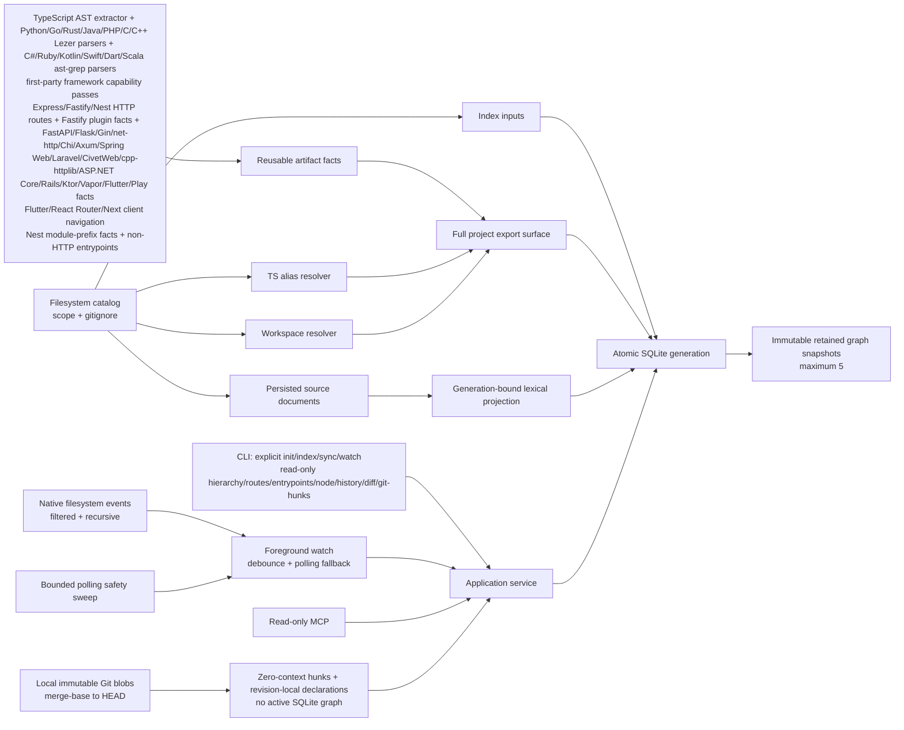

<div align="center">

# SymbolLattice

**Evidence-first local code intelligence for TypeScript, JavaScript, Python, Go, Rust, Java, PHP, C, C++, C#, Ruby, Kotlin, Swift, Dart, and Scala projects.**

[](https://github.com/HsinPu/symbol-lattice/tags)
[](https://nodejs.org/)
[](https://www.typescriptlang.org/)
[](LICENSE)

[Quick start](#quick-start) | [Type hierarchy](#direct-type-hierarchy-evidence) | [Routes](#static-route-and-client-navigation-evidence) | [Nest entrypoints](#nestjs-non-http-entrypoint-evidence) | [Node inspection](#generation-bound-node-inspection) | [History and diff](#retained-graph-history-and-structural-diff) | [Auto sync](#opt-in-foreground-watch) | [Affected tests](#affected-test-evidence) | [Git hunks](#immutable-git-hunk-declaration-attribution) | [Context packs](#bounded-multi-symbol-context) | [Commands](#command-reference) | [MCP](#mcp-server) | [Architecture](#architecture) | [Roadmap](#roadmap) | [Comparison](#release-by-release-feature-comparison)

</div>

> [!IMPORTANT]
> **v0.48.0** is an early developer release. This public repository runs from source; its npm package is intentionally private and is not published to npm.

SymbolLattice builds a local symbol graph without hiding uncertainty. It keeps syntax-proven artifact facts, resolves cross-file relationships conservatively, and records why every resolved edge exists. The graph stays local to the inspected project under `.symbol-lattice/index.sqlite`.

## Why SymbolLattice?

- **Evidence-first** - resolved edges retain a rule ID, resolution stage, considered symbols, relevant configuration paths, and re-export route when applicable.
- **Safe freshness** - source hashes and project inputs are stored with each active generation; `status` reports drift instead of silently rebuilding.
- **Workspace-aware** - local npm/Yarn-style workspaces can resolve package roots and explicit subpath exports without reading `node_modules`.
- **Incremental parsing, atomic publication** - `sync` only reparses changed source artifacts when their persisted facts are compatible, then atomically publishes one fresh project graph.
- **Event-accelerated foreground freshness** - opt-in `watch` uses native filesystem events when the host supports them, exposes bounded pending-path evidence in its own stream, coalesces saves, retains bounded polling as a safety sweep, and invokes the same atomic `sync` only after drift.
- **Generation-bound source evidence** - `search` and exact `explore` results use source captured with the active graph generation, even when the live project has since drifted.
- **Declaration-focused node view** - exact `node` results return the full persisted declaration range plus a bounded declaration body, direct callers/callees, and explicit limits from one active generation without substituting live source text.
- **Static route evidence** - narrow Express, Fastify, NestJS, Python FastAPI/Flask, Go Gin/`net/http`/Chi, Rust Axum, Java Spring Web, PHP Laravel, C CivetWeb, C++ cpp-httplib, C# ASP.NET Core, Ruby Rails, Kotlin Ktor, Swift Vapor, Scala/Java Play HTTP packs, and Flutter, React Router, and Next.js client-navigation routes create first-class `route` nodes and evidence-bearing `routes` edges only when the registration and handler form are statically proven. Literal Play `->` Router mounts are retained separately as evidence-bearing `handles` relationships, never fabricated HTTP endpoints.
- **Non-HTTP transport evidence** - AST-proven NestJS GraphQL, microservice, and WebSocket entrypoints use distinct `entrypoint` nodes and exact `handles` edges, so a message pattern or subscription is never mislabeled as an HTTP route.
- **Direct type-hierarchy evidence** - AST-proven `extends` and `implements` edges preserve value/type namespace proof, type-only imports, re-export provenance, unresolved bases, and bounded direct parent/child views without pretending to have a full type checker.
- **Bounded context packs** - ordered symbol references produce persisted source, capped relationship/impact summaries, and static directed evidence paths without guessing ambiguous symbols or dynamic behavior.
- **Affected-test evidence** - changed indexed files map to conventionally named tests through bounded, exact import/export proof paths; explicit paths, `--working-tree`, and `--base <ref>` retain stale, scope, depth, visit, and result limits in the response.
- **Immutable Git hunk attribution** - `git-hunks` compares a local merge base with `HEAD` through immutable Git blobs, returns zero-context hunks, and anchors declarations independently in each revision without an active graph or a cross-revision identity claim.
- **Retained graph history** - up to five immutable graph generations can be listed and structurally compared without reading Git, live source text, or hidden background state.
- **Agent-safe MCP** - MCP tools are read-only and never initialize or refresh a project.

## Quick start

### Requirements

- Node.js `>=22.13 <25`
- npm

```bash
git clone https://github.com/HsinPu/symbol-lattice.git
cd symbol-lattice
npm install
npm run build

# Create the first graph for a project.
node dist/cli/main.js init /path/to/project

# Inspect a stored relationship.
node dist/cli/main.js explain-edge "edge:<edge-id>" --project /path/to/project
```

On Windows, use `npm.cmd` if `npm` is not available directly in PowerShell.

> [!WARNING]
> SymbolLattice refuses to index a filesystem root or home directory unless `--force` is supplied deliberately.

### Typical workflow

```bash
# Query symbols after indexing.
node dist/cli/main.js find add --project /path/to/project
node dist/cli/main.js callers "src/math.ts#add" --project /path/to/project
node dist/cli/main.js node "src/math.ts#add" --project /path/to/project
node dist/cli/main.js hierarchy "src/models.ts#User" --project /path/to/project --limit 25
node dist/cli/main.js routes /path/to/project --method GET --path /api --limit 20
node dist/cli/main.js routes /path/to/project --method NAVIGATE --path /settings --limit 20
node dist/cli/main.js entrypoints /path/to/project --transport graphql --operation query --name author --limit 20
node dist/cli/main.js search "session timeout" --project /path/to/project --path src
node dist/cli/main.js search "health" --project /path/to/project --language python
node dist/cli/main.js search "health" --project /path/to/project --language go
node dist/cli/main.js search "health" --project /path/to/project --language java
node dist/cli/main.js search "health" --project /path/to/project --language php
node dist/cli/main.js search "health" --project /path/to/project --language c
node dist/cli/main.js search "health" --project /path/to/project --language cpp
node dist/cli/main.js search "health" --project /path/to/project --language csharp
node dist/cli/main.js search "health" --project /path/to/project --language ruby
node dist/cli/main.js search "health" --project /path/to/project --language kotlin
node dist/cli/main.js search "health" --project /path/to/project --language swift
node dist/cli/main.js search "health" --project /path/to/project --language dart
node dist/cli/main.js search "health" --project /path/to/project --language scala
node dist/cli/main.js context "src/consumer.ts#calculate" "src/math.ts#add" --project /path/to/project

# Select affected tests from changed files already present in the active generation.
node dist/cli/main.js affected src/math.ts --project /path/to/project
git diff --name-only HEAD | node dist/cli/main.js affected --stdin --project /path/to/project

# Or let SymbolLattice read a local Git change set without fetching or syncing.
node dist/cli/main.js affected --working-tree --project /path/to/project
node dist/cli/main.js affected --base origin/main --project /path/to/project

# Attribute immutable zero-context Git hunks to declarations extracted per revision.
node dist/cli/main.js git-hunks /path/to/project --base origin/main --limit 10

# Inspect freshness before an explicit update.
node dist/cli/main.js status /path/to/project
node dist/cli/main.js sync /path/to/project

# List immutable retained graph generations, then compare two returned IDs.
node dist/cli/main.js history /path/to/project
node dist/cli/main.js diff "generation:<older-id>" /path/to/project --to "generation:<newer-id>"

# Or keep an already initialized local graph fresh in this terminal.
node dist/cli/main.js watch /path/to/project
```

One-shot data commands emit stable, pretty JSON. `watch` is the deliberate streaming exception: it emits one compact NDJSON receipt per line. `--json` is retained as a forward-compatible script flag.

## Capabilities

| Area | v0.48.0 behavior |
| --- | --- |
| Source files | TypeScript, TSX, JavaScript, JSX, Python, Go, Rust, Java, PHP, C, C++, C#, Ruby, Kotlin, Swift, Dart, and Scala (`.c`, `.cpp`, `.cc`, `.cxx`, `.hpp`, `.hh`, `.hxx`, `.cs`, `.rb`, `.kt`, `.swift`, `.dart`, `.scala`; plus Play `conf/routes` and `conf/*.routes` route tables) |
| Scope | Project root by default or repeatable, persisted `--scope` directories |
| Discovery | Root `.gitignore` with negation; `.git`, `.symbol-lattice`, `coverage`, `dist`, and `node_modules` are always excluded |
| Symbols | TypeScript/JavaScript: files, classes, functions, methods, interfaces, types, variables, routes, and entrypoints. Python: files, classes, functions, methods, and direct FastAPI / same-file or proven cross-file `APIRouter` / same-file Flask routes. Go: files, top-level functions, and direct Gin / `net/http` / Chi routes. Rust: files, top-level functions, and direct Axum routes. Java: files, direct top-level classes and methods, direct Spring Web routes, and direct package facts usable by Play controller resolution. PHP: files, direct top-level classes, methods, functions, and direct Laravel facade routes. C: files, direct top-level functions, and direct CivetWeb routes. C++: files, direct top-level classes, methods, functions, and direct cpp-httplib routes. C#: files, direct top-level classes, interfaces, methods, local functions, and direct ASP.NET Core routes. Ruby: files, direct top-level classes, methods, functions, and direct Rails routes. Kotlin: files, direct top-level classes, interfaces, methods, functions, and direct Ktor routes. Swift: files, direct top-level classes, structs, protocols, methods, functions, and direct Vapor routes. Dart: files, direct top-level classes, methods, functions, and direct Flutter named-navigation routes. Scala: files, direct top-level classes, objects, traits, methods, functions, direct Play route-table entries, and literal Play Router-mount nodes |
| Relationships | TypeScript/JavaScript: `contains`, module imports/exports, direct identifier calls, evidence-bearing `routes` and `handles`, plus direct `extends` / `implements`. Python: syntax-proven `contains` plus direct FastAPI and Flask `routes`. Go: syntax-proven `contains` plus direct Gin, `net/http`, and Chi `routes`. Rust: syntax-proven `contains` plus direct Axum `routes`. Java: syntax-proven `contains` plus direct Spring Web `routes` and exact Play controller-action targets when one direct Java package/class/method proves the route. PHP: syntax-proven `contains` plus direct Laravel `routes`, exact only for same-file controller methods and explicitly unresolved otherwise. C: syntax-proven `contains` plus direct CivetWeb `ALL` routes to exact same-file top-level functions. C++: syntax-proven `contains` plus direct cpp-httplib `routes` to exact same-file top-level functions. C#: syntax-proven `contains` plus direct ASP.NET Core Minimal API and MVC controller `routes` to exact same-file handlers. Ruby: syntax-proven `contains` plus direct Rails `routes`, exact only for same-file non-namespaced controller methods and explicitly unresolved otherwise. Kotlin: syntax-proven `contains` plus direct Ktor `routes` to exact same-file top-level callable-reference functions. Swift: syntax-proven `contains` plus direct Vapor `routes` to exact same-file named functions. Dart: syntax-proven `contains` plus direct Flutter `NAVIGATE` routes to exact same-file widget classes. Scala: syntax-proven `contains` plus direct Play `conf/routes` entries that resolve exactly only with one direct Scala-or-Java package, one matching indexed class/object, and one direct method; literal `->` Router mounts become exact or unresolved `handles` edges and never appear as concrete `routes` results |
| Module resolution | Relative paths, TypeScript/JavaScript `baseUrl` and `paths`, then local workspace packages; Python has a deliberately narrow, regular-package proof for direct one-dot FastAPI router imports; Go, Rust, Java, PHP, C, C++, C#, Ruby, Kotlin, Swift, Dart, and Scala have no generic module resolver in this release |
| Workspaces | Root `package.json` workspaces array/object, local package root/subpath `exports`, and entrypoint fallback |
| Re-exports | Named aliases, `export *`, default-through-named aliases, and namespace-export provenance |
| Retrieval | Local deterministic FTS5 search across persisted source text and identifier parts; bounded path/language filters, source/symbol evidence, and exact `explore` excerpts from the same active generation |
| Node inspection | Exact ID, qualified-name, simple-name, or `path:line[:column]` matches can return the persisted declaration range, capped direct callers/callees, source provenance, truncation, and active freshness from one generation |
| Routes | Static AST-proven Express literal registrations; Fastify shorthand/full-object registrations plus inline, same-file named, and imported/re-exported plugin `register(..., { prefix })` projection; direct NestJS controller decorators plus `RouterModule.register()` module-prefix projection; direct same-file FastAPI application decorators plus same-file and one-dot package-relative cross-file `APIRouter` / literal `include_router(...)` composition; direct Flask application decorators and same-file literal `Blueprint` / `register_blueprint(...)` composition; direct Go Gin engine / literal same-function `RouterGroup` composition, direct `net/http` `HandleFunc` / same-function `ServeMux` composition, and direct Chi `NewRouter` / `NewMux` method registrations; direct Rust Axum `Router::new().route(...)` builder chains; direct Java Spring Web controller method annotations with literal paths; direct PHP Laravel facade controller-action routes; direct C CivetWeb literal `mg_set_request_handler(...)` routes represented as `ALL`; direct C++ cpp-httplib named-handler routes; direct C# `WebApplication` Minimal API `Map*` and `ApiController` MVC method attributes; direct Ruby `Rails.application.routes.draw` literal controller-action routes; direct Kotlin Ktor `Application.module` `routing` callable-reference routes; direct Swift Vapor `routes(_ app: Application)` literal segment routes with same-file named handlers; direct Dart Flutter `MaterialApp(routes: {...})` same-file widget navigation; direct Scala/Java Play `conf/routes` literal controller-action entries with exact unique package-class-method handlers or explicit unresolved evidence, plus literal `->` Router mount `handles` evidence; recursively composed literal React Router JSX `Route`, `createRoutesFromElements(...)`, and v6.4+ data-router navigation; and convention-derived Next.js Pages/App Router page routes. All concrete HTTP/browser registrations use bounded `routes` listing and exact or deliberately unresolved handler evidence; browser routes use `NAVIGATE`, never fabricated HTTP `GET` |
| Non-HTTP entrypoints | AST-proven direct NestJS GraphQL `Query` / `Mutation` / `Subscription`, microservice `MessagePattern` / `EventPattern`, and WebSocket `SubscribeMessage` handlers. Bounded `entrypoints` listing keeps transport/operation/name semantics and exact `handles` evidence separate from HTTP routes |
| Type hierarchy | Direct TS/JS class `extends`, TS class `implements`, and TS interface `extends`; exact lexical/import/re-export proof with value/type namespaces, plus bounded direct parents/children |
| Context | Bounded packs for 1–8 ordered references: exact-match source excerpts, capped callers/callees and reverse impact, plus shortest static directed evidence paths between adjacent exact references |
| Affected tests | Explicit changed files or local Git change sets feed exact persisted `imports` / `exports` paths, deterministic proof paths, conventional test-path classification, and explicit completeness limits |
| Immutable Git hunks | Local merge-base-to-`HEAD` zero-context hunks from immutable blobs, independently anchored to revision-local declarations without an active SQLite graph |
| Retained history | Up to five immutable graph generations, newest-first summaries, live active freshness kept separate, and bounded structural `history` / `diff` reads |
| Storage | Local SQLite v4-compatible metadata with additive retained snapshot, generation-bound source retrieval, raw artifact-fact, edge-evidence, index-input, and index-work tables |
| Freshness | Source hashes, configuration/workspace manifest fingerprints, extractor/resolver versions, and actionable stale reasons |
| Foreground watch | Explicit native-event-accelerated monitor with a 250 ms debounce, bounded pending-file disclosure, compact NDJSON receipts, polling fallback/retry, and the existing atomic incremental `sync` |

### First-party framework capability registry

Framework coverage is declared once and actively selects the extraction passes applicable to the parsed language. This is a stable integration boundary, not a runtime framework detector: every pass below still requires its own syntax proof before it emits facts.

| Capability | Proven surfaces in v0.48 |
| --- | --- |
| Express | Literal receiver methods and identifier handlers |
| Fastify | Literal routes and static prefix composition |
| NestJS | HTTP decorators, non-HTTP entrypoints, and module prefixes |
| FastAPI | Python direct application decorators plus same-file and direct one-dot package-relative `APIRouter` routes through literal `include_router` prefixes |
| Flask | Python direct app shortcut / `route` decorators plus same-file `Blueprint` routes through literal `register_blueprint` prefixes |
| Gin | Go direct engine methods plus same-function literal `RouterGroup` prefixes |
| net/http | Go direct `http.HandleFunc` and same-function literal `http.NewServeMux().HandleFunc` registrations |
| Chi | Go direct `chi.NewRouter()` / `chi.NewMux()` literal named-handler registrations |
| Axum | Rust direct imported `Router::new()` literal route-builder chains and direct imported method-router named local handlers |
| Spring Web | Java direct imported or fully-qualified `@RestController` / `@Controller`, a literal optional class `@RequestMapping`, and one literal `@GetMapping` / `@PostMapping` / `@PutMapping` / `@PatchMapping` / `@DeleteMapping` direct local method |
| Laravel | PHP direct imported/fully-qualified route facade calls with literal controller-action arrays |
| CivetWeb | C direct [`mg_set_request_handler(context, uri, handler, cbdata)`](https://civetweb.github.io/civetweb/api/mg_set_request_handler.html) registration after `civetweb.h` inclusion, with unique unshadowed same-file handlers; represented as `ALL` because registration has no method argument |
| cpp-httplib | C++ direct local server bindings with literal named-handler HTTP methods |
| ASP.NET Core | C# direct `WebApplication` Minimal API bindings and `ApiController` MVC attributes |
| Rails | Ruby direct `Rails.application.routes.draw` literal controller-action routes |
| Ktor | Kotlin direct `Application.module` / `routing` literal callable-reference routes |
| Vapor | Swift direct `routes(_ app: Application)` literal segment routes with same-file named handlers |
| Flutter | Dart direct `MaterialApp(routes: {...})` literal named-navigation routes with same-file widget classes |
| Play | Scala `conf/routes` / `conf/*.routes` literal controller-action entries with exact unique Scala-or-Java package-class-method handlers, plus literal static `->` Router-mount `handles` evidence |
| React Router | Recursive literal JSX `Route`, `createRoutesFromElements` JSX trees, and data-router object trees |
| Next.js | Pages Router and App Router page default exports |

### Resolution contract

| State | Meaning |
| --- | --- |
| `exact` | Proven by syntax, lexical binding, explicit import, workspace package, or re-export surface |
| `heuristic` | Conservative unique-name inference; useful but never presented as proof |
| `unresolved` | Kept for inspection but excluded from callers, callees, and impact paths |

For an exact call that travels through a barrel, evidence uses `module.reexported-import-binding` and includes a `resolutionPath`, for example:

```json
{
  "ruleId": "module.reexported-import-binding",
  "resolutionPath": [
    "apps/web/src/consumer.ts",
    "packages/core/src/index.ts",
    "packages/core/src/math.ts"
  ]
}
```

### Static route and client-navigation evidence

v0.14 introduced the first framework pack as a graph contract, not a regex guess; v0.25 adds an executable first-party capability registry and convention-derived Next.js page routes, v0.26 recursively composes proven literal React Router data-router paths, v0.27 brings the same bounded composition to literal JSX `Route` trees, v0.28 proves direct `createRoutesFromElements(...)` JSX trees independently, v0.29 adds the first Python/FastAPI slice, v0.30 composes direct same-file `APIRouter` registrations, v0.31 projects a strictly proven one-dot package-relative FastAPI router import, v0.32 adds direct Flask app and same-file Blueprint route evidence, v0.33 adds direct Go Gin engine and literal RouterGroup routes, v0.34 adds direct Go `net/http` `HandleFunc` routes, v0.35 adds direct Chi router routes, v0.36 adds the first Rust/Axum route-builder slice, v0.37 adds direct Java/Spring Web controller method mappings, v0.38 adds PHP/Laravel, v0.39 adds C++/cpp-httplib, v0.40 adds C#/ASP.NET Core, v0.41 adds Ruby/Rails, v0.42 adds Kotlin/Ktor, v0.43 adds Swift/Vapor, v0.44 adds Dart/Flutter named navigation, v0.45 adds Scala/Play route tables, v0.46 resolves a Play controller action through unique direct package-class-method proof, and v0.47 extends that proof to Java classes while making literal Play `->` Router mounts explicit `handles` evidence. A supported concrete registration creates a first-class `route` symbol such as `GET /users`, `GET /api/users`, `CONNECT /tunnel`, `ALL /health`, or `NAVIGATE /settings` and a distinct `routes` edge to its terminal handler. That edge remains visible in `callers`, `callees`, `impact`, `context`, `explore`, `node`, and `explain-edge`; its kind keeps HTTP dispatch and browser navigation separate from ordinary function calls.

#### Express

```ts
import express, { Router } from "express";
import { listUsers } from "./users.js";

const app = express();
const router = Router();

app.get("/users", listUsers);
router.post("/users", requireAuth, createUser);
```

```bash
# Read the persisted active-generation route graph only.
node dist/cli/main.js routes /path/to/project
node dist/cli/main.js routes /path/to/project --method GET --path /users --limit 20
```

The pack accepts only static proofs:

- an ESM `express` default/namespace import or named `Router` import;
- an immutable `const` local receiver initialized directly by `express()`, `express.Router()`, or `Router()`;
- one of `get`, `post`, `put`, `patch`, `delete`, `head`, `options`, or `all`;
- a slash-prefixed string literal path; and
- identifier-only middleware/handler arguments, with the final identifier as the terminal handler.

#### Fastify

SymbolLattice follows the direct registration forms documented in the official [Fastify Routes](https://fastify.dev/docs/latest/Reference/Routes/) and [Plugins](https://fastify.dev/docs/latest/Reference/Plugins/) references, while retaining only facts it can prove from the source AST:

```ts
import Fastify from "fastify";
import { createJob, listUsers } from "./handlers.js";

const server = Fastify({ logger: true });

server.get("/users", listUsers);
server.post("/jobs", { schema: {} }, createJob);
server.route({
  method: ["GET", "TRACE"],
  url: "/diagnostics",
  handler: listUsers
});

server.register(async (api) => {
  api.get("/users", listUsers);
  api.register(async (v1) => {
    v1.route({ method: "POST", url: "/jobs", handler: createJob });
  }, { prefix: "/v1" });
}, { prefix: "/api" });

async function adminPlugin(server: unknown) {
  server.get("/health", listUsers);
  server.register(reportsPlugin, { prefix: "/reports" });
}

const reportsPlugin = async (server: unknown) => {
  server.get("/daily", listUsers);
};

server.register(adminPlugin, { prefix: "/admin" });
```

v0.22 additionally follows a direct ESM export surface across files. The route symbols remain attached to their declaration file, while their paths are projected through the root and nested plugin prefixes:

```ts
// src/api.ts
import { listUsers } from "./handlers.js";
import { jobsPlugin } from "./jobs-barrel.js";

export async function api(server: unknown) {
  server.get("/users", listUsers);
  server.register(jobsPlugin, { prefix: "/v1" });
}

// src/jobs-barrel.ts
export { jobsPlugin } from "./jobs.js";

// src/api-barrel.ts
export { api } from "./api.js";

// src/main.ts
import Fastify from "fastify";
import { api as publicApi } from "./api-barrel.js";

const app = Fastify();
app.register(publicApi, { prefix: "/api" });
// Projects GET /api/users and any static jobsPlugin routes under /api/v1.
```

The v0.22 pack accepts only:

- a direct non-type-only ESM default import from `fastify`;
- an immutable, lexically unshadowed `const server = Fastify(...)` receiver;
- shorthand `get`, `head`, `trace`, `delete`, `options`, `patch`, `put`, `post`, or `all` calls with a slash-prefixed string or no-substitution template path and a terminal identifier handler; or
- one direct `server.route({ ... })` object with one uppercase static HTTP method (or nonempty duplicate-free static method array), exactly one literal `url` or `path`, and a direct identifier `handler` (either `handler: name` or `{ handler }`) with a value-space lexical/import/re-export proof.
- a direct non-generator inline function/arrow callback, a same-file local callback, or a direct non-type-only ESM-imported callback passed as the first argument to `server.register(callback, { prefix: "/..." })`. A named source callback must be either a direct function declaration with no direct rebinding or an immutable `const` initialized by a direct function/arrow expression; it must have an identifier first parameter that is not reassigned in its lexical body. Every accepted registration has exactly two arguments and one static slash-prefixed, non-root, non-trailing `prefix`.
- for an imported root callback, an exact value-space import/re-export path to one exported function or variable symbol. Its source plugin may use direct local, imported, or re-exported identifier child callbacks with the same literal registration shape. Nested accepted callbacks compose prefixes before route projection; a repeated plugin in the active ancestry is not expanded again.

Every Fastify route handler must resolve in value space; type-only imports or re-exports remain unresolved rather than becoming a runtime edge. A projected inline-plugin route records `routeRegistration: "fastify-inline-plugin-prefix"`; a route whose prefix chain includes a named local callback records `routeRegistration: "fastify-local-plugin-prefix"`; a route projected from an imported source plugin records `routeRegistration: "fastify-imported-plugin-prefix"`. Resolution preserves that distinction as `framework.fastify.inline-plugin-prefix.*`, `framework.fastify.local-plugin-prefix.*`, or `framework.fastify.imported-plugin-prefix.*` evidence. The optional Fastify shorthand options slot is retained as call context but not interpreted.

Same-file named-plugin receiver projection remains singular: its exact lexical binding must appear as the direct first argument of exactly one direct `.register(...)` call in that source file. Cross-file projection accepts only direct identifier imports and exact export surfaces; assignment aliases, namespace/member access, `fastify-plugin` wrappers, mutable callbacks, computed/spread/duplicate registrations, unresolved or ambiguous exports, and dynamic prefixes remain excluded. Root routes inside a prefixed plugin are also excluded: Fastify's runtime `prefixTrailingSlash` option can yield different concrete route surfaces, so SymbolLattice retains no guessed canonical path. CommonJS/namespace factories, hooks, schemas, custom methods, runtime route options, dynamic values, inline/member handlers, computed/spread/duplicate full-route fields, and conflicting `url` plus `path` remain outside this release.

If the terminal handler cannot be resolved through a lexical binding, explicit import, or re-export surface, the route and its `routes` edge remain persisted as `unresolved`. SymbolLattice does not promote a unique global name to a route handler.

#### FastAPI (Python)

The Python framework pack follows FastAPI's documented [direct application/decorator](https://fastapi.tiangolo.com/tutorial/first-steps/) and [APIRouter composition](https://fastapi.tiangolo.com/tutorial/bigger-applications/) forms, but emits facts only for a narrow AST-proven subset:

```python
from fastapi import FastAPI as Api, APIRouter as Router

app = Api()
router = Router(prefix="/catalog")

@router.get("/")
async def list_items():
    return []

app.include_router(router, prefix="/api")
```

This creates `GET /api/catalog/ -> list_items` with an exact `routes` edge and `framework.fastapi.direct-router.include-router.decorator.local-function` syntax evidence. Direct application decorators remain supported with `framework.fastapi.direct-app.decorator.local-function`.

v0.31 additionally recognizes this regular-package cross-file form:

```python
# api/routers/catalog.py
from fastapi import APIRouter

router = APIRouter(prefix="/catalog")

@router.get("/health")
async def health():
    return {"ok": True}
```

```python
# api/main.py
from fastapi import FastAPI
from .routers.catalog import router as catalog_router

app = FastAPI()
app.include_router(catalog_router, prefix="/api")
```

When `api/__init__.py` and `api/routers/__init__.py` are present, this creates `GET /api/catalog/health -> health` with exact module evidence, `framework.fastapi.imported-router.include-router.decorator.local-function`, and the stored path `api/main.py -> api/routers/catalog.py`.

The v0.31 contract accepts only:

- a syntactically valid `.py` file with a direct one-line `from fastapi import ...` named import; `FastAPI` and `APIRouter` may appear in the same import list and may use direct import aliases;
- a direct top-level `app = FastAPI(...)` / `app = Alias(...)` or `router = APIRouter(...)` / `router = Alias(...)` assignment, with no possible top-level rebinding before the use being proved;
- an optional `APIRouter(prefix="/...")` and `app.include_router(router, prefix="/...")` prefix that is a plain, unescaped literal and has no trailing slash; unrelated keyword arguments such as `tags` and `dependencies` are retained only as configuration, not inferred graph evidence;
- a direct top-level `@app.get` or `@router.get` (`post`, `put`, `patch`, `delete`, `head`, `options`, or `trace`) decorator immediately attached to a top-level `def` or `async def`; and
- for an `APIRouter` route, either a direct top-level same-file `app.include_router(router, ...)` after the decorated function, or one direct `from .module import router [as local_router]` mounted by a direct top-level literal `app.include_router(local_router, ...)`. The cross-file form requires a regular package (`__init__.py` at the importer directory and every traversed child directory), a single leading dot, one imported name, a final non-rebound source router, and an exact local handler.

It intentionally excludes parent-relative (`..`) and package-only (`from . import ...`) imports, namespace packages, wildcard/multiple-name imports, member router imports (`users.router`), import/re-export chains, nested routers, `include_router` factories/wrappers, dynamic or escaped paths/prefixes, star/keyword expansion, router decorators declared after inclusion, malformed Python, and generic Python call/import/export resolution. Those remain later, separately proven slices rather than inferred from text.

> [!NOTE]
> `routes` is a read-only active-generation query. Its `status` may be stale after a source edit, while every route/handler record remains evidence from the last successfully indexed generation. Run `sync` or `index` to publish newer route evidence.

#### Flask (Python)

v0.32 adds a second Python framework pack for the documented Flask [routing](https://flask.palletsprojects.com/en/stable/quickstart/#routing) and [Blueprint](https://flask.palletsprojects.com/en/stable/blueprints/) forms. It produces direct exact route-to-handler edges for this narrow subset:

```python
from flask import Blueprint as BP, Flask as App

app = App(__name__)
catalog = BP("catalog", __name__, url_prefix="/catalog")

@app.route("/health", methods=["GET", "POST"])
def health():
    return {"ok": True}

@catalog.get("/items")
def list_items():
    return []

app.register_blueprint(catalog, url_prefix="/api")
```

This emits `GET /health`, `POST /health`, and `GET /api/catalog/items` with exact syntax evidence. Direct app routes use `framework.flask.direct-app.decorator.local-function`; Blueprint composition uses `framework.flask.direct-blueprint.register-blueprint.decorator.local-function`.

The v0.32 Flask contract accepts only:

- a syntactically valid, one-line named `from flask import ...` import, with direct aliases allowed for `Flask` and `Blueprint`;
- direct top-level `app = Flask(...)` and `blueprint = Blueprint(first_argument, second_argument, ...)` assignments, with no possible top-level rebinding before the route or registration being proved;
- direct top-level `@app.get` / `post` / `put` / `patch` / `delete`, or `@app.route("/...", methods=[...])` / tuple methods using unique uppercase literal HTTP methods; an omitted `methods` records the documented default `GET` only;
- direct top-level Blueprint decorators in the same file, followed by direct `app.register_blueprint(blueprint, url_prefix="/...")`; and
- a plain, unescaped literal `url_prefix` with no trailing slash. Blueprint constructor positional values and unrelated keyword options remain configuration, not graph evidence.

It intentionally excludes cross-file Blueprints, `add_url_rule`, nested or factory Blueprints, `before_request` / middleware / dependency behavior, dynamic methods or endpoints, star/keyword expansion, member receivers, custom decorator wrappers, escaped/dynamic prefixes, and runtime routing configuration.

#### Gin (Go)

v0.33 adds a first Go framework pack using the `@lezer/go` AST adapter. It proves only direct Gin engine and same-function literal `RouterGroup` registrations:

```go
package main

import gin "github.com/gin-gonic/gin"

func health(c *gin.Context) {}
func listUsers(c *gin.Context) {}

func main() {
  router := gin.Default()
  router.GET("/health", health)

  api := router.Group("/api")
  api.GET("/users", listUsers)
}
```

This emits `GET /health -> health` with `framework.gin.direct-engine.method.local-function` evidence and `GET /api/users -> listUsers` with `framework.gin.direct-group.method.local-function` evidence. Direct `GET`, `POST`, `PUT`, `PATCH`, `DELETE`, `HEAD`, and `OPTIONS` methods are supported; `Any` is represented as `ALL`.

The v0.33 Gin contract accepts only:

- a syntactically valid `.go` file and one direct non-dot/non-blank import of `github.com/gin-gonic/gin`, using the default `gin` name or a direct alias;
- a same-function short-variable engine binding such as `router := gin.Default()` or `router := gin.New()`, whose package alias is not shadowed before the binding;
- direct `group := receiver.Group("/prefix")` bindings with one literal slash-prefixed, non-root, non-trailing, non-duplicated-slash prefix; nested proven groups compose their literal prefixes;
- a direct receiver HTTP method with one literal slash-prefixed path and exactly one named package-level function handler; and
- no local shadowing of the handler name before the proven registration.

It intentionally excludes `var` engine declarations, `Handle`, `Match`, static-file helpers, inline/multiple/middleware handlers, dynamic or escaped paths, root/trailing/double-slash group prefixes, group middleware, chained/member receivers, factory/wrapper construction, cross-file receiver flow, Go module/package resolution, methods, and runtime routing behavior.

#### net/http (Go)

v0.34 adds a separate standard-library capability. It accepts direct `HandleFunc` registrations on the default multiplexer and on a literal same-function `ServeMux` binding; v0.35 extends the literal method-pattern subset with `CONNECT`:

```go
package main

import "net/http"

func health(w http.ResponseWriter, r *http.Request) {}
func listUsers(w http.ResponseWriter, r *http.Request) {}

func main() {
  http.HandleFunc("/health", health)

  mux := http.NewServeMux()
  mux.HandleFunc("GET /users", listUsers)
}
```

This emits `ALL /health -> health` with `framework.net-http.default-serve-mux.handle-func.local-function` evidence and `GET /users -> listUsers` with `framework.net-http.serve-mux.handle-func.local-function` evidence. Bare slash-prefixed patterns are explicitly represented as `ALL`; the supported Go 1.22 method patterns are `GET`, `POST`, `PUT`, `PATCH`, `DELETE`, `HEAD`, `OPTIONS`, `TRACE`, and `CONNECT`.

The contract requires one direct non-dot/non-blank `net/http` import (default `http` name or direct alias), a same-function short-variable `mux := http.NewServeMux()` binding when a custom mux is used, a plain literal slash path or supported `METHOD /path` pattern, and exactly one unshadowed named package-level handler. It intentionally excludes `http.Handle`, `ServeMux.Handle`, method receivers, inline or wrapped handlers, dynamic/escaped patterns, `var` and factory/wrapper bindings, `DefaultServeMux` member calls, host/wildcard patterns, cross-file receiver flow, generic Go module/package resolution, and runtime routing behavior.

#### Chi (Go)

v0.35 adds a distinct `github.com/go-chi/chi/v5` capability. It proves a direct non-dot/non-blank import using the default `chi` name or a direct alias, a same-function `:= chi.NewRouter()` or `chi.NewMux()` binding, a literal slash-prefixed path, and one unshadowed named package-level handler:

```go
package main

import (
  "net/http"
  chi "github.com/go-chi/chi/v5"
)

func health(w http.ResponseWriter, r *http.Request) {}
func openTunnel(w http.ResponseWriter, r *http.Request) {}

func main() {
  router := chi.NewRouter()
  router.Get("/health", health)
  router.Connect("/tunnel", openTunnel)
}
```

This emits `GET /health -> health` and `CONNECT /tunnel -> openTunnel`, each with `framework.chi.direct-router.method.local-function` evidence. Direct `Get`, `Post`, `Put`, `Patch`, `Delete`, `Head`, `Options`, `Trace`, `Connect`, and `HandleFunc` are supported; `HandleFunc` is represented as `ALL`.

It intentionally excludes `Route` / `Group` / `Mount` path composition, `With` middleware chains, `Handle`, `Method` / `MethodFunc`, `Query`, inline or wrapped handlers, dynamic/escaped paths, `var`/factory/wrapper bindings, receiver methods, cross-file router flow, generic Go module/package resolution, and runtime router behavior.

#### Axum (Rust)

v0.36 adds the first non-Go language adapter and a deliberately narrow `axum` capability. It proves a direct `use` binding for `axum::Router` and each method-router helper, a contiguous literal `Router::new().route(...)` builder chain, and one unshadowed named top-level Rust function handler:

```rust
use axum::{
    routing::{get, post},
    Router,
};

async fn health() {}
async fn create_user() {}

fn app() {
    let app = Router::new()
        .route("/health", get(health))
        .route("/users", post(create_user));
}
```

This emits `GET /health -> health` and `POST /users -> create_user`, each with `framework.axum.direct-router.route.local-function` evidence. Direct imported `get`, `post`, `put`, `patch`, `delete`, `head`, `options`, and `trace` helpers are supported; import aliases are accepted when their source path remains unambiguous. `get` is retained as the explicit `GET` registration rather than synthesizing Axum's implicit `HEAD` behavior.

The contract deliberately excludes `route_service`, `nest`, `merge`, `with_state`, `layer`, typed or generic `Router` construction, trailing builder wrappers, `MethodRouter` method composition such as `get(a).post(b)`, inline/closure/wrapped/namespaced handlers, dynamic/escaped paths, `Router`/method-helper shadows, `pub use` or wildcard imports, mutable/factory/router-flow tracking, methods, cross-file Cargo/module resolution, semantic type checking, and runtime behavior. Syntax-error Rust files retain only their file symbol until repaired.

#### Spring Web (Java)

v0.37 adds Java `.java` discovery, direct top-level class/method containment, and the first `spring-web` capability. A route requires a direct (non-static, non-wildcard) import or a fully-qualified Spring annotation, a direct `@RestController` or `@Controller` class, an optional literal class `@RequestMapping` prefix, a single literal method shortcut annotation, and the exact direct local method declaration:

```java
import org.springframework.web.bind.annotation.GetMapping;
import org.springframework.web.bind.annotation.PostMapping;
import org.springframework.web.bind.annotation.RequestMapping;
import org.springframework.web.bind.annotation.RestController;

@RestController
@RequestMapping("/api/users")
public class UserController {
  @GetMapping
  public String listUsers() { return "[]"; }

  @PostMapping(path = "/")
  public String createUser() { return "created"; }
}
```

This emits `GET /api/users -> UserController.listUsers` and `POST /api/users -> UserController.createUser`, each with `framework.spring-web.direct-controller.literal-method-mapping.local-method` evidence. It supports direct imported or fully-qualified `@RestController` / `@Controller`, optional `@RequestMapping`, and direct `@GetMapping`, `@PostMapping`, `@PutMapping`, `@PatchMapping`, or `@DeleteMapping` annotations. A bare method mapping contributes the controller prefix; the path argument may be a single literal positional value or one literal `path =` / `value =` value.

It intentionally excludes method-level `@RequestMapping(method = ...)`, multi-path arrays, custom/composed annotations, placeholders or SpEL, multiple condition attributes, wildcard/static imports, nested types, inherited/interface handlers, generic Java package/classpath resolution, semantic Spring configuration, and runtime behavior. Java files with syntax errors retain only their file symbol until repaired.

#### Laravel (PHP)

v0.38 adds PHP `.php` discovery, direct top-level PHP declarations, and an AST-proven `laravel` capability. It accepts a direct `use Illuminate\Support\Facades\Route` import (including one explicit alias) or the fully-qualified facade, one literal URI, and one controller action array. The direct methods are `get`, `post`, `put`, `patch`, `delete`, `options`, and `any`; a URI without a leading slash is normalized to one:

```php
<?php

use Illuminate\Support\Facades\Route;

Route::get('/health', [HealthController::class, 'show']);
Route::post('health', [HealthController::class, 'replace']);

class HealthController {
    public function show(): string { return 'ok'; }
    public function replace(): string { return 'saved'; }
}
```

This emits `GET /health -> HealthController.show` and `POST /health -> HealthController.replace`, each with `framework.laravel.direct-facade.literal-controller-action.local-method` evidence. A typical controller in another PHP file remains useful but honest: SymbolLattice records the literal route and `Controller@action` reference with `unresolved` evidence rather than guessing a cross-file target.

It intentionally excludes controller/import/package resolution, route groups and prefixes, `resource` / `apiResource`, closures, invokable/string handlers, `match`, redirects/views/fallbacks, middleware, route-model binding, route-cache/configuration semantics, dynamic or escaped/interpolated values, grouped/wildcard imports, aliases beyond one direct facade binding, trait/interface/anonymous declarations, and runtime behavior. PHP files with syntax errors retain only their file symbol until repaired.

#### cpp-httplib (C++)

v0.39 adds C++ `.cpp`, `.cc`, `.cxx`, `.hpp`, `.hh`, and `.hxx` discovery, direct top-level class/method/function containment, and the first `cpp-httplib` capability. A route requires a direct `#include <httplib.h>` (or `"httplib.h"`), a direct `httplib::Server` or `httplib::SSLServer` binding in one direct top-level function body, a literal slash-prefixed path, and one unique named top-level local function handler:

```cpp
#include <httplib.h>

void health(const httplib::Request &, httplib::Response &) {}
void create_user(const httplib::Request &, httplib::Response &) {}

int main() {
  httplib::Server server;
  server.Get("/health", health);
  server.Post("/users", create_user);
}
```

This emits `GET /health -> health` and `POST /users -> create_user`, each with `framework.cpp-httplib.direct-server.literal-route.local-function` evidence. Direct `Get`, `Post`, `Put`, `Patch`, `Delete`, `Head`, and `Options` registrations are supported. A direct receiver reassignment invalidates the binding before later route extraction.

It intentionally excludes `using namespace httplib`, wrapper/factory/mutable server flow beyond direct rebinding invalidation, nested blocks, routes declared through class/member/lambda/callback handlers, regex/raw/escaped/dynamic paths, server/client aliases, cross-file handlers, generic include resolution, middleware/pre/post routing handlers, C++ overload/template/namespace resolution, and runtime behavior. C++ files with syntax errors retain only their file symbol until repaired.

#### ASP.NET Core (C#)

v0.40 adds C# `.cs` discovery, direct top-level class/interface/method/local-function containment, and an `aspnet-core` capability backed by a prebuilt Tree-sitter grammar. Minimal API routes require a direct `WebApplication.CreateBuilder(...).Build()` chain or direct builder-plus-`Build()` bindings, a literal slash-prefixed `MapGet`, `MapPost`, `MapPut`, `MapPatch`, or `MapDelete` call, and one unique direct top-level named local function handler:

```csharp
var builder = WebApplication.CreateBuilder(args);
var app = builder.Build();

app.MapGet("/health", Health);
app.MapPost("/orders", CreateOrder);

static string Health() => "ok";
static void CreateOrder() {}
```

This emits `GET /health -> Health` and `POST /orders -> CreateOrder`, each with `framework.aspnet-core.direct-web-application.literal-route.local-function` evidence. Direct builder or app receiver reassignment invalidates that binding before later route extraction.

The same pack also accepts direct MVC controller routes when exactly one direct `using Microsoft.AspNetCore.Mvc;` (or fully-qualified MVC attributes) proves `ApiController`, `Route`, and one `HttpGet` / `HttpPost` / `HttpPut` / `HttpPatch` / `HttpDelete` / `HttpHead` / `HttpOptions` method attribute:

```csharp
using Microsoft.AspNetCore.Mvc;

[ApiController]
[Route("api/orders")]
public class OrdersController {
  [HttpGet("{id}")]
  public string GetById(int id) => id.ToString();
}
```

This emits `GET /api/orders/{id} -> OrdersController.GetById` with `framework.aspnet-core.direct-api-controller.literal-route.method` evidence. Controller templates are combined only from direct, literal class and method attributes.

It intentionally excludes `MapMethods`, `MapGroup`, route filters, middleware, lambda/delegate/member/cross-file handlers, endpoint metadata, controller tokens such as `[controller]`, aliases, inheritance/interface resolution, nested types/scopes, full ASP.NET configuration and DI semantics, semantic type checking, and runtime behavior. C# files with syntax errors retain only their file symbol until repaired.

#### Rails (Ruby)

v0.41 adds Ruby `.rb` discovery, direct top-level class/method/function containment, and a first `rails` capability backed by a prebuilt Tree-sitter grammar. A route must appear directly inside `Rails.application.routes.draw do ... end`, use one of `get`, `post`, `put`, `patch`, `delete`, `head`, or `options`, have one literal slash-prefixed path, and provide exactly `to: "controller#action"`:

```ruby
Rails.application.routes.draw do
  get "/health", to: "health#show"
  post "/orders", to: "orders#create"
end

class HealthController
  def show
  end
end
```

This emits `GET /health -> HealthController.show` with `framework.rails.direct-routes-draw.literal-controller-action.local-method` evidence when that non-namespaced controller class and method are in the same Ruby file. A normal Rails `config/routes.rb` file still records the literal route and `controller#action` reference with `unresolved` evidence instead of guessing a controller in another file.

It intentionally excludes `resources` / `resource`, `namespace`, `scope`, route groups/prefixes, constraints, redirects, mounts, roots, `match`, lambdas and non-controller handlers, controller aliases/namespaces, dynamic/interpolated/escaped values, generic Ruby module/call/type resolution, cross-file controller resolution, and runtime Rails behavior. Ruby files with syntax errors retain only their file symbol until repaired.

#### Ktor (Kotlin)

v0.42 adds Kotlin `.kt` discovery, direct top-level class/interface/method/function containment, and a first `ktor` capability backed by the shared prebuilt Tree-sitter registry. A route requires direct, unaliased imports of `Application`, `routing`, and its route verb; a direct `fun Application.module()` body; one direct `routing { ... }` block; and one literal path plus a same-file callable reference:

```kotlin
import io.ktor.server.application.Application
import io.ktor.server.routing.get
import io.ktor.server.routing.post
import io.ktor.server.routing.routing

fun Application.module() {
  routing {
    get("/health", ::health)
    post("/orders", ::createOrder)
  }
}

fun health() {}
fun createOrder() {}
```

This emits `GET /health -> health` and `POST /orders -> createOrder` with `framework.ktor.direct-application-module.routing.literal-route.callable-reference.local-function` evidence. A handler must be one unique direct top-level function in the same file, so every accepted Ktor edge is `exact` rather than a guessed lambda or cross-file target.

It intentionally excludes star/aliased imports, other module names/receivers, nested or receiver-qualified `routing` calls, `route` / `authenticate` / `static` composition, lambda handlers, named/qualified/member references, dynamic/interpolated/escaped paths, overload or cross-file resolution, generic Kotlin import/package/type analysis, Ktor plugins/pipelines, and runtime behavior. Kotlin files with syntax errors retain only their file symbol until repaired.

#### Vapor (Swift)

v0.43 adds Swift `.swift` discovery, direct top-level class/struct/protocol/method/function containment, and a first `vapor` capability backed by the shared prebuilt Tree-sitter registry. A route requires one direct `import Vapor`, a direct `routes(_ app: Application)` function, a direct `app.get` / `post` / `put` / `patch` / `delete` / `head` / `options` call, zero or more literal path segments, and a unique same-file named `use: handler` function:

```swift
import Vapor

public func routes(_ app: Application) throws {
  app.get("health", use: health)
  app.post("orders", ":id", use: updateOrder)
}

func health(req: Request) throws -> String { "ok" }
func updateOrder(req: Request) throws -> String { "updated" }
```

This emits `GET /health -> health` and `POST /orders/:id -> updateOrder` with `framework.vapor.direct-routes-application.literal-segment-route.use.local-function` evidence. The handler must be one unique direct top-level function in the same file, so every accepted Vapor edge is `exact` rather than a guessed closure, controller member, or cross-file target.

It intentionally excludes aliases, non-`app` receivers, `group` / `grouped` / middleware composition, closure/member/qualified handlers, dynamic/interpolated/escaped path segments, overload or cross-file resolution, generic Swift package/import/call/type analysis, Fluent models/controllers, and runtime Vapor behavior. Swift files with syntax errors retain only their file symbol until repaired.

#### Flutter (Dart)

v0.44 adds Dart `.dart` discovery, direct top-level class/method/function containment, and a first `flutter` capability backed by the shared prebuilt Tree-sitter registry. A navigation route requires a direct `import 'package:flutter/material.dart';`, one direct `MaterialApp` construction, one direct literal `routes` map, a slash-prefixed literal key, a one-parameter arrow builder, and a unique same-file widget class:

```dart
import 'package:flutter/material.dart';

class MyApp extends StatelessWidget {
  @override
  Widget build(BuildContext context) {
    return MaterialApp(
      routes: {
        '/': (context) => const HomePage(),
        '/settings': (context) => SettingsPage(),
      },
    );
  }
}

class HomePage extends StatelessWidget {}
class SettingsPage extends StatelessWidget {}
```

This emits `NAVIGATE / -> HomePage` and `NAVIGATE /settings -> SettingsPage` with `framework.flutter.direct-material-app.literal-routes-map.local-widget-class` evidence. Each accepted edge targets exactly one direct same-file class, so navigation remains `exact` rather than guessing a dynamic builder, a router delegate, or a widget defined elsewhere.

It intentionally excludes `MaterialApp.router`, `CupertinoApp`, `home` / `onGenerateRoute` / `Navigator` calls, aliases, spreads or typed/dynamic maps, nonliteral paths, closures, constructors with arguments, non-class targets, and cross-file widget resolution. Dart files with syntax errors retain only their file symbol until repaired.

#### Play (Scala route tables; Scala or Java controllers)

v0.47 keeps Scala `.scala` discovery, direct top-level class/object/trait/method/function containment, and the `play` capability. Play route tables are a separate configuration syntax, so SymbolLattice discovers only `conf/routes` and `conf/*.routes` as Scala-owned inputs. It accepts one literal HTTP verb, one slash-prefixed path, and one controller-action reference:

```routes
GET   /health        controllers.HealthController.health
POST  /orders        controllers.OrderController.create(input: CreateOrder)
```

This emits `GET /health` and `POST /orders` route symbols. A route receives `framework.play.conf-routes.literal-controller-action.package-class-method` and an `exact` `routes` edge only when all of the following are uniquely proven from indexed syntax:

- The route names a fully static controller action such as `controllers.HealthController.health`.
- One direct Scala or Java package declaration matches `controllers`.
- Exactly one matching Scala class/object or Java class symbol exists in that package.
- Exactly one direct body `def health` belongs to that symbol.

The resolver records every class and method candidate in evidence. If any proof is absent or ambiguous, the edge stays `unresolved` with `framework.play.conf-routes.literal-controller-action.unresolved-handler`; it never falls back to a project-wide name guess. The package/class facts are persisted in SQLite raw artifact facts, so an unrelated incremental `sync` recomputes the same cross-file resolution without reparsing unchanged controllers.

The official [Play Scala routing documentation](https://www.playframework.com/documentation/switch/3.0.8/ScalaRouting) describes `->` as a Router mount rather than a concrete controller-action route. v0.47 preserves its literal static subset without inventing endpoints:

~~~routes
->   /api   api.Routes
~~~

This emits a `MOUNT /api -> api.Routes` route-kind graph node and one `handles` edge to a uniquely proven `api.Routes` Scala/Java class. Its evidence is `framework.play.conf-routes.literal-router-mount.package-class`; a missing or ambiguous target remains an explicit `unresolved` `framework.play.conf-routes.literal-router-mount.unresolved-router` edge. A mount never appears in the `routes` command because it is not itself a concrete HTTP endpoint.

It intentionally excludes nonliteral or malformed route rows, dynamic/wildcard Router prefixes, unqualified Router names, router-interface type checking, recursive expansion of a mounted Router into HTTP endpoints, `build.sbt` project detection, imported or classpath controller resolution, overload resolution, custom route binders, reverse routing, and runtime Play behavior. Scala files with syntax errors retain only their file symbol until repaired.

### React Router client-navigation evidence

v0.28 indexes three deliberately narrow React Router source forms: recursively composed literal JSX `Route` trees, direct `createRoutesFromElements(...)` JSX trees, and recursively composed literal v6.4+ data-router object trees. A supported client route becomes a `NAVIGATE /...` symbol, not an HTTP route: `NAVIGATE` is a query discriminator that preserves browser-navigation meaning while reusing the existing read-only `routes`, callers, impact, context, and edge-explanation views.

#### JSX `Route` elements

```tsx
import { Route as AppRoute } from "react-router-dom";
import { DashboardPage, OverviewPage, SettingsPage } from "./pages.js";

export function AppRoutes() {
  return (
    <AppRoute element={<Shell />}>
      <>
        <AppRoute path="/dashboard" Component={DashboardPage}>
          <AppRoute index element={<OverviewPage />} />
          <AppRoute path="settings" element={<SettingsPage />} />
        </AppRoute>
      </>
    </AppRoute>
  );
}
```

The resulting route records are `NAVIGATE /dashboard -> DashboardPage`, `NAVIGATE /dashboard -> OverviewPage`, and `NAVIGATE /dashboard/settings -> SettingsPage`. The pathless `Shell` layout establishes child context but does not become a fabricated public route merely because it has an element. A v5 `component={LegacyPage}` route remains supported only as a direct standalone slash-prefixed route; it never enables nested composition.

#### `createRoutesFromElements(...)` JSX trees

```tsx
import { createRoutesFromElements as makeRoutes, Route } from "react-router-dom";
import { OverviewPage, SettingsPage, WorkspacePage } from "./pages.js";

export const routes = makeRoutes(
  <>
    <Route element={<Shell />}>
      <Route path="workspace" Component={WorkspacePage}>
        <Route index element={<OverviewPage />} />
        <Route path="settings" Component={SettingsPage} />
      </Route>
    </Route>
  </>
);
```

This produces `NAVIGATE /workspace -> WorkspacePage`, `NAVIGATE /workspace -> OverviewPage`, and `NAVIGATE /workspace/settings -> SettingsPage` with `routeRegistration: "react-router-create-routes-from-elements"` provenance and `framework.react-router.create-routes-from-elements.*` edge evidence. The factory provenance is not assigned merely because the function name occurs in source: SymbolLattice proves the direct value import, direct non-optional call, exact one JSX argument, and literal direct-child route tree before it emits facts.

#### Data-router object arrays

```tsx
import { createBrowserRouter as makeRouter } from "react-router-dom";
import { OverviewPage, SettingsPage, WorkspacePage } from "./pages.js";

export const router = makeRouter([
  {
    // A pathless layout contributes no public URL of its own.
    children: [
      {
        path: "workspace",
        Component: WorkspacePage,
        children: [
          { index: true, Component: OverviewPage },
          { path: "settings", element: <SettingsPage /> }
        ]
      }
    ]
  }
]);
```

This produces `NAVIGATE /workspace -> WorkspacePage`, `NAVIGATE /workspace -> OverviewPage`, and `NAVIGATE /workspace/settings -> SettingsPage` with `routeRegistration: "react-router-data-router"` provenance and `framework.react-router.data-router.*` edge evidence. A pathless layout passes its parent's URL context to literal children but does not become a fabricated public route itself. Query either React Router form separately from HTTP registrations when useful:

```bash
node dist/cli/main.js routes /path/to/project --method NAVIGATE --path /workspace/settings --limit 20
```

> [!NOTE]
> Compared with the local CodeGraph baseline used to plan this pack, SymbolLattice proves the import binding, direct JSX/factory/data-router tree shape, literal path composition, and page binding through the AST instead of matching a source-text window. Dynamic router configurations can therefore remain unresolved by design, while unrelated object `path` fields or JSX tags are not promoted into navigation evidence.

The v0.28 pack accepts only:

- a direct, non-type-only named `Route`, `createRoutesFromElements`, `createBrowserRouter`, `createHashRouter`, or `createMemoryRouter` import from `react-router` or `react-router-dom`; import aliases are supported;
- for JSX, a direct literal `Route` tree with slash-prefixed root paths or pathless layouts, direct child `Route` elements or direct JSX fragments, static relative child paths, and `index` children that have neither a path nor substantive route content; v6 `Component={Page}` / `element={<Page />}` handlers may compose, while v5 `component={Page}` remains direct and standalone;
- for `createRoutesFromElements`, one direct non-optional factory call with exactly one direct JSX `Route` or JSX fragment argument. Its literal tree follows the same root/pathless-layout, direct-child/fragment, static-relative-child, and index-route rules as JSX extraction;
- for data routers, one direct non-optional factory call with exactly one direct array-literal argument; a slash-prefixed root or a pathless layout can lead a recursive literal `children` array, static non-root children must have a nonempty relative path, and an `index: true` child uses its parent URL with no own path or children;
- for every emitted JSX, factory, or data-router route, exactly one direct supported page reference; a pathless layout passes context but is not emitted merely because it has a component; and
- exact local, import, or re-export value-space proof for the page component. Unresolved component references remain visible as unresolved `routes` edges rather than becoming global name guesses.

JSX, factory, and data-router extraction intentionally do not make one unsupported child erase an independently proven ancestor or sibling. They do not, however, derive a route from an unsupported shape. Dynamic paths or child arrays, member/wrapped/inline page expressions, type-only or shadowed imports, route-array variables/spreads, `lazy` route fields, unsupported factory call shapes (including optional calls, multiple arguments, or dynamic JSX values), JSX conditionals or arbitrary wrapper descendants, absolute child paths, and `.` / `..` child segments produce no recursive navigation evidence for that shape. Runtime router semantics are not inferred.

### Next.js filesystem navigation evidence

v0.25 recognizes two narrow convention surfaces without loading Next.js, executing a build, or inferring runtime configuration. An eligible source file must have exactly one direct, named default export; the file path then contributes the route pattern and the ordinary resolver proves the handler binding.

```tsx
// pages/blog/[slug].tsx
export default function ArticlePage() {
  return <article>Article</article>;
}

// src/app/(marketing)/pricing/page.tsx
import { PricingPage } from "../../../components/pricing-page.js";

export default PricingPage;
```

These produce `NAVIGATE /blog/[slug] -> ArticlePage` with `routeRegistration: "nextjs-pages-router"` and `NAVIGATE /pricing -> PricingPage` with `routeRegistration: "nextjs-app-router"`. The handler edge carries `framework.nextjs.pages-router.*` or `framework.nextjs.app-router.*` evidence, including the existing exact local/import/re-export distinction.

The v0.25 pack accepts only:

- `pages/` or `src/pages/` files, excluding `pages/api/` and special `_app`, `_document`, `_error`, `404`, and `500` files; `index` maps to its containing path;
- `app/` or `src/app/` files named `page` with a TS/JS extension; normal route segments and dynamic segments such as `[slug]` are retained, while a conventional route group such as `(marketing)` is omitted from the URL;
- one direct named `export default function Page() {}`, `export default class Page {}`, or a direct `export default Page` identifier; and
- the existing exact lexical, import, or re-export resolution of that named page handler. An unresolved handler remains an unresolved `routes` edge instead of becoming a global-name guess.

> [!CAUTION]
> This is not a generic Next.js runtime model. Pages API files, App Router `route` handlers, middleware, layouts, templates, loading/error/not-found files, anonymous or wrapped/HOC default exports, parallel-route `@slot` segments, and intercepting-route segments are deliberately excluded. Route groups are omitted only when their segment has the conventional `(name)` shape.

### NestJS decorator and RouterModule route evidence

v0.17 extends the AST-proven NestJS HTTP pack with exact `RouterModule.register()` prefix projection. Nest combines the optional controller prefix with a method decorator path, and module routes recursively add parent-to-child prefixes. SymbolLattice follows the documented [controller-routing](https://docs.nestjs.com/controllers) and [RouterModule](https://docs.nestjs.com/recipes/router-module) models while retaining source, binding, and module-composition evidence.

```ts
import { Controller as ApiController, Get, Post } from "@nestjs/common";

@ApiController("api/cats")
export class CatsController {
  @Get()
  findAll() { return []; }

  @Post(":id")
  replaceOne() { return []; }
}
```

The indexed route records are `GET /api/cats -> CatsController.findAll` and `POST /api/cats/:id -> CatsController.replaceOne`. No name lookup or project-wide fallback is used for these handler edges: a valid decorated method in the same controller is the proof.

When the controller is registered in a module with a static RouterModule route tree, the resolver produces the complete project route:

```ts
import { Module } from "@nestjs/common";
import { RouterModule } from "@nestjs/core";

@Module({ controllers: [CatsController] })
export class CatsModule {}

@Module({
  imports: [
    RouterModule.register([
      {
        path: "admin",
        module: AdminModule,
        children: [{ path: "catalog", module: CatsModule }]
      }
    ])
  ]
})
export class AppModule {}
```

Here `@Controller("cats")` plus `@Get(":id")` becomes `GET /admin/catalog/cats/:id`. Its persisted handler edge remains `exact`, but now records `framework.nestjs.router-module.exact-prefix` module evidence with the handler, controller, and owning module candidates.

The v0.17 surface is deliberately strict:

- TypeScript and JavaScript source are supported when the parser exposes decorators.
- `Controller`, `Get`, `Post`, `Put`, `Patch`, `Delete`, `Head`, `Options`, and `All` must be non-type-only **named imports** from `@nestjs/common`; import aliases are supported.
- `@Controller(...)` and the method decorator must be direct calls with zero arguments or one static string/template-literal path. Prefixes are normalized only at their join boundary, so `@Controller("api")` plus `@Get(":id")` becomes `/api/:id`.
- Decorated instance methods with a body are accepted. Their `routes` edge is `exact` with `framework.nestjs.decorator-route.local-method` syntax evidence.
- Module composition requires direct named `Module` and `RouterModule` imports from `@nestjs/common` and `@nestjs/core`, respectively; aliases are supported. Only a direct `RouterModule.register([...])` entry in a direct `@Module({ imports: [...] })` array is read.
- The route tree accepts literal `path`, direct identifier `module`, and recursively static `children` entries. Controller/module targets need exact local, import, or re-export class proof. Dynamic, namespace, type-only, shadowed, duplicate, computed, or spread-based shapes are not promoted into a prefix.
- If a module prefix cannot be proven, SymbolLattice retains the controller-local route rather than inventing a global route. `forRoot` / `forChild`, global prefixes, versioning, runtime adapters, guards, custom/composed decorators, and SSE remain outside the HTTP route proof surface. The separate non-HTTP NestJS proof surface is documented below.

> [!NOTE]
> `routes` does not need a new command or MCP tool for React Router, Fastify, or NestJS: the existing read-only route query returns Express, Fastify, React Router, and NestJS evidence from the active generation together. Use `--method NAVIGATE` to select React Router client-navigation routes.

### NestJS non-HTTP entrypoint evidence

v0.18 adds a distinct transport graph contract for NestJS operations that are not HTTP routes. A supported declaration creates an `entrypoint` node named as `<transport> <operation> <name>` and an exact `handles` edge to its instance method. The edge participates in callers, callees, impact, context, `explore`, `node`, and `explain-edge`, but it never appears in `routes` or receives a fabricated HTTP method/path.

```ts
import { Controller } from "@nestjs/common";
import { Query, Resolver } from "@nestjs/graphql";
import { MessagePattern } from "@nestjs/microservices";
import { SubscribeMessage, WebSocketGateway } from "@nestjs/websockets";

@Resolver()
export class AuthorsResolver {
  @Query()
  author() { return {}; }
}

@Controller()
export class MathController {
  @MessagePattern({ cmd: "sum" })
  sum() { return 0; }
}

@WebSocketGateway({ namespace: "events" })
export class EventsGateway {
  @SubscribeMessage("created")
  created() {}
}
```

The persisted records are `graphql query author`, `microservice message {"cmd":"sum"}`, and `websocket subscribe events:created` respectively. Query them independently from HTTP routes:

```bash
# Read the active generation only; this never initializes or refreshes an index.
node dist/cli/main.js entrypoints /path/to/project --transport graphql --operation query
node dist/cli/main.js entrypoints /path/to/project --transport microservice --name '{"cmd"'
node dist/cli/main.js entrypoints /path/to/project --transport websocket --operation subscribe --name events:
```

The contract follows Nest's documented [GraphQL resolver](https://docs.nestjs.com/graphql/resolvers) and [subscription](https://docs.nestjs.com/graphql/subscriptions), [microservice message/event](https://docs.nestjs.com/microservices/basics), and [WebSocket gateway](https://docs.nestjs.com/websockets/gateways) decorators while keeping only statically provable information:

- Decorators must be direct, non-type-only named imports from their owning Nest package; aliases are supported. Namespace calls, local barrels, custom/composed decorators, foreign imports, and shadowed bindings are not promoted.
- GraphQL requires one direct `@Resolver(...)` on the class plus direct `@Query`, `@Mutation`, or `@Subscription` instance-method decorators. A zero-argument or arrow-return-type operation uses the method name; a literal schema-first name or a static `{ name: "..." }` option is retained exactly. Dynamic or conflicting names remain outside the graph.
- Microservices require one direct `@Controller(...)` class decorator plus direct `@MessagePattern` or `@EventPattern` methods. The first pattern argument may be a static string/template literal or a recursively static JSON-compatible object with ordinary data properties; object keys are canonicalized before persistence. An optional transport argument is not separately modeled.
- WebSockets require one direct `@WebSocketGateway(...)` class decorator and a direct single-literal `@SubscribeMessage(...)` method decorator. A gateway with no options, a literal numeric port, or an object with an absent/static literal `namespace` is supported; a nonempty namespace is composed as `namespace:event`.
- Handlers must be non-static methods with a body and a direct source-level name. Runtime schema generation, GraphQL field resolvers, dynamic pattern construction, dynamic gateway configuration, runtime transport selection, guards, adapters, and broker/server wiring are intentionally not inferred.

> [!NOTE]
> `entrypoints` is a read-only active-generation view with a default limit of 50 and a maximum of 100. Its status may be stale after source edits, while its records remain evidence from the last successful index. Run `sync` or `index` to publish newer transport facts.

### Direct type hierarchy evidence

v0.15 adds declaration-level hierarchy facts without borrowing a compiler type checker or using a project-wide name guess. A supported relationship is an AST-proven direct identifier in a class or interface heritage clause; SymbolLattice records the exact identifier range and preserves an unresolved relationship when its binding cannot be proved.

```ts
import { BaseModel } from "./base-model.js";
import type { Auditable, Serializable } from "./contracts.js";

export class User extends BaseModel implements Auditable, Serializable {}
export interface AdminUser extends Auditable {}
```

```bash
# Query only the persisted active-generation hierarchy.
node dist/cli/main.js hierarchy "src/user.ts#User" --project /path/to/project
node dist/cli/main.js hierarchy "src/base-model.ts#BaseModel" --project /path/to/project --limit 25
```

The graph edge direction is child to parent. `hierarchy` therefore returns direct outgoing parents and exact incoming children, bounded independently by a default of 25 and a maximum of 100. An unresolved parent remains visible as `parent: null`; unresolved edges never manufacture a child relationship.

The evidence contract is intentionally narrow:

- TypeScript and JavaScript class `extends` require a **value-space** proof and resolve only to an indexed class.
- TypeScript class `implements` and interface `extends` use the **type space** and may resolve to an indexed class, interface, or type alias. `import type` and type-only re-export provenance are supported here, but never as runtime class bases.
- Local lexical bindings, explicit imports, and re-export surfaces can prove a target. Explicit but incompatible, ambiguous, or missing bindings remain `unresolved`; SymbolLattice never falls back to a unique global name for heritage.
- Direct identifier generic arguments such as `Base<T>` are accepted. Qualified names, mixin/call expressions, intersections, conditional types, and other complex heritage expressions are deliberately excluded.
- The source surface is named class/interface declarations plus default-exported class expressions. Variable-held and nested class expressions do not receive separate hierarchy nodes in v0.15.

> [!NOTE]
> `hierarchy` is a read-only active-generation query, not a transitive traversal or override engine. Its status may be stale after a source edit, while its parents and children remain evidence from the last successful generation. Run `sync` or `index` to publish newer hierarchy facts.

### Indexed source search

`find` and `query` resolve graph symbols by name, qualified name, ID, or location. `search` is a separate retrieval command: it searches only the source text and identifier-part corpus captured with the active graph generation.

```bash
# Prefix-style lexical retrieval. All query terms must match the indexed corpus.
node dist/cli/main.js search "fetch response" --project /path/to/project

# Restrict persisted results without reading the live source tree.
node dist/cli/main.js search "session timeout" --project /path/to/project \
  --path src/server --language typescript --limit 10
```

Search accepts letters, numbers, and identifier fragments; punctuation is treated as text separation rather than query syntax, and common diacritics fold consistently with local FTS (`café` can match `cafe`). Each result includes its deterministic rank, file and language, persisted source range/excerpt, terms found directly in source, an explanation, and zero or more overlapping declaration candidates.

> [!NOTE]
> `status` is evaluated against the live project, but `search.results` always come from the persisted active generation. If a file changes after indexing, search can truthfully return `stale: true` while still showing the older indexed excerpt. Run `sync` or `index` to publish newer evidence.

### Generation-bound exploration

For an exact symbol match, `explore` returns its excerpt from the same active generation as its graph relationships and ranges. It never substitutes the current file contents. This means a changed or deleted live file can produce `stale: true` while the response still carries the older, internally consistent evidence.

The bundled service supplies `sourceAvailability` to make that contract explicit:

- `active-generation` — `source` is immutable persisted evidence from the active generation.
- `unavailable` — the graph is still queryable, but an older adapter or legacy generation cannot supply persisted source text; `source` is `null` and SymbolLattice does not fall back to the live filesystem.
- `not-applicable` — the reference was ambiguous or not found, so there is no exact symbol source to return.

The field is additive: an external legacy `ExploreService` embedding may omit it rather than making a provenance claim it cannot support.

### Generation-bound node inspection

`node` is the exact-symbol companion to `explore`: it returns the full declaration range plus a bounded persisted declaration body rather than a small surrounding excerpt, together with direct persisted callers and callees from the same active generation.

```bash
# ID, qualified name, simple name, and path:line[:column] references use the normal exact-match rules.
node dist/cli/main.js node "src/math.ts#add" --project /path/to/project
node dist/cli/main.js node "src/math.ts:12" --project /path/to/project
```

Every response carries fixed `bounds`: at most **200 source lines**, **16,000 UTF-16 code units**, **25 direct callers**, **25 direct callees**, and **25 ambiguous match candidates**. `source` includes the full persisted declaration `range`, `totalLines`, `totalCharacters`, and `truncated`. When a declaration exceeds either source bound, `source.text` is a contiguous prefix of that immutable declaration range; SymbolLattice never quietly reads a current file to fill the remainder. `callers.truncated`, `callees.truncated`, and `matchCandidatesTruncated` make relation or ambiguity omissions explicit.

Like `explore`, `node` preserves `exact`, `ambiguous`, and `not_found` matching rather than choosing an ambiguous candidate. Ambiguous candidates retain deterministic source order and are capped at 25 with `matchCandidatesTruncated: true` when further persisted candidates exist. Only an exact match has source or graph relationships. `sourceAvailability` is `active-generation`, `unavailable`, or `not-applicable`; a legacy adapter or generation with no persisted source projection remains graph-queryable but returns `source: null`, never live source. The command and MCP tool are read-only and do not initialize, sync, or refresh an index.

### Bounded multi-symbol context

`context` is a separate, additive view for reading a small, explicit set of related symbols. It does not replace the single-symbol `explore` contract.

```bash
node dist/cli/main.js context \
  "src/consumer.ts#calculate" \
  "src/math.ts#add" \
  --project /path/to/project
```

The input accepts **1–8 ordered references**. Each result preserves the normal `exact`, `ambiguous`, or `not_found` match rather than selecting an ambiguous candidate. Ambiguous candidate lists cap at 25 and set `matchCandidatesTruncated` when more persisted candidates exist. Exact matches include a persisted source excerpt when the active generation can supply it, bounded direct callers/callees, and bounded reverse-impact paths.

Adjacent exact references are also checked as a directed static path in the supplied order. A returned `path` is the deterministic shortest path through **exact** `calls`, `routes`, `handles`, or `imports` edges only. SymbolLattice never reverses an edge, treats a heuristic edge as proof, or fabricates a dynamic-dispatch hop. Each pair reports one of `path`, `same-symbol`, `no-path`, `not-applicable`, or `truncated`.

| Option | Default | Range | Effect |
| --- | ---: | ---: | --- |
| Match candidates | `25` | fixed | Cap candidates returned for each ambiguous reference and report `matchCandidatesTruncated` |
| `--relation-limit` | `8` | `1–25` | Cap direct callers and callees per exact symbol |
| `--max-hops` | `4` | `1–6` | Cap directed evidence-path hops for each adjacent pair |
| `--impact-depth` | `2` | `1–3` | Cap reverse dependency depth per exact symbol |
| `--impact-limit` | `8` | `1–25` | Cap reverse-impact paths per exact symbol |

Each context response includes the applied `bounds`, per-section `truncated` flags, and a fixed per-path traversal budget. This makes response size and omitted evidence explicit instead of silently ranking or dropping data.

> [!NOTE]
> Context uses the same active-generation source-document bundle as its graph data. With an older `GraphStore` adapter or legacy generation, exact graph context remains available with `sourceAvailability: "unavailable"`; SymbolLattice never reads the live file as a substitute.

### Affected test evidence

`affected` turns changed source files into a bounded test-selection report. Supply one or more paths directly, pipe a file list into `--stdin`, or select the files with a local read-only Git change set.

```bash
# One or more project-relative files. Absolute paths are normalized to the project.
node dist/cli/main.js affected src/math.ts src/http/client.ts --project /path/to/project

# Keep Git selection caller-owned when that fits an existing CI pipeline.
git diff --name-only HEAD | node dist/cli/main.js affected --stdin --project /path/to/project

# Compare HEAD with the staged/unstaged working tree and untracked files.
node dist/cli/main.js affected --working-tree --project /path/to/project

# Compare the local merge-base of origin/main and HEAD. This does not fetch.
node dist/cli/main.js affected --base origin/main --project /path/to/project
```

#### Local Git selection

`--working-tree` resolves the local `HEAD`, compares it with the staged and unstaged working tree, and adds untracked files that are not ignored. `--base <ref>` resolves the supplied **local** ref, finds `merge-base(<ref>, HEAD)`, and compares that merge base with `HEAD`; it intentionally excludes uncommitted and untracked work.

The two Git modes are mutually exclusive and cannot be combined with explicit paths or `--stdin`. They require a repository with a resolvable `HEAD`. Git is run with argv-only process execution, `--no-ext-diff`, and `--no-textconv`; SymbolLattice never fetches, commits, stages, initializes, indexes, or syncs as part of this query.

Git output is preserved under `changeSet.changes`, including non-source files and both sides of renames or copies. Only supported TypeScript/JavaScript/Python/Go/Rust paths outside `.git`, `.symbol-lattice`, `coverage`, `dist`, and `node_modules` become `changeSet.sourcePaths`; those paths are capped at `50` and are the only inputs sent to graph analysis. If a Git change set has no supported source paths, the response returns its provenance with `affected: null` rather than inventing an empty graph traversal.

> [!CAUTION]
> Git selection is **file-level**, not semantic Git diff. It does not map hunks to declarations, infer runtime behavior, or run a test runner. A base comparison may also be stale relative to the active graph generation; use the returned freshness and completeness fields before treating the selected tests as complete.

For each changed file that exists in the active generation, SymbolLattice walks reverse **exact** `imports` and `exports` edges. This includes barrel re-exports and returns one deterministic proof path from the changed file to each selected test. A changed test file itself is included with a zero-edge `changed-test` path.

Test files are classified conservatively from their indexed paths: `*.test.*`, `*.spec.*`, and `*.e2e.*`, plus files under `__tests__/`, `test/`, `tests/`, `spec/`, or `e2e/`. This is static path convention, not test-runner discovery.

| Bound | Default | Range | Effect |
| --- | ---: | ---: | --- |
| Changed source paths | `50` | `1-50` explicit; `0-50` from Git | Rejects oversized input lists instead of silently dropping files |
| `--depth` | `5` | `1-8` | Caps reverse exact import/export hops per changed indexed file |
| `--limit` | `25` | `1-100` | Caps returned proof-bearing test records |
| Visited files | `500` | fixed | Caps traversal work independently for each changed indexed file |

An explicit-path report always includes `inputs.indexed`, `inputs.notIndexed`, the test-path classification, proof path, `indexScope`, and `completeness`. A Git-selected report wraps that report in `affected` and adds immutable `changeSet` provenance. `completeForActiveGeneration` is true only when the active generation is fresh, every requested path was indexed, and no depth, visit, or result cap omitted evidence. It is never a claim that unindexed source roots, runtime-discovered tests, dynamic dispatch, or unsupported languages are fully covered.

> [!NOTE]
> The graph proof is always read from the active persisted generation. As with other query commands, freshness is evaluated against the live project so a stale index is visible rather than silently refreshed.

### Immutable Git hunk declaration attribution

`git-hunks [path] --base <ref> [--limit <count>]` is intentionally separate from `affected --base <ref>`. `affected` first performs **file-level** local Git selection and then uses the active persisted graph to select conventionally named tests. `git-hunks` requires no active SQLite graph: it resolves the supplied local ref, computes `merge-base(<ref>, HEAD)`, and compares that merge base with `HEAD` only. It reads immutable local Git blobs, returns zero-context unified hunks, and extracts declaration anchors separately from the exact old and new revisions.

```bash
# Read immutable local Git revisions only; this never fetches or uses the working tree.
node dist/cli/main.js git-hunks /path/to/project --base origin/main

# Apply a smaller global hunk-record result bound.
node dist/cli/main.js git-hunks /path/to/project --base origin/main --limit 10
```

The command has no working-tree, staged, or untracked-file selector. It does not read an active graph, select tests, fetch, index, synchronize, or mutate Git or SQLite state. Supported TS/TSX/JS/JSX/Python/Go/Rust/Java source sides are read from the two resolved revisions only.

| Bound | Default | Range | Effect |
| --- | ---: | ---: | --- |
| Changed supported source files | `50` | fixed maximum | Rejects a larger local merge-base-to-`HEAD` source selection rather than reading more blobs |
| `--limit` | `25` | `1-100` | Globally caps returned hunk records after deterministic ordering |
| Declaration anchors | `25` per side | fixed maximum | Caps anchors independently for each old and new hunk side and reports truncation explicitly |

> [!CAUTION]
> Declaration IDs and anchors are **revision-local** evidence. A returned old-side declaration and new-side declaration are not an identity match: SymbolLattice makes no rename, move, or cross-side continuity claim.

### Workspace resolution

SymbolLattice recognizes local workspace packages declared by the root `package.json`:

```json
{
  "private": true,
  "workspaces": ["packages/*"]
}
```

It also accepts `{ "workspaces": { "packages": [...] } }`, recursive `**` patterns, and `!` exclusions. Resolution order is:

1. Relative source path.
2. TypeScript/JavaScript `paths` or `baseUrl` alias.
3. Local workspace package name and explicit subpath export.
4. Unresolved.

Workspace targets must already be inside the active source scope. SymbolLattice never broadens `--scope`, follows `node_modules`, or chooses between duplicate workspace package names. Invalid, escaping, or duplicate manifests fail explicitly before replacing the active graph.

### Re-export semantics

The extractor stores re-export syntax as raw, reusable facts. The resolver then builds a deterministic export surface across the project:

- Local and explicit named exports take precedence over wildcard exports.
- `export *` never forwards `default`.
- Wildcard name collisions remain unresolved rather than selecting the first candidate.
- Cyclic barrels terminate safely; no target is fabricated without a declaration.
- `export * as namespace` is retained as provenance, but namespace property dispatch remains unresolved in this release.

### Incremental sync contract

`init` and `index` perform a complete extraction and graph rebuild. `sync` is explicit and follows this contract:

1. Scan current sources, scope, ignore policy, TypeScript configuration, and workspace manifests.
2. Reuse a persisted raw artifact only when its file path, content hash, language, and extractor version match.
3. Re-extract added, modified, or incompatible artifacts.
4. Compute reverse import/re-export dependency invalidation for observability.
5. Rebuild the full module/export and source-retrieval projections from the current raw facts and scanned source documents.
6. Atomically replace the active generation only after all work succeeds.

The full-project projection in step 5 is intentional: a new export, removed file, barrel change, or configuration change can affect an unchanged caller. `lastIndexWork` reports `reExtractedFiles`, `reusedArtifactFiles`, and `dependencyInvalidatedFiles`; it does **not** claim that resolution was only partial. A no-op `sync` does not create a new generation.

## Retained graph history and structural diff

Every successful `init`, `index`, or changed `sync` publishes an immutable graph snapshot. SymbolLattice retains at most **five** generations, including the active one. `history` lists their IDs and immutable metadata; use those IDs as inputs to `diff`.

```bash
# Newest first. `--limit` only limits this response; it does not change retention.
node dist/cli/main.js history /path/to/project --limit 5

# Compare an older retained graph with the active graph.
node dist/cli/main.js diff "generation:<older-id>" /path/to/project --limit 50

# Or select both retained graph generations explicitly.
node dist/cli/main.js diff "generation:<older-id>" /path/to/project \
  --to "generation:<newer-id>" --limit 50
```

`history` returns newest-first generation summaries with the captured counts, index-work telemetry when available, extractor/resolver versions, and a `retention` object. Its `activeStatus` is deliberately separate: it is the live-filesystem freshness of the **current active generation**, not a freshness claim about an older retained snapshot.

Each `history` or `diff` selection is assembled from one coherent persisted SQLite read. A concurrent `sync` cannot mix retained snapshots from one generation set with an active projection from another; live freshness remains separately reported in `activeStatus`.

`diff` compares two saved `GraphSnapshot` values and returns independently bounded `added`, `removed`, and `modified` sections for files, symbols, edges, and pending references. Every section reports `{ items, total, truncated }`; `--limit` applies independently to every section. File modification ignores the publication-only `indexedAt` field and instead uses path, content hash, and language. Symbols, edges, and pending references are compared by stable ID; a same-ID payload change is an explicit structural modification.

> [!CAUTION]
> This is a retained **graph** diff, not Git history or a semantic source diff. It does not identify commits, inspect hunks, infer renames or moves, browse historical source text, or map lines to declarations. A changed identity is reported as remove-plus-add unless a stable ID persists. Unknown, evicted, or older than five generations are reported explicitly rather than silently substituted.

History and diff are read-only: they never run `init`, `index`, `sync`, or `watch`. A no-op `sync` also does not create a duplicate generation. Existing v0.10-and-earlier active indexes gain a trustworthy retained snapshot only through an explicit mutating lifecycle such as `sync`, `index`, or `init`; read commands never perform that migration for you.

### Opt-in event-accelerated foreground watch

`watch` brings the existing freshness and atomic-sync contract into an explicit foreground process. The CLI requests a native recursive filesystem watcher when the host supports it, coalesces event bursts for 250 ms, and keeps the established bounded polling cadence as a safety sweep. It never starts implicitly from a query, MCP request, or another CLI command.

```bash
# Requires an existing initialized graph. Native events accelerate the default 2-second safety sweep.
node dist/cli/main.js watch /path/to/project

# Choose an intentionally slower safety sweep for a large project (250-60000 ms).
node dist/cli/main.js watch /path/to/project --interval 5000

# Opt out of native events when a controlled environment needs polling only.
node dist/cli/main.js watch /path/to/project --poll

# A filesystem root or home-directory project still needs deliberate consent.
node dist/cli/main.js watch /path/to/project --force
```

At startup, SymbolLattice runs the same live freshness check used by `status`, completes an atomic `sync` only if that check finds drift, then subscribes to native project events. An event restarts one 250 ms debounce and runs the same status-to-sync path, while an independent bounded safety sweep remains armed even if events continue arriving. Events that arrive during a status check or sync coalesce into one later reconciliation, so scans and writes never overlap. The adapter ignores `.git`, `.symbol-lattice`, `coverage`, `dist`, and `node_modules` events; its own SQLite publication cannot trigger a feedback loop. The watch process reuses stored scope and intentionally exposes no `--scope`, so it cannot quietly replace the scope established by a prior `init`, `index`, or `sync`.

Each stdout line is one compact NDJSON receipt. Every receipt has `event`, `observedAt`, `projectPath`, `status`, `previousGenerationId`, `generationId`, `lastIndexWork`, `error`, `retryDelayMs`, `pendingFileCount`, `pendingFiles`, `pendingFilesTruncated`, and `pendingFilesUnknown`; values that do not apply are explicit `null` rather than omitted. `event-watch-active` confirms that native events are available. `event-watch-failed` carries either `WATCH_EVENTS_UNAVAILABLE` (setup) or `WATCH_EVENTS_FAILED` (a later watcher error), closes the event source, and leaves polling active.

For native events, `event-pending` discloses the bounded project-relative paths that still need a successful freshness reconciliation. `pendingFiles` is lexically ordered and capped at 25 paths. `pendingFileCount` is exact only when no path was unknown and the cap was not reached; otherwise it is `null`, with `pendingFilesUnknown` or `pendingFilesTruncated` explaining why. A successful `event-fresh` or `synced` receipt clears the pending state; a `status-failed` or `sync-failed` receipt retains it. Polling-only mode never fabricates file paths. The abbreviated examples below show only the fields relevant to each transition.

```json
{"event":"event-watch-active","error":null,"retryDelayMs":null}
{"event":"event-pending","pendingFileCount":1,"pendingFiles":["src/math.ts"],"pendingFilesTruncated":false,"pendingFilesUnknown":false}
{"event":"stale-detected","previousGenerationId":"generation:old","generationId":"generation:old","error":null,"retryDelayMs":null}
{"event":"synced","previousGenerationId":"generation:old","generationId":"generation:new","lastIndexWork":{"mode":"incremental"},"pendingFileCount":0,"pendingFiles":[],"pendingFilesTruncated":false,"pendingFilesUnknown":false,"error":null,"retryDelayMs":null}
```

Temporary configuration or filesystem failures emit `sync-failed` or `status-failed` with an actionable error and a bounded exponential retry delay (at most 60000 ms). If native watching is unavailable or later fails, the existing polling loop remains the fallback rather than making freshness silently disappear. If the previously active index itself disappears, `watch` emits terminal `status-failed` with `MISSING_INDEX`, exits non-zero, and requires a new explicit `init` before restart. The current active generation remains available through ordinary refresh failures because `sync` publishes only after a successful full-project projection. Press `Ctrl+C` (or send `SIGTERM`) to close the event source and stop future work; an in-flight sync is allowed to finish before the final `stopped` receipt.

> [!CAUTION]
> This is an explicit foreground event accelerator with polling fallback, not a daemon or a durable background service. Native events are a scheduling hint: every reconciliation still scans the live catalog before deciding whether to publish. Pending paths are observable only by the foreground stream that observed them; SymbolLattice does not claim CodeGraph-style MCP response banners, cross-process pending state, per-file partial resolution, semantic Git diff, or background freshness after the process exits.

## Configuration and scope

```bash
# Index only selected project-relative directories.
node dist/cli/main.js init /path/to/project --scope src --scope packages/core

# Reuse the successful scope later.
node dist/cli/main.js sync /path/to/project

# Replace it deliberately.
node dist/cli/main.js sync /path/to/project --scope src
```

The active generation fingerprints the root `.gitignore`, selected `tsconfig.json` or `jsconfig.json`, project-local `extends` chain, root workspace manifest, discovered workspace manifests, and effective scope. `status` can report:

| Reason | Meaning |
| --- | --- |
| `source-files-changed` | The active source set or source hash differs |
| `project-inputs-changed` | Scope, ignore policy, config, or workspace metadata differs |
| `indexer-version-changed` | Persisted artifacts or projection semantics need an explicit refresh |
| `configuration-invalid` | Current TypeScript or workspace configuration cannot be parsed safely |
| `configuration-untracked` | A legacy generation has no reproducibility identity |

## Command reference

| Command | Purpose |
| --- | --- |
| `init [path]` | Create the local database and build the first full generation |
| `index [path]` | Explicitly perform a full extraction and rebuild |
| `sync [path]` | Explicitly reuse compatible raw facts and publish a fresh graph when needed |
| `watch [path]` | Keep an existing graph fresh in the foreground with native-event acceleration, a 250 ms debounce, capped pending-path disclosure, `--interval 250-60000` polling fallback, `--poll` opt-out, compact NDJSON receipts, retry/backoff, and `--force` only for deliberate broad paths |
| `status [path]` | Report active generation, freshness, stale reasons, and latest index work |
| `history [path]` | List bounded immutable retained graph-generation summaries; accepts `--limit` and never refreshes the index |
| `diff <from-generation-id> [path]` | Structurally compare an older retained graph with active or explicit `--to <generation-id>`; accepts per-category `--limit` and never refreshes the index |
| `find <query>` / `query <query>` | Search symbols by name, qualified name, ID, or location |
| `search <query>` | Search persisted source and identifier evidence; accepts `--limit`, `--path`, and `--language` |
| `node <reference>` | Return one exact symbol's bounded persisted declaration range, direct callers/callees, provenance, and freshness; never refreshes the index |
| `hierarchy <reference>` | Return bounded direct `extends` / `implements` parents and exact children, including unresolved parent evidence; accepts `--limit` and never refreshes the index |
| `routes [path]` | List bounded static Express, Fastify, Flask, FastAPI, Gin, `net/http`, Chi, and Axum route nodes (including direct inline, same-file named, and imported/re-exported Fastify plugin-prefix projections) plus AST-proven NestJS route nodes with exact `RouterModule.register()` prefix projections; accepts `--method` (including `TRACE` and `CONNECT`), `--path`, and `--limit`; never refreshes the index |
| `entrypoints [path]` | List bounded AST-proven NestJS GraphQL, microservice, and WebSocket entrypoints with exact handler evidence; accepts `--transport`, `--operation`, `--name`, and `--limit`; never refreshes the index |
| `callers <symbol>` / `callees <symbol>` | Show direct graph relationships |
| `impact <symbol>` | Trace reverse impact with optional `--depth` and explicit output `--limit` |
| `affected [filePaths...]` | Select conventionally named tests from exact persisted import/export evidence; accepts direct paths or `--stdin`, plus local Git `--working-tree` or `--base <ref>`, `--depth`, and `--limit` |
| `git-hunks [path] --base <ref> [--limit <count>]` | Read bounded zero-context hunks from immutable local merge-base-to-`HEAD` blobs and anchor declarations independently per revision; needs no active SQLite graph |
| `explore <query>` | Return exact generation-bound source when available, callers, callees, impact, and freshness |
| `context <reference...>` | Build a bounded multi-symbol persisted-evidence pack for 1–8 ordered references |
| `explain-edge <edge-id>` | Explain edge endpoints and resolution evidence |
| `serve --mcp` | Start the stdio MCP server |

`init`, `index`, and `sync` accept repeatable `--scope <directory>` plus `--force`. `watch` deliberately has no `--scope`: it reuses the active generation's persisted scope.

## MCP server

Build SymbolLattice and initialize the target project first:

```bash
node dist/cli/main.js serve --mcp --project /path/to/project
```

| Tool | Contract |
| --- | --- |
| `symbol_lattice_explore` | Return generation-bound source when available, callers, callees, impact, freshness, and structured output for an existing graph |
| `symbol_lattice_node` | Return one exact node's bounded persisted declaration range, direct callers/callees, provenance, and freshness without refreshing an index |
| `symbol_lattice_hierarchy` | Return bounded direct `extends` / `implements` parents and exact children from one active generation, including unresolved parent evidence, without refreshing an index |
| `symbol_lattice_routes` | Return bounded static Express and Fastify route nodes, including direct inline, same-file named, and imported/re-exported Fastify plugin-prefix projections, plus AST-proven NestJS route nodes with exact RouterModule prefix projections, method/path filters, handler-edge evidence, and freshness without refreshing an index |
| `symbol_lattice_entrypoints` | Return bounded AST-proven NestJS GraphQL, microservice, and WebSocket entrypoints with transport/operation/name filters, exact `handles` evidence, and freshness without refreshing an index |
| `symbol_lattice_context` | Return bounded generation-bound source, relationships, reverse impact, and directed proof paths for ordered references without refreshing an index |
| `symbol_lattice_affected` | Return bounded affected-test proofs for changed files, index coverage, and completeness limits without refreshing an index |
| `symbol_lattice_affected_git` | Read a local Git working-tree or merge-base change set, then return its provenance and bounded affected-test proofs without fetching, refreshing, or synchronizing an index |
| `symbol_lattice_git_hunks` | Return bounded zero-context hunks from immutable local merge-base-to-`HEAD` blobs and revision-local declaration anchors without an active graph, Git fetch, or mutation |
| `symbol_lattice_search` | Return persisted source evidence, declaration candidates, and freshness without refreshing an index |
| `symbol_lattice_history` | List retained immutable graph-generation summaries and separately named active live freshness without refreshing an index |
| `symbol_lattice_diff` | Compare two retained graph snapshots structurally with per-category bounds; it is not a Git or hunk diff and never refreshes an index |
| `symbol_lattice_explain_edge` | Return an edge, endpoints, evidence, and freshness for an existing graph |

None of these tools initializes, refreshes, starts a watcher, or otherwise mutates an index. `symbol_lattice_affected_git` additionally uses local read-only Git only; it never fetches or updates repository state. `symbol_lattice_git_hunks` uses only immutable local Git blobs from the resolved merge base to `HEAD`; it does not select working-tree, staged, or untracked files, read an active SQLite graph, or claim rename, move, or cross-side identity. `symbol_lattice_history` and `symbol_lattice_diff` read retained graph snapshots only; they do not browse historical source or run Git.

## Upgrade notes

SQLite v1 through v4 indexes remain readable. v0.4 adds generation-bound source documents and an FTS5 projection under the SQLite v4 metadata marker, so a v0.3 binary can still open and reindex after a rollback. A legacy generation has no historical source-search projection, so `search` reports an explicit availability error until a successful `sync` or `index` publishes one. That backfill can reuse compatible v0.3 raw artifact facts; it does not invent historical source evidence or telemetry. v0.4.1 adds no schema migration: when an embedded older GraphStore adapter or legacy active generation cannot supply the persisted source documents, exact `explore` remains graph-queryable with `source: null` and `sourceAvailability: "unavailable"`; it never reads a live file as substitute evidence. v0.5 adds no SQLite migration either: `context` reuses that same optional source-document bundle and keeps exact graph context available with source marked `unavailable` when an older adapter cannot supply it. v0.6 adds no SQLite migration: `affected` only reads the active graph bundle, so compatible legacy GraphStore adapters remain usable; older adapters expose `indexScope: null` instead of a fabricated scope. v0.7 also adds no SQLite migration: ordinary graph queries and explicit-path `affected` remain compatible with older adapters, while Git-selected affected tests are available only when a `GitChangeSetProvider` is injected; the CLI provides the local read-only adapter. v0.8 adds no SQLite migration: `watch` is a foreground CLI lifecycle around the existing status and sync service paths, so older embeddings and the read-only MCP tool surface remain unchanged. v0.9 also adds no SQLite migration: it injects an optional native event source into the existing foreground lifecycle, while older embeddings continue with polling only. v0.10 adds no SQLite migration and keeps callback callers source-compatible, but TypeScript producers that construct `WatchReceipt` must supply the four pending-disclosure fields. A short-lived pre-release marker `5` is normalized to `4` by explicit `sync` or `index` before rollback.

v0.11 keeps the SQLite metadata marker at `4` for rollback compatibility and adds an immutable `generation_snapshots` table plus retained-generation side data. It retains at most five graph generations, including the active one, and explicitly removes obsolete FTS rows before generation deletion. A v2-v4 active projection is backfilled only by an explicit mutating lifecycle (`sync`, `index`, or `init`); a v1 projection has no real generation ID, so SymbolLattice never fabricates a historical snapshot for it. `history` and `diff` remain read-only: if the active generation has not been backfilled, they return an explicit availability error instead of modifying the database. Older external `GraphStore` adapters remain usable for their existing features; retained-history requests return an explicit availability error until the adapter implements the optional capability. Embeddings that do not expose `history` or `diff` do not register their respective MCP tools.

v0.12 adds no SQLite migration or active-graph requirement. Immutable Git hunk attribution is available to an embedding only when it supplies the optional Git hunk capability; otherwise its existing MCP surface remains unchanged. The feature reads local immutable Git blobs directly and never backfills, refreshes, or otherwise changes an index.

v0.13 adds no SQLite migration or index backfill. `node` reuses the optional active source-document bundle already used by exact exploration: a compatible adapter exposes the additive CLI/service and `symbol_lattice_node` MCP surface, while an explore-only embedding keeps its existing MCP tools. Exact nodes remain graph-queryable when a legacy adapter or generation cannot return source documents, but report `sourceAvailability: "unavailable"` and never read current filesystem text as a substitute.

v0.14 adds no SQLite schema migration. It persists additive `route` symbols and `routes` edges through the existing graph and retained-snapshot tables, while the raw-fact/resolver version advance deliberately marks a pre-v0.14 active index as needing `sync` or `index` before it can make a route-coverage claim. The `routes` CLI/service works against the active generation only; an explore-only embedded MCP service does not register `symbol_lattice_routes` until it exposes that optional capability.

v0.15 adds no SQLite schema migration. It persists additive `extends` and `implements` edges through the existing graph, raw-fact, and retained-snapshot storage. The extractor/resolver version advance deliberately marks a pre-v0.15 active index as needing `sync` or `index` before it can make a hierarchy-coverage claim; raw facts now retain value/type binding namespaces and type-only import/re-export markers. Existing generations remain readable. The `hierarchy` CLI/service reads only the active generation, and an explore-only embedded MCP service does not register `symbol_lattice_hierarchy` until it exposes that optional capability.

v0.16 adds no SQLite schema migration or public query surface. It persists direct NestJS HTTP `route` symbols and exact `routes` edges through the existing graph and retained-snapshot tables. The extractor advances because raw facts now contain AST-proven Nest decorator edges, so a pre-v0.16 active index reports `indexer-version-changed` until an explicit `sync` or `index` republishes route evidence; the resolver version is unchanged because no name-resolution rule was added. Existing generations remain readable, and the existing `routes` CLI/service/MCP tool reads the active generation only.

v0.17 adds no SQLite schema migration or public query surface. It persists additive Nest route-to-controller, module-to-controller, and `RouterModule.register()` prefix facts in the existing raw artifact-fact payload, then projects complete route symbols during full project resolution. Both extractor and resolver versions advance, so a pre-v0.17 active index requires an explicit `sync` or `index` before route coverage can include module prefixes. Existing generations remain readable; the current `routes` CLI/service/MCP surface reads only the active generation.

v0.18 adds no SQLite schema migration. It persists additive `entrypoint` symbols and direct `handles` edges through existing graph, raw-fact, and retained-snapshot storage. The extractor advances to `typescript-ast-v7`, so a pre-v0.18 active index reports `indexer-version-changed` until an explicit `sync` or `index` republishes complete non-HTTP transport evidence; the resolver remains `project-resolver-v5` because these are file-local syntax edges. Existing generations remain readable. The new `entrypoints` CLI/service and `symbol_lattice_entrypoints` MCP tool are read-only; an explore-only embedding does not register the MCP tool until it exposes the additive capability.

v0.19 adds no SQLite schema migration or new route-query surface. It retains optional Fastify route provenance in the existing raw artifact-fact JSON and reuses the existing `routes` CLI/service/MCP tool. The extractor advances to `typescript-ast-v8` and the resolver to `project-resolver-v6`, so a pre-v0.19 active index reports `indexer-version-changed` until an explicit `sync` or `index` republishes Fastify facts. Route handlers now require value-space lexical/import/re-export proof, preventing type-only imports or re-exports from appearing as runtime handler edges. Existing Express facts without Fastify provenance remain readable and preserve their established Express evidence rule IDs.

v0.20 adds no SQLite schema migration or route-query command. It stores the additive optional `routeRegistration: "fastify-inline-plugin-prefix"` field in the same raw artifact-fact payload and reuses the existing `routes` CLI/service/MCP view. The extractor advances to `typescript-ast-v9` and the resolver to `project-resolver-v7`, so a pre-v0.20 active index requires an explicit `sync` or `index` before direct inline Fastify plugin-prefix routes can appear. Existing facts remain readable and preserve their established Express and non-plugin Fastify evidence rules.

v0.21 adds no SQLite schema migration or route-query command. It introduces the additive optional `routeRegistration: "fastify-local-plugin-prefix"` value in the same raw artifact-fact payload and reuses the existing `routes` CLI/service/MCP view. The extractor advances to `typescript-ast-v10` and the resolver to `project-resolver-v8`, so a pre-v0.21 active index requires an explicit `sync` or `index` before same-file named Fastify plugin-prefix routes can appear. Existing facts remain readable and preserve their established Express, non-plugin Fastify, and inline-plugin evidence rules.

v0.22 adds no SQLite schema migration or route-query command. It persists additive `fastifyPluginFacts` (source-plugin routes, nested registrations, and imported root registrations) plus the optional `routeRegistration: "fastify-imported-plugin-prefix"` value in the existing raw artifact-fact JSON, then resolves exact plugin import/re-export surfaces into ordinary `route` symbols and `routes` edges. The extractor advances to `typescript-ast-v11` and the resolver to `project-resolver-v9`, so a pre-v0.22 active index requires an explicit `sync` or `index` before cross-file Fastify plugin-prefix routes can appear. Existing facts remain readable and preserve their previous evidence rules.

v0.23 adds no SQLite schema migration or route-query command. It introduces additive `RouteMethod` value `NAVIGATE` and optional `routeFramework: "react-router"` provenance in the existing route fact payload, then projects direct JSX `Route` declarations into ordinary route symbols and `routes` edges. The extractor advances to `typescript-ast-v12` and the resolver to `project-resolver-v10`, so a pre-v0.23 active index requires an explicit `sync` or `index` before React Router navigation evidence can appear. Existing HTTP route symbols and facts remain readable.

v0.24 adds no SQLite schema migration or route-query command. It adds the optional `routeRegistration: "react-router-data-router"` value to the existing route fact payload, then projects direct `createBrowserRouter`, `createHashRouter`, and `createMemoryRouter` object entries into ordinary route symbols and `routes` edges. The extractor advances to `typescript-ast-v13` and the resolver to `project-resolver-v11`, so a pre-v0.24 active index requires an explicit `sync` or `index` before data-router navigation evidence can appear. Existing React Router JSX and HTTP route symbols and facts remain readable.

v0.25 adds no SQLite schema migration or route-query command. It introduces executable first-party framework capability declarations and additive `routeFramework: "nextjs"` plus `routeRegistration: "nextjs-pages-router" | "nextjs-app-router"` provenance in existing route facts, then projects convention-derived Pages/App Router navigation routes into ordinary route symbols and `routes` edges. The extractor advances to `typescript-ast-v14` and the resolver to `project-resolver-v12`, so a pre-v0.25 active index requires an explicit `sync` or `index` before the new capability and Next.js navigation evidence can appear. Existing facts and evidence remain readable.

v0.26 adds no SQLite schema migration or route-query command. It recursively projects direct literal React Router data-router `children` trees, static relative children, index routes, and pathless layouts through the existing `NAVIGATE`, route-framework, route-registration, and `routes` evidence contracts. The extractor advances to `typescript-ast-v15`, so a pre-v0.26 active index requires an explicit `sync` or `index` before recursive route facts can appear. The project resolver remains `project-resolver-v12`, and existing facts and evidence remain readable.

v0.27 adds no SQLite schema migration or route-query command. It recursively projects direct literal React Router JSX `Route` trees, direct JSX fragments, static relative children, index routes, and pathless layouts through the same existing `NAVIGATE`, route-framework, route-registration, and `routes` evidence contracts. The extractor advances to `typescript-ast-v16`, so a pre-v0.27 active index requires an explicit `sync` or `index` before recursive JSX route facts can appear. The project resolver remains `project-resolver-v12`, and existing facts and evidence remain readable.

v0.28 adds no SQLite schema migration or route-query command. It introduces the additive `routeRegistration: "react-router-create-routes-from-elements"` provenance and independently projects direct imported `createRoutesFromElements(...)` JSX trees through the existing `NAVIGATE`, route-framework, and `routes` evidence contracts. The extractor advances to `typescript-ast-v17` and the resolver to `project-resolver-v13`, so a pre-v0.28 active index requires an explicit `sync` or `index` before exact factory-specific evidence can appear. Existing facts and evidence remain readable.

v0.29 adds no SQLite schema migration or route-query command. It adds Python `.py` discovery, Python declaration/containment facts, and same-file direct FastAPI decorator routes to the existing raw-fact and graph payloads. The extractor advances to `multi-language-ast-v18`; the resolver remains `project-resolver-v13` because the initial Python surface emits only file-local syntax edges. A pre-v0.29 active index reports `indexer-version-changed` until an explicit `sync` or `index` publishes Python-capable facts. Existing generations remain readable.

v0.30 adds no SQLite schema migration or route-query command. It expands the existing file-local Python raw-fact surface with direct same-file `APIRouter` decorators, literal router prefixes, and direct literal `app.include_router(router, ...)` composition. The extractor advances to `multi-language-ast-v19`; the resolver remains `project-resolver-v13` because route proof still remains within one Python file. A pre-v0.30 active index reports `indexer-version-changed` until an explicit `sync` or `index` publishes APIRouter-capable facts. Existing generations remain readable.

v0.31 adds no SQLite schema migration or route-query command. It persists additive `fastApiRouterFacts` for final direct router declarations, their literal decorated handler routes, and direct one-dot relative router inclusions; the project resolver then projects exact route nodes only when the source and target form one regular Python package with explicit `__init__.py` markers. The extractor advances to `multi-language-ast-v20` and the resolver to `project-resolver-v14`, so a pre-v0.31 active index requires an explicit `sync` or `index` before cross-file FastAPI router evidence can appear. Existing generations remain readable.

v0.32 adds no SQLite schema migration or route-query command. It introduces an additive `flask` framework capability and direct Python syntax edges for literal Flask app and same-file Blueprint registrations; no generic Python module resolver is added. The extractor advances to `multi-language-ast-v21`; the resolver remains `project-resolver-v14`. A pre-v0.32 active index requires an explicit `sync` or `index` before Flask route evidence can appear. Existing generations remain readable.

v0.33 adds no SQLite schema migration or route-query command. It adds Go `.go` discovery, persisted Go language filters, conservative top-level function containment, and direct Gin engine / same-function literal RouterGroup route evidence. The extractor advances to `multi-language-ast-v22`; the resolver remains `project-resolver-v14`. A pre-v0.33 active index requires an explicit `sync` or `index` before Go and Gin evidence can appear. Existing generations remain readable.

v0.34 adds no SQLite schema migration or route-query command. It introduces an additive `net-http` framework capability and exact Go `http.HandleFunc` / same-function `http.NewServeMux().HandleFunc` route facts, including the documented literal Go 1.22 method-pattern subset. The extractor advances to `multi-language-ast-v23`; the resolver remains `project-resolver-v14` because all proof remains file-local. A pre-v0.34 active index requires an explicit `sync` or `index` before `net/http` route evidence can appear. Existing generations remain readable.

v0.35 adds no SQLite schema migration or route-query command. It introduces an additive `chi` framework capability, direct `chi.NewRouter()` / `chi.NewMux()` HTTP route facts, and the additive `CONNECT` route-method value used by direct Chi and Go 1.22 `net/http` patterns. The extractor advances to `multi-language-ast-v24`; the resolver remains `project-resolver-v14` because all proof remains file-local. A pre-v0.35 active index requires an explicit `sync` or `index` before Chi or `CONNECT` route evidence can appear. Existing generations remain readable.

v0.36 adds no SQLite schema migration or route-query command. It adds Rust `.rs` discovery, source-search/CLI/MCP language filtering, conservative top-level Rust function containment, and exact direct Axum route-builder facts. The extractor advances to `multi-language-ast-v25`; the resolver remains `project-resolver-v14` because all proof remains file-local. A pre-v0.36 active index requires an explicit `sync` or `index` before Rust or Axum route evidence can appear. Existing generations remain readable.

v0.37 adds no SQLite schema migration or route-query command. It adds Java `.java` discovery, persisted Java source-search/CLI/MCP language filtering, conservative direct top-level Java class/method containment, and exact direct Spring Web route facts. The extractor advances to `multi-language-ast-v26`; the resolver remains `project-resolver-v14` because all proof remains file-local. A pre-v0.37 active index requires an explicit `sync` or `index` before Java or Spring Web route evidence can appear. Existing generations remain readable.

v0.38 adds no SQLite schema migration or route-query command. It adds PHP `.php` discovery, persisted PHP source-search/CLI/MCP language filtering, direct top-level PHP class/method/function containment, and direct Laravel facade route facts. The extractor advances to `multi-language-ast-v27`; the resolver remains `project-resolver-v14`. A pre-v0.38 active index requires an explicit `sync` or `index` before PHP or Laravel route evidence can appear. Existing generations remain readable.

v0.39 adds no SQLite schema migration or route-query command. It adds C++ source/header discovery, persisted C++ source-search/CLI/MCP language filtering, direct top-level C++ class/method/function containment, and exact direct cpp-httplib route facts. The extractor advances to `multi-language-ast-v28`; the resolver remains `project-resolver-v14` because all supported C++ proof remains file-local. A pre-v0.39 active index requires an explicit `sync` or `index` before C++ or cpp-httplib route evidence can appear. Existing generations remain readable.

v0.40 adds no SQLite schema migration or route-query command. It adds C# `.cs` discovery, persisted C# source-search/CLI/MCP language filtering, direct top-level C# class/interface/method/local-function containment, and exact direct ASP.NET Core Minimal API and MVC controller route facts. The extractor advances to `multi-language-ast-v29`; the resolver remains `project-resolver-v14` because all supported C# proof remains file-local. A pre-v0.40 active index requires an explicit `sync` or `index` before C# or ASP.NET Core route evidence can appear. Existing generations remain readable.

v0.41 adds no SQLite schema migration or route-query command. It adds Ruby `.rb` discovery, persisted Ruby source-search/CLI/MCP language filtering, direct top-level Ruby class/method/function containment, and direct Rails `routes.draw` controller-action route facts. The shared ast-grep adapter registers C# and Ruby grammars together so either extractor can run in one process. The extractor advances to `multi-language-ast-v30`; the resolver remains `project-resolver-v14` because all supported Ruby proof remains file-local. A pre-v0.41 active index requires an explicit `sync` or `index` before Ruby or Rails route evidence can appear. Existing generations remain readable.

v0.42 adds no SQLite schema migration or route-query command. It adds Kotlin `.kt` discovery, persisted Kotlin source-search/CLI/MCP language filtering, direct top-level Kotlin class/interface/method/function containment, and exact direct Ktor `Application.module`/`routing` callable-reference route facts. The shared ast-grep adapter registers C#, Ruby, and Kotlin grammars together so all three extractors can run in one process. The extractor advances to `multi-language-ast-v31`; the resolver remains `project-resolver-v14` because all supported Kotlin proof remains file-local. A pre-v0.42 active index requires an explicit `sync` or `index` before Kotlin or Ktor route evidence can appear. Existing generations remain readable.

v0.43 adds no SQLite schema migration or route-query command. It adds Swift `.swift` discovery, persisted Swift source-search/CLI/MCP language filtering, direct top-level class/struct/protocol/method/function containment, and exact direct Vapor `routes(_ app: Application)` literal-segment route facts. The shared ast-grep adapter registers C#, Ruby, Kotlin, and Swift grammars together so all four extractors can run in one process. The extractor advances to `multi-language-ast-v32`; the resolver remains `project-resolver-v14` because all supported Swift proof remains file-local. A pre-v0.43 active index requires an explicit `sync` or `index` before Swift or Vapor route evidence can appear. Existing generations remain readable.

v0.44 adds no SQLite schema migration or route-query command. It adds Dart `.dart` discovery, persisted Dart source-search/CLI/MCP language filtering, direct top-level class/method/function containment, and exact direct Flutter `MaterialApp(routes: {...})` named-navigation facts. The shared ast-grep adapter registers C#, Ruby, Kotlin, Swift, and Dart grammars together so all five extractors can run in one process. The extractor advances to `multi-language-ast-v33`; the resolver remains `project-resolver-v14` because all supported Flutter proof remains file-local. A pre-v0.44 active index requires an explicit `sync` or `index` before Dart or Flutter route evidence can appear. Existing generations remain readable.

v0.45 adds no SQLite schema migration or route-query command. It adds Scala `.scala` and Play `conf/routes` / `conf/*.routes` discovery, persisted Scala source-search/CLI/MCP language filtering, direct top-level class/object/trait/method/function containment, and direct literal Play controller-action route facts with explicit unresolved handlers. The shared ast-grep adapter registers C#, Ruby, Kotlin, Swift, Dart, and Scala grammars together so all six extractors can run in one process. The extractor advances to `multi-language-ast-v34`; the resolver remains `project-resolver-v14` because v0.45 does not resolve Scala controller handlers across files. A pre-v0.45 active index requires an explicit `sync` or `index` before Scala or Play route evidence can appear. Existing generations remain readable.

v0.46 adds no SQLite schema migration or route-query command. It retains additive `scalaFacts` package/class facts and Play route pending references in the existing raw artifact-fact payload, then resolves an exact edge only from unique direct package-class-method proof. The extractor advances to `multi-language-ast-v35` and the resolver to `project-resolver-v15`; a pre-v0.46 active index reports `indexer-version-changed` until an explicit `sync` or `index` publishes the new raw facts and cross-file projection. Existing generations remain readable.

v0.47 adds no SQLite schema migration or route-query command. It persists the previously additive `scalaFacts` payload, adds additive `javaFacts` package/class facts, and records literal Play Router mounts as raw facts projected into `handles` evidence. Direct Play controller actions now accept exactly one matching Scala or Java package/class/method proof. The extractor advances to `multi-language-ast-v36` and the resolver to `project-resolver-v16`; a pre-v0.47 active index reports `indexer-version-changed` until an explicit `sync` or `index` republishes all compatible facts. Existing generations remain readable.

v0.48 adds no SQLite schema migration or route-query command. It adds C `.c` discovery, direct C function containment, and direct CivetWeb literal request-handler routes represented as `ALL` through the existing file, symbol, edge, source-search, and route-query contracts. The extractor advances to `multi-language-ast-v37`; the resolver remains `project-resolver-v16` because all accepted CivetWeb proof is file-local. A pre-v0.48 active index reports `indexer-version-changed` until an explicit `sync` or `index` republishes C-capable facts. Existing generations remain readable.

## Architecture



```text
src/
  application/     Use cases, incremental planning, and graph projection
  cli/             Commander-based CLI
  domain/          Graph, evidence, identity, and index-work contracts
  extraction/      TypeScript AST plus Python, Go, Rust, Java, PHP, C, C++ Lezer and C#/Ruby/Kotlin/Swift/Dart/Scala ast-grep fact extraction
  infrastructure/  Filesystem, workspace, TypeScript, and SQLite adapters
  mcp/             Read-only MCP server
  ports/           Dependency boundaries
```

## Deliberate boundaries

v0.48.0 does not yet provide:

- Daemon mode, background automatic sync after the foreground process exits, cross-process watch coordination, MCP per-query pending-file banners, worker pools, or historical source browsing.
- pnpm workspace YAML, TypeScript project references, external/package `extends`, or nested `.gitignore` semantics.
- CommonJS `require`, dynamic dispatch, reflection, arbitrary framework routes, or namespace property-call resolution. The Express and Fastify packs remain limited to syntax-proven direct static registrations; Fastify now projects direct imported/re-exported plugin callbacks and nested direct identifier registrations, but it does not model mutable/assignment aliases, namespace/member access, `fastify-plugin` wrappers, dynamic prefixes, prefixed-plugin root-route variants, hooks, inline route handlers, or runtime route composition. The React Router pack accepts only direct literal JSX `Route` trees with direct child routes/fragments, direct one-argument `createRoutesFromElements(...)` literal JSX trees, or direct one-argument data-router literal trees with direct page identifiers; it does not model `basename`, `lazy`, array variables/spreads, v5 nested `component` trees, dynamic children, JSX conditionals/arbitrary wrapper descendants, absolute child paths, dynamic/optional/multiple-argument factory calls, or runtime router configuration. The Next.js pack accepts only convention-derived Pages/App page files with one direct named default export; it excludes API and App Route handlers, wrappers, parallel/intercepting routes, layouts, middleware, and runtime configuration.
- The Python/FastAPI surface proves one narrow cross-file router form: direct import aliases, direct `APIRouter` construction, literal router/include prefixes, same-file composition, and a one-dot regular-package direct router import are supported. Flask supports direct app and same-file Blueprint registrations with literal methods/prefixes. Neither pack resolves generic Python imports/exports/calls, parent-relative or namespace-package FastAPI imports, cross-file Flask Blueprints, member routers, import/re-export chains, nested routers, assignment aliases, dependencies or middleware as graph relationships, factory composition, star/keyword expansion, possible rebindings, dynamic/escaped paths or prefixes, or routers declared after inclusion. Syntax-error Python files retain only their file symbol until repaired.
- The Go surface proves top-level functions, direct same-function `:= gin.Default()` / `gin.New()` receivers, literal one-handler Gin registrations with literal non-root/non-trailing `RouterGroup` prefixes, direct `http.HandleFunc`, same-function `mux := http.NewServeMux()` / `mux.HandleFunc` registrations, and direct `chi.NewRouter()` / `chi.NewMux()` receiver methods. It excludes `var` bindings, `Handle` / `Match`, static helpers, inline/multiple/middleware or wrapped handlers, path escaping/dynamic values, root/trailing/double-slash Gin group prefixes, Chi `Route` / `Group` / `Mount` composition, factory/wrapper/chained/mutable receiver flow, `DefaultServeMux` member calls, host/wildcard pattern semantics, cross-file module/package resolution, methods, generic Go imports/calls/types, and runtime framework behavior. Syntax-error Go files retain only their file symbol until repaired.
- The Rust surface proves top-level functions and direct Axum `Router::new().route("/path", method(handler))` chains only when the `Router` and method helpers have direct unambiguous `axum` imports. It excludes `route_service`, `nest`, `merge`, state/layer/wrapper chains, generic constructors, `MethodRouter` composition, inline/wrapped/namespaced handlers, dynamic/escaped paths, wildcard or public re-exports, cross-file Cargo/module resolution, methods, semantic type checking, and runtime behavior. Syntax-error Rust files retain only their file symbol until repaired.
- The Java surface proves direct top-level classes/methods and Spring Web routes only when direct non-static/non-wildcard imports (or fully-qualified annotations), one direct `@RestController` / `@Controller`, an optional literal class `@RequestMapping`, one literal shortcut method mapping, and its direct local method body are all present. It excludes method-level `@RequestMapping(method = ...)`, multi-path arrays, custom/composed annotations, placeholders/SpEL, additional conditions, nested/inherited/interface handlers, Java package/classpath resolution, generic Java import/call/type analysis, semantic Spring configuration, and runtime behavior. Syntax-error Java files retain only their file symbol until repaired.
- The PHP surface proves direct top-level classes/methods/functions and literal Laravel facade controller-action routes only after one direct facade import/alias or fully-qualified facade proof. It resolves only an unqualified same-file controller method; imported or cross-file controllers stay explicitly unresolved. It excludes `match`, group/prefix/resource composition, closures and other handler forms, generic PHP import/package/call/type resolution, dynamic/escaped/interpolated paths or actions, middleware/configuration semantics, and runtime behavior. Syntax-error PHP files retain only their file symbol until repaired.
- The C surface proves only direct top-level function containment and direct CivetWeb `mg_set_request_handler(context, "/literal", handler, cbdata)` registrations after direct `civetweb.h` inclusion. It represents the registration as `ALL` because CivetWeb chooses no method there. It excludes preprocessing/macro/header graph resolution, C type checking, function-pointer or cross-file handler resolution, wrappers/aliases, nested control flow, dynamic/raw/escaped URIs, non-identifier context/handler expressions, duplicate or potentially shadowed handlers, auth/WebSocket callbacks, per-method request inspection, and runtime behavior. Syntax-error C files retain only their file symbol until repaired.
- The C++ surface proves direct top-level classes/methods/functions and cpp-httplib routes only after a direct `httplib.h` include, one direct `httplib::Server` / `httplib::SSLServer` local binding, a literal path, and a unique direct named local function handler. It excludes `using namespace`, aliases/wrappers/factories/nested scopes, lambda/member/callback handlers, dynamic/raw/escaped paths, generic include/namespace/template/overload/cross-file resolution, middleware hooks, and runtime behavior. Syntax-error C++ files retain only their file symbol until repaired.
- The C# surface proves direct top-level classes/interfaces/methods/local functions plus ASP.NET Core routes only after direct `WebApplication` builder/application bindings with literal `MapGet` / `MapPost` / `MapPut` / `MapPatch` / `MapDelete` calls and a unique named local-function handler, or direct MVC import/fully-qualified `ApiController`, literal `Route`, and one literal `Http*` method attribute on its exact local method. It excludes `MapMethods`, `MapGroup`, filters/middleware, lambdas/delegates/member/cross-file handlers, controller tokens/aliases, nested/inherited/interface controllers, ASP.NET configuration/DI semantics, generic C# import/call/type resolution, and runtime behavior. Syntax-error C# files retain only their file symbol until repaired.
- The Ruby surface proves direct top-level classes/methods/functions and Rails routes only inside a direct `Rails.application.routes.draw` block with one supported direct verb, one literal slash-prefixed path, and exactly one literal `to: "controller#action"` pair. It resolves only a non-namespaced same-file controller class and method; all other valid controller-action references remain explicitly unresolved. It excludes `resources` / `resource`, `namespace` / `scope`, constraints, dynamic strings, block/lambda handlers, controller aliases, generic Ruby module/call/type resolution, cross-file controller resolution, and runtime Rails behavior. Syntax-error Ruby files retain only their file symbol until repaired.
- The Kotlin surface proves direct top-level classes/interfaces/methods/functions and Ktor routes only after direct unaliased imports of `io.ktor.server.application.Application`, `io.ktor.server.routing.routing`, and the used HTTP verb; a direct `fun Application.module()` body; a direct `routing` block; a literal path; and one unique direct top-level `::handler` reference. It excludes wildcard/aliased imports, alternate module/receiver names, route groups/plugins/pipeline composition, lambda/member/qualified/overloaded/cross-file handlers, dynamic strings, generic Kotlin import/package/call/type resolution, and runtime Ktor behavior. Syntax-error Kotlin files retain only their file symbol until repaired.
- The Swift surface proves direct top-level classes/structs/protocols/methods/functions and Vapor routes only after a direct `import Vapor`, a direct `routes(_ app: Application)` function, direct `app` verb calls, zero or more literal path segments, and one unique direct same-file `use: handler` function. It excludes groups/prefixes/middleware, closure/member/qualified/overloaded/cross-file handlers, dynamic/escaped/interpolated strings, generic Swift package/import/call/type resolution, Fluent/controller semantics, and runtime Vapor behavior. Syntax-error Swift files retain only their file symbol until repaired.
- The Dart surface proves direct top-level classes/methods/functions and Flutter navigation only after a direct `package:flutter/material.dart` import, one direct `MaterialApp` literal `routes` map, a slash-prefixed literal key, a one-parameter arrow builder that calls a no-argument class constructor, and exactly one same-file class target. It excludes `MaterialApp.router`, `CupertinoApp`, `home` / `onGenerateRoute` / `Navigator` calls, aliases, typed/dynamic or spread maps, dynamic/escaped/interpolated paths, closures, constructor arguments, non-class/cross-file targets, generic Dart import/package/call/type resolution, and runtime Flutter behavior. Syntax-error Dart files retain only their file symbol until repaired.
- The Scala surface proves direct top-level classes, objects, traits, methods, and functions through the Scala AST. The Play surface proves an `exact` handler only for literal `conf/routes` / `conf/*.routes` entries whose fully static controller action has one direct matching Scala-or-Java package declaration, class/object, and body method; every other accepted entry remains `unresolved`. It also preserves a literal static fully-qualified `->` Router mount as a `handles` edge, not a concrete endpoint. It excludes dynamic/wildcard prefixes, Router-interface type checking, recursive mounted-router endpoint expansion, `build.sbt` detection, imported/classpath controller resolution, overload resolution, custom binders, reverse routing, Scala 3 contextual declarations, generic Scala/Java call/type analysis, and runtime Play behavior. Syntax-error Scala files retain only their file symbol until repaired.
- Semantic type checking, transitive hierarchy traversal, declaration-merging semantics, override dispatch, mixin/qualified/conditional heritage expressions, or automatic framework decorator inference. v0.18 recognizes direct imported NestJS HTTP decorators, direct static `RouterModule.register()` prefixes, and the narrowly defined non-HTTP decorators documented above; it does not infer custom decorators, barrels, `forRoot` / `forChild`, global/version prefixes, guards, GraphQL field resolvers, dynamic patterns, dynamic gateway configuration, or runtime transport wiring.
- Language adapters beyond TS/TSX/JS/JSX/Python/Go/Rust/Java/PHP/C/C++/C#/Ruby/Kotlin/Swift/Dart/Scala, external dependency indexing, telemetry, or multi-project routing.
- Embedding-based or cloud retrieval, semantic ranking, arbitrary natural-language context assembly, semantic Git diff beyond immutable zero-context hunk-to-revision-local-declaration evidence, or reliable rename/move/cross-side identity attribution.

## Roadmap

| Milestone | Focus |
| --- | --- |
| `v0.3.0` | Workspace packages, AST re-exports, dependency-aware incremental parsing, and schema v4 telemetry |
| `v0.4.0` | Generation-bound FTS5 source retrieval, source/symbol evidence, CLI search, and structured read-only MCP retrieval |
| `v0.4.1` | Generation-bound exact exploration source, explicit source availability, and adapter-safe source-document reads |
| `v0.5.0` | Bounded multi-symbol context, exact static evidence paths, capped relationship/impact context, and explicit `impact --limit` |
| `v0.6.0` | Changed-file affected-test evidence with exact import/export proofs, bounded traversal, explicit index coverage, and read-only MCP support |
| `v0.7.0` | Local Git-aware changed-file selection for working trees or local merge bases, immutable change-set provenance, and read-only MCP support |
| `v0.8.0` | Opt-in foreground freshness watch, compact NDJSON lifecycle receipts, bounded retry/backoff, and atomic incremental synchronization without MCP mutation |
| `v0.9.0` | Native-event-accelerated foreground watch with debounce, hard-excluded event filtering, polling fallback, atomic sync reuse, and no MCP mutation |
| `v0.10.0` | Bounded foreground pending-file disclosure for native event batches, honest unknown/overflow semantics, and clear-after-success lifecycle evidence |
| `v0.11.0` | Bounded retained immutable graph generations, read-only CLI/MCP history and structural diff, explicit active freshness, and v4-compatible storage migration |
| `v0.12.0` | Bounded immutable local Git hunk attribution with zero-context hunks, revision-local declaration anchors, and read-only CLI/MCP support without an active graph |
| `v0.13.0` | Exact persisted node inspection with bounded full declaration ranges, direct callers/callees, explicit source provenance, and additive read-only CLI/MCP support |
| `v0.14.0` | First AST-proven Express framework pack: literal static route nodes/handler edges, route-aware graph traversal, and bounded read-only CLI/MCP listing |
| `v0.15.0` | Direct AST-proven TypeScript/JavaScript `extends` / `implements` graph with value/type namespace proof, unresolved heritage evidence, and bounded read-only CLI/MCP hierarchy views |
| `v0.16.0` | AST-proven NestJS HTTP controller decorators with direct method edges, imported-alias proof, and shared read-only route views |
| `v0.17.0` | AST-proven `RouterModule.register()` module prefixes, recursive static children, exact module/controller bindings, and complete Nest HTTP route projections |
| `v0.18.0` | AST-proven NestJS GraphQL operations, microservice message/event patterns, and WebSocket subscriptions as separate `entrypoint` / `handles` evidence, with bounded read-only CLI and MCP listing |
| `v0.19.0` | AST-proven Fastify shorthand and full-object route registrations, Fastify-specific handler evidence, and `TRACE` route filtering through the existing read-only route views |
| `v0.20.0` | AST-proven direct inline Fastify plugin-prefix composition, nested static prefixes, prefix-aware handler evidence, and unchanged read-only route views |
| `v0.21.0` | AST-proven same-file named Fastify plugin-prefix composition, nested local/inline prefixes, distinct local-plugin handler evidence, and unchanged read-only route views |
| `v0.22.0` | AST-proven imported/re-exported Fastify plugin-prefix composition, nested cross-file plugin facts, cycle-safe projection, distinct imported-plugin handler evidence, and unchanged read-only route views |
| `v0.23.0` | AST-proven React Router JSX `Route` extraction, explicit `NAVIGATE` client-navigation records, exact page-component evidence, and existing read-only route views across CLI, MCP, callers, impact, and context |
| `v0.24.0` | AST-proven React Router `createBrowserRouter` / `createHashRouter` / `createMemoryRouter` direct object arrays, data-router-specific handler evidence, and existing read-only navigation route views |
| `v0.25.0` | Executable first-party framework capability registry plus AST/syntax-proven Next.js Pages Router and App Router page-navigation evidence, exact handler resolution, deliberate convention boundaries, and unchanged read-only route views |
| `v0.26.0` | AST-proven recursive React Router literal data-router trees: relative children, index routes, pathless-layout traversal, exact handler evidence, unsafe-shape rejection, and unchanged read-only navigation route views |
| `v0.27.0` | AST-proven recursive React Router literal JSX `Route` trees: direct child routes/fragments, relative children, index routes, pathless-layout traversal, exact handler evidence, v5 standalone compatibility, unsafe-shape rejection, and unchanged read-only navigation route views |
| `v0.28.0` | AST-proven direct React Router `createRoutesFromElements(...)` JSX trees: import/call/tree proof, factory-specific provenance and evidence, nested relative/index/pathless composition, unsafe-shape rejection, and unchanged read-only navigation route views |
| `v0.29.0` | Python `.py` discovery through a Lezer AST adapter, conservative file/class/function/method containment, and direct same-file FastAPI decorator route evidence with exact local handlers |
| `v0.30.0` | AST-proven same-file FastAPI `APIRouter` decorators projected through direct literal `include_router(...)` prefixes, including direct import aliases, static prefix composition, exact local handlers, and rejection of dynamic/rebound/late shapes |
| `v0.31.0` | Python cross-file one-dot regular-package direct router facts and exact literal `include_router` projection, with source/target package-boundary proof and auditable module evidence |
| `v0.32.0` | Flask direct application shortcut / `route` decorators and same-file Blueprint prefix composition, with exact local handlers and dynamic/rebound rejection |
| `v0.33.0` | Go `.go` discovery, conservative top-level function containment, direct Gin engine methods, and nested same-function literal `RouterGroup` prefix composition with exact local handlers |
| `v0.34.0` | Go standard-library `http.HandleFunc` and same-function literal `ServeMux.HandleFunc` routes, including an exact Go 1.22 method-pattern subset and dynamic/rebound rejection |
| `v0.35.0` | Go Chi `NewRouter` / `NewMux` direct literal route methods, `CONNECT` route-query support, and continued dynamic/shadow/rebinding rejection |
| `v0.36.0` | Rust `.rs` discovery, top-level function containment, exact direct Axum `Router::new().route(...)` method-router chains, Rust source-search/CLI/MCP filters, and dynamic/shadow/wrapper rejection |
| `v0.37.0` | Java `.java` discovery, direct class/method containment, exact direct Spring Web controller shortcut mappings, Java source-search/CLI/MCP filters, and literal/import/syntax-error rejection |
| `v0.38.0` | PHP `.php` discovery, direct PHP declaration containment, AST-proven direct Laravel facade controller-action routes, exact same-file method evidence, explicit cross-file unresolved evidence, and PHP source-search/CLI/MCP filters |
| `v0.39.0` | C++ source/header discovery, direct C++ declaration containment, AST-proven cpp-httplib direct named-handler routes, C++ source-search/CLI/MCP filters, direct receiver-rebinding invalidation, and dynamic/lambda/syntax-error rejection |
| `v0.40.0` | C# `.cs` discovery, class/interface/method/local-function containment, AST-proven ASP.NET Core Minimal API and MVC controller routes, C# source-search/CLI/MCP filters, direct receiver-rebinding invalidation, and dynamic/lambda/syntax-error rejection |
| `v0.41.0` | Ruby `.rb` discovery, direct Ruby declaration containment, AST-proven direct Rails `routes.draw` controller-action routes, exact same-file method evidence, explicit cross-file unresolved evidence, shared C#/Ruby ast-grep registry, and Ruby source-search/CLI/MCP filters |
| `v0.42.0` | Kotlin `.kt` discovery, class/interface/method/function containment, AST-proven Ktor direct `Application.module` / `routing` callable-reference routes, Kotlin source-search/CLI/MCP filters, shared C#/Ruby/Kotlin ast-grep registry, and dynamic/lambda/import/syntax-error rejection |
| `v0.43.0` | Swift `.swift` discovery, class/struct/protocol/method/function containment, AST-proven direct Vapor `routes(_ app: Application)` literal-segment routes, Swift source-search/CLI/MCP filters, shared C#/Ruby/Kotlin/Swift ast-grep registry, and dynamic/closure/import/syntax-error rejection |
| `v0.44.0` | Dart `.dart` discovery, class/method/function containment, AST-proven Flutter `MaterialApp(routes: {...})` named navigation, Dart source-search/CLI/MCP filters, shared C#/Ruby/Kotlin/Swift/Dart ast-grep registry, and dynamic/closure/import/syntax-error rejection |
| `v0.45.0` | Scala `.scala` discovery, class/object/trait/method/function containment, static Play `conf/routes` and `conf/*.routes` controller-action route facts, Scala source-search/CLI/MCP filters, shared C#/Ruby/Kotlin/Swift/Dart/Scala ast-grep registry, and explicit unresolved handler evidence |
| `v0.46.0` | Scala Play full controller-action pending facts plus exact unique direct package-class-method cross-file resolution, evidence candidates, and fail-closed missing/ambiguous proof behavior |
| `v0.47.0` | Persisted Scala package/class raw facts, Java package/class raw facts for exact Play handler resolution, Java-or-Scala unique package-class-method proof, and literal static Play `->` Router mounts as exact/unresolved `handles` evidence without fabricated endpoints |
| `v0.48.0` | C `.c` discovery and function containment, direct CivetWeb literal request-handler `ALL` routes, C source-search/CLI/MCP filters, unique unshadowed handler proof, and dynamic/missing-header/syntax-error rejection |
| `v0.49+` | Play `build.sbt`/configuration detection, recursive mounted-router endpoint expansion with Router-interface proof, imported/classpath/overload controller resolution; Flutter `MaterialApp.router` / `onGenerateRoute` / `Navigator` evidence and proven cross-file widget resolution; Vapor group/prefix composition and proven cross-file handler resolution; Ktor `route` / `authenticate` composition and proven cross-file handler resolution; Rails controller/import/package resolution and `resources` / namespace composition; Laravel controller/import/package resolution and route-group/resource composition; deeper C/CivetWeb and cpp-httplib scope/handler and include resolution; ASP.NET Core `MapGroup` / `MapMethods` and controller-token resolution; Spring method-level `@RequestMapping` and richer literal annotation values; Java classpath resolution; Axum route/MethodRouter composition; Rust Cargo/module resolution; Go Chi `Route` / `Group` / `Mount` composition; Echo/Fiber packs and broader Go resolution; React Router `<Routes>` boundary proof; deeper Next.js convention coverage; `fastify-plugin` wrapper proof; GraphQL field-resolver/runtime-transport evidence; contract graphs, retained-generation source browsing, and further CodeGraph-parity work |

See [CHANGELOG.md](CHANGELOG.md) for release notes and migration history.

## Release-by-release feature comparison

Every release creates a verified standalone comparison report against the local CodeGraph baseline at `C:\Users\win10\Desktop\Graph\FEATURE_COMPARISON_vX.Y.Z.md` (for example, `FEATURE_COMPARISON_v0.48.0.md`). The version number is part of the filename, so each release retains an independent comparison record. It intentionally lives beside the local `symbol-lattice` and `codegraph` checkouts rather than inside either project. Starting with v0.28, these reports are written in Traditional Chinese. Each report distinguishes a proven precision advantage from broader-but-less-proven source coverage, and records remaining gaps instead of treating a version bump as parity.

## Development

```bash
npm.cmd run check
npm.cmd test
npm.cmd run build
npm.cmd pack --dry-run
git diff --check
```

The suite covers discovery, input fingerprints, alias and workspace resolution, exact direct TypeScript/JavaScript heritage extraction and namespace-aware local/import/re-export resolution, bounded hierarchy traversal, executable framework-capability registration, exact static Express and Fastify route extraction including inline, same-file named, and cross-file imported/re-exported plugin-prefix composition plus handler resolution, recursive literal React Router JSX, `createRoutesFromElements`, and data-router client-navigation extraction with direct fragments, relative children, index routes, pathless layouts, unsafe-shape rejection, factory-specific evidence, and exact handler resolution, direct Next.js Pages/App Router convention extraction with handler resolution, import/type/shadow/spread/lazy/factory-option boundary checks, CLI/MCP `NAVIGATE` filtering, and incremental raw-fact reuse, direct NestJS controller decorators plus static `RouterModule.register()` prefix composition and non-HTTP GraphQL/microservice/WebSocket entrypoint extraction with alias, shadow, dynamic, persistence, and incremental raw-fact reuse coverage, route- and entrypoint-aware graph traversal, re-export semantics, exact affected-test proofs and completeness limits, local Git change-set parsing and selection, immutable revision-local Git hunk declaration attribution, bounded generation-bound node declaration evidence, generation-bound search and exploration source evidence, retained graph history and structural diffs, legacy snapshot backfill, stale-source evidence, bounded foreground pending-file disclosure, event debounce/polling fallback/retry receipts, no-op sync, schema migration, atomic rollback, MCP read-only behavior, CLI parsing, and architecture boundaries.

Python coverage includes `.py` discovery, direct declaration/containment extraction, malformed-source fail-closed behavior, direct FastAPI alias/application/decorator evidence, same-file plus one-dot regular-package cross-file `APIRouter` literal-prefix/`include_router` composition, direct Flask app and same-file `Blueprint` literal-prefix routes, persisted fact/evidence boundaries, source search, CLI/MCP language filters, and incremental indexing.

Go coverage includes `.go` discovery, persisted source search and CLI/MCP language filters, conservative top-level function containment, direct/default-or-aliased Gin engine creation, direct literal engine and nested same-function `RouterGroup` routes, direct/default-or-aliased `net/http` `HandleFunc` plus same-function `ServeMux` routes, direct/default-or-aliased Chi `NewRouter` / `NewMux` routes, Go 1.22 literal method-pattern and `CONNECT` evidence, dynamic/shadow/rebinding rejection, malformed-source fail-closed behavior, and exact route-query integration.

Rust coverage includes `.rs` discovery, persisted source search and CLI/MCP language filters, conservative top-level function containment, direct/default-or-aliased Axum `Router::new()` literal route-builder chains, imported `get` / `post` / `put` / `patch` / `delete` / `head` / `options` / `trace` method routers, dynamic/shadow/inline/composition/wrapper rejection, malformed-source fail-closed behavior, and exact route-query integration.

Java coverage includes `.java` discovery, persisted source search and CLI/MCP language filters, direct top-level class/method containment, direct imported or fully-qualified Spring Web controller evidence, literal class prefix plus literal method mapping extraction, direct local-method route edges, wildcard/dynamic/multi-value/method-level-`RequestMapping` rejection, malformed-source fail-closed behavior, and exact route-query integration.

PHP coverage includes `.php` discovery, persisted source search and CLI/MCP language filters, direct or aliased/fully-qualified Laravel facade evidence, literal URI and controller-action extraction, exact same-file local-method routes, explicit unresolved cross-file-controller routes, dynamic/closure/resource rejection, malformed-source fail-closed behavior, and persisted route-query integration.

C coverage includes `.c` discovery, persisted source search and CLI/MCP language filters, direct top-level function containment, direct `civetweb.h` inclusion plus literal `mg_set_request_handler(context, uri, handler, cbdata)` routes represented as `ALL`, unique unshadowed same-file function-handler proof, dynamic/missing-header/duplicate/shadowed/syntax-error rejection, and persisted route-query integration.

C++ coverage includes `.cpp` / `.cc` / `.cxx` / `.hpp` / `.hh` / `.hxx` discovery, persisted source search and CLI/MCP language filters, direct top-level class/method/function containment, direct `httplib.h` include plus `httplib::Server` / `httplib::SSLServer` binding proof, literal direct named-handler HTTP routes, receiver-rebinding invalidation, dynamic/lambda/missing-header rejection, malformed-source fail-closed behavior, and persisted route-query integration.

C# coverage includes `.cs` discovery, persisted source search and CLI/MCP language filters, direct top-level class/interface/method/local-function containment, direct `WebApplication` Minimal API and `ApiController` MVC route proof, direct receiver-rebinding invalidation, dynamic/lambda/missing-import rejection, malformed-source fail-closed behavior, and persisted route-query integration.

Ruby coverage includes `.rb` discovery, persisted source search and CLI/MCP language filters, direct top-level class/method/function containment, direct `Rails.application.routes.draw` literal verb/controller-action proof, exact same-file non-namespaced controller methods, explicit unresolved cross-file or namespaced controller routes, direct/dynamic/resource/namespace rejection, malformed-source fail-closed behavior, and persisted route-query integration.

Kotlin coverage includes `.kt` discovery, persisted source search and CLI/MCP language filters, direct top-level class/interface/method/function containment, direct `Application.module`/`routing` literal callable-reference route proof, exact same-file top-level function handlers, dynamic/lambda/missing-import/wrong-module rejection, malformed-source fail-closed behavior, and persisted route-query integration.

Swift coverage includes `.swift` discovery, persisted source search and CLI/MCP language filters, direct top-level class/struct/protocol/method/function containment, direct `import Vapor` plus `routes(_ app: Application)` literal segment/`use: handler` route proof, exact same-file top-level function handlers, dynamic/closure/missing-import/wrong-function/wrong-parameter rejection, malformed-source fail-closed behavior, and persisted route-query integration.

Dart coverage includes `.dart` discovery, persisted source search and CLI/MCP language filters, direct top-level class/method/function containment, direct `import 'package:flutter/material.dart';` plus `MaterialApp(routes: {...})` literal named-navigation proof, exact same-file widget-class targets, dynamic/closure/missing-import/wrong-app/missing-target rejection, malformed-source fail-closed behavior, and persisted route-query integration.

Scala coverage includes `.scala` plus Play `conf/routes` / `conf/*.routes` discovery, persisted source search and CLI/MCP language filters, direct top-level class/object/trait/method/function containment, static literal Play controller-action pending facts, exact unique direct package-class-method cross-file resolution, candidate evidence, missing/wrong-package fail-closed behavior, malformed-source fail-closed behavior, and persisted route-query integration.

## Contributing

Issues and focused pull requests are welcome. Keep changes small, preserve explicit indexing and evidence contracts, and add tests for observable graph behavior.

## License

Distributed under the [MIT License](LICENSE).

## Links

- [Repository](https://github.com/HsinPu/symbol-lattice)
- [Issues](https://github.com/HsinPu/symbol-lattice/issues)
- [Pull requests](https://github.com/HsinPu/symbol-lattice/pulls)
- [Releases and tags](https://github.com/HsinPu/symbol-lattice/tags)
